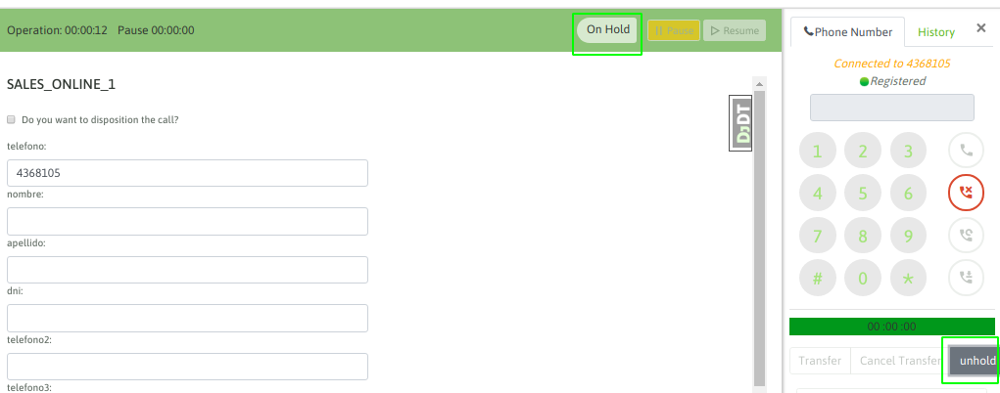
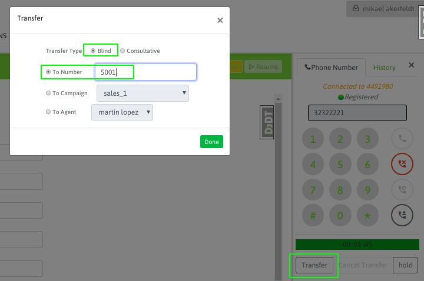
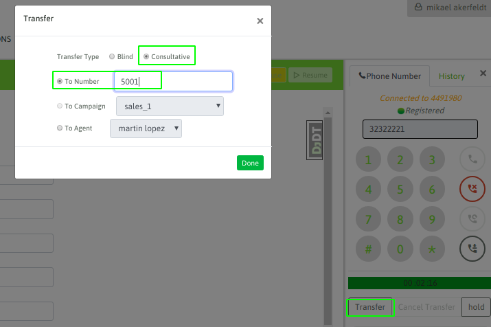
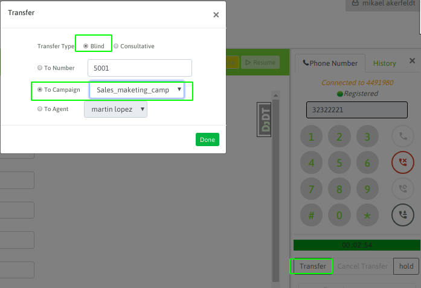
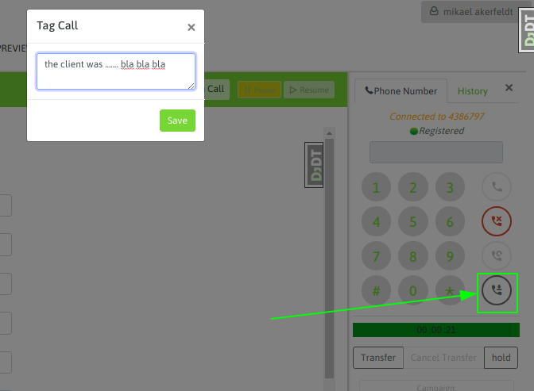
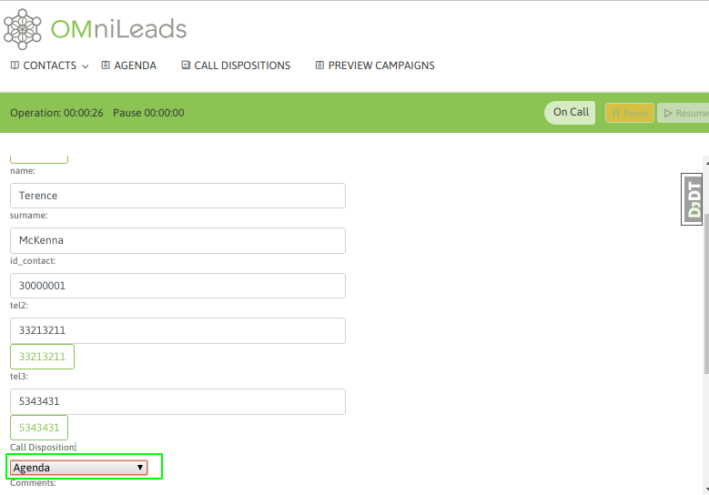
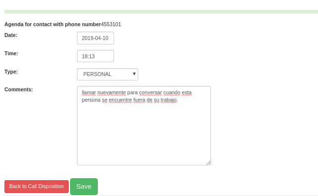

Poner en espera una llamada
***************************

En medio de cualquier tipo de llamada en curso, el agente puede poner en espera al teléfono en el otro extremo
de la comunicación. Esto se logra hundiendo el botón "hold" del webphone de agente.

.. image:: images/about_agent_callactions_hold_1.png

*Figure 1: call on hold*

Al disparar la acción de hold, el otro extremo de la llamada que escuchando la música de espera, mientras que el agente puede volver a retomar la llamada cuando desee
simplemente hundiendo el botón de unhold, tal como se indica en la figura 2.

*Figure 2: unhold*

Esta funcionalidad puede ser utilizada en cualquier tipo de llamada.

Transferencias de llamados
**************************

Dentro del abanico de posibilidades de transferencias de llamadas que se pueden realizar en el sistema, tenemos las siguientes:

**Transferencia directa hacia otro agente**

El "agente A" se encuentra en una llamada activa y desea transferir la llamada hacia el "agente B" de manera directa.
En este caso se hunde el botón de transferencia disponible en el webphone y luego se selecciona "blind transfer" como tipo de transferencia y se puede elegir al agente destino.

.. image:: images/about_agent_callactions_ag2ag_bt.png

*Figure 3: "Agent A" to "Agent B" blind transfer*

En este caso, la llamada automáticamente es despachada hacia el agente B, quedando liberado el webphone del "agente A". Una vez disparada esta transferencia, no se puede volver
a recuperar la llamada original, ni tampoco el "agente A" puede conocer si la llamada fue atendida o no por el "agente B"

**Transferencia directa a número externo**

El "agente A" se encuentra en una llamada activa y desea transferir la llamada hacia un "Teléfono" externo a OMniLeads de manera directa. Cuando decimos externo, nos referimos
a una llamada que se genera hacia afuera del sistema, puede ser una extensión del PBX de la compañía o bien un teléfono externo de la PSTN.

En este caso se hunde el botón de transferencia disponible en el webphone y luego se selecciona "blind transfer" como tipo de transferencia y se debe introducir el número destino en recuadro
como lo indica la figura 4.

*Figure 4: "Agent A" to "External telephone" blind transfer*

En este caso, la llamada automáticamente es despachada hacia el teléfono destino, quedando liberado el webphone del "agente A". Una vez disparada esta transferencia, no se puede volver
a recuperar la llamada original, ni tampoco el "agente A" puede conocer si la llamada fue atendida o no por el teléfono destino de la transferencia.

**Transferencia con consulta hacia otro agente**

El "agente A" se encuentra en una llamada activa y desea transferir la llamada hacia el "agente B" de manera consultativa, es decir logrando que el teléfono externo quede
en espera mientras el "agente A" abre un nuevo canal hacia el "agente B", si la llamada entre ambos se establece y el "agente B" desea recibir la transferencia, entonces
el "agente A" corta la llamada y automáticamente el teléfono externo queda unido en una llamada con el "agente B".

.. image:: images/about_agent_callactions_ag2ag_ct.png

*Figure 5: "Agent A" to "Agent B" consultative transfer*

En este escenario también puede ocurrir:

-  Que no se logre contactar al "agente B", entonces el "agente A" puede cancelar la transferencia durante el ring hacia el "agente B" con el botón "cancel transfer" del webphone.

- Se logra el contacto con el "agente B" pero éste no pueda/quiera proceder con la transferencia, por lo tanto el "agente B" debe cortar la llamada y atomáticamente vuelve a quedar el "agente A" con el teléfono externo enlazados.

**Transferencia con consulta a número externo**

El "agente A" se encuentra en una llamada activa y desea transferir la llamada hacia un "teléfono" externo de manera consultativa, es decir logrando que "telefono externo A" quede
en espera mientras el "agente A" abre un nuevo canal hacia el "teléfono externo B", si la llamada entre ambos se establece y el "teléfono externo B" desea recibir la transferencia, entonces
el "agente A" corta la llamada y automáticamente el "teléfono externo A" queda unido en una llamada con el "teléfono externo B".

*Figure 6: "Agent A" to "External telephone" consultative transfer*

En este escenario también puede ocurrir:

-  Que no se logre contactar al "teléfono externo B", entonces el "agente A" puede cancelar la transferencia durante el ring hacia el "teléfono externo B" con el botón "cancel transfer" del webphone.

- Se logra el contacto con el "telefono externo B" pero éste no pueda/quiera proceder con la transferencia, por lo tanto el "teléfono externo B" debe cortar la llamada y atomáticamente vuelve a quedar el "agente A" con el "teléfono externo A" enlazados.

**Transferencia a otra campaña**

Bajo este escenario el "agente A" se encuentra en una llamada activa y desea transferir la llamada hacia una campaña entrante. A la hora de seleccionar el tipo de transferencia
se debe marcar "blind transfer" ya que la llamada es lanzada sobre la cola de espera de la campaña destino.

*Figure 7: "Agent A" to "inbound campaign" transfer*

Como se trata de una transferencia directa, la llamada automáticamente es despachada hacia el teléfono destino, quedando liberado el webphone del "agente A". Una vez disparada esta transferencia, no se puede volver
a recuperar la llamada original, ni tampoco el "agente A" puede conocer si la llamada fue atendida o no

Observar grabación de llamada
*****************************

Esta funcionalidad del webphone de agente, permite a éste poder generar una marca sobre la grabación de la llamada. La idea es que luego desde el módulo de busqueda de grabaciones
se pueda recuperar grabaciones "observadas" por los agentes y allí también desplegar la observación que realizó el agente sobre la grabación de la llamada.

*Figure 8: call recording tag*

Como se indica en la figura 8, luego de hundir el botón para marcar la llamada, se depliega un campo de texto para que el agente pueda describir la situación.

Finalmente en el módulo de grabación de OMniLeads, se puede recuperar dicha grabación y observar lo que el agente escribió al respecto.

Agendamiento de llamadas
************************

La funcionalidad de agendamiento de llamadas permite al sistema volver a procesar un contacto hacia el futuro. La idea es no descartar al mismo, sino seguirlo gestionando.

**Agendamiento personal:**

Cuando el agente requiere volver a llamar a un contacto determinado, puede generar un recordatorio en su agenda personal, para luego al listar dicha agenda contar con
la entrada que le recuerda el horario y contacto que debe llamar.

El agendamiento de llamadas es una calificación que se encuentra por defecto siempre como calificación de contacto.

*Figure 9: agenda personal*

Luego de guardar la calificación, se despliega un formulario para seleccionar la fecha, hora y motivo de la agenda personal del contacto.

*Figure 10: detalles de la agenda personal*

Finalmente, la entrada en la agenda personal del agente quedará disponible ingresando al punto de menú Agendas:

.. image:: images/about_agent_callactions_agenda_3.png

*Figure 11: detalles de la agenda personal*

**Agendamiento global de llamadas predictivas**

Este tipo de agendamiento es solo aplicable a campañas con discador predictivo ya que tiene como finalidad volver a colocar al contacto dentro de la lista de números
a llamar por el discador. En este escenario el discador simplemente vuelve a llamar a dicho número agendado hacia el final de la campaña, es decir no se puede elegir
ni una fecha u horario ni tampoco sobre qué agente va a caer el contacto llamado nuevamente por el discador.

Se trata de una funcionalidad que permite no descartar al contacto, pero sin implicar un seguimiento personal por parte del agente.

Para generar una agenda de este tipo, se debe calificar al contacto con la calificación "agenda" pero luego seleccionar "global" en el menú de selección del tipo de agenda.
