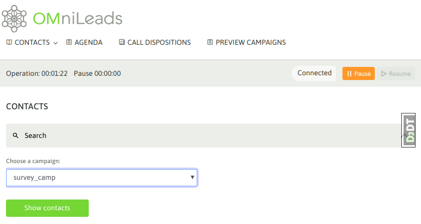
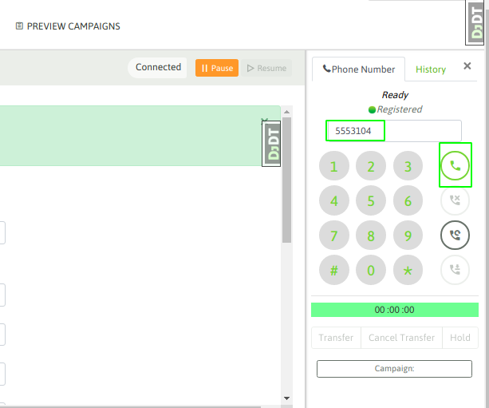
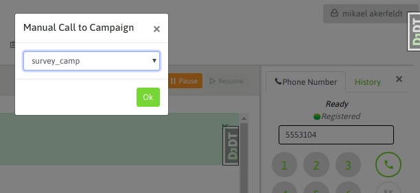
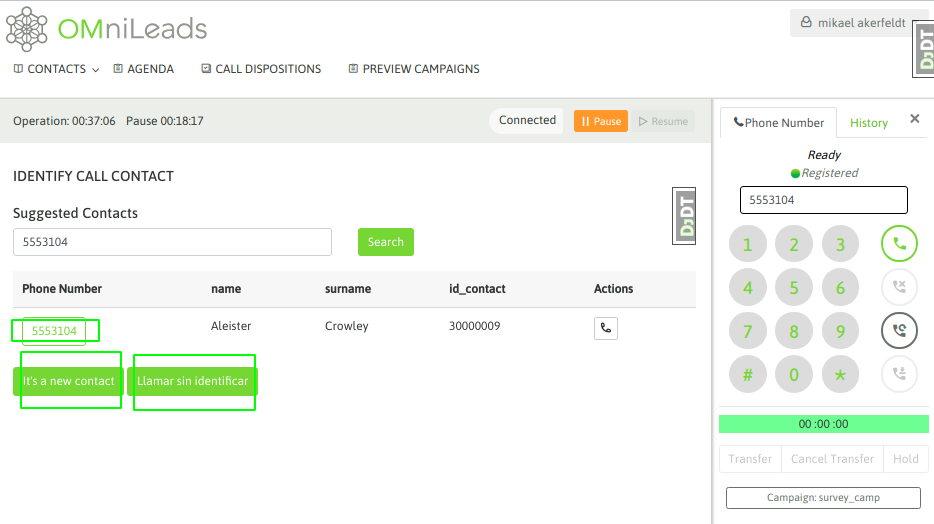
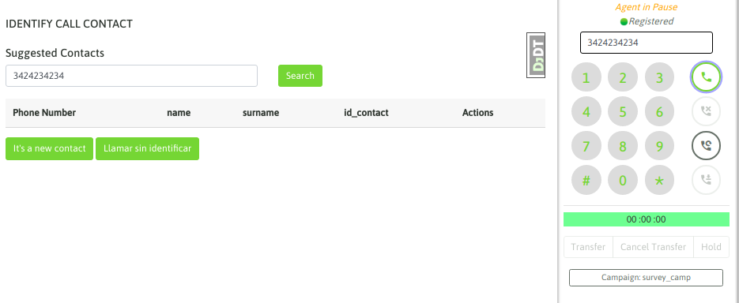
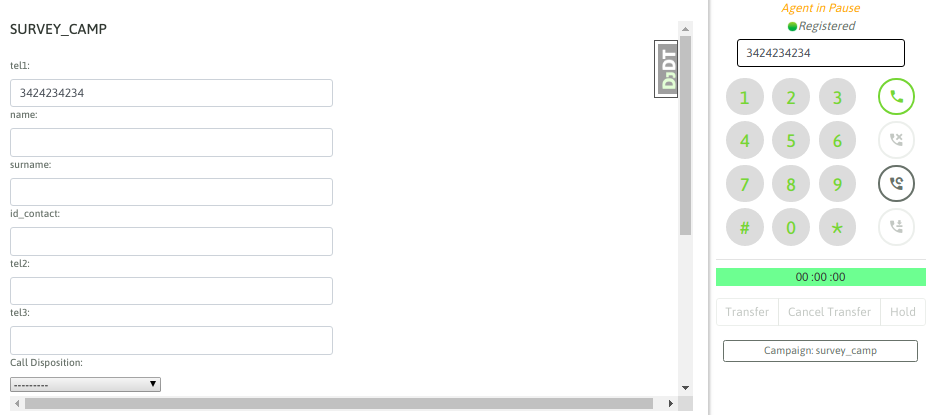
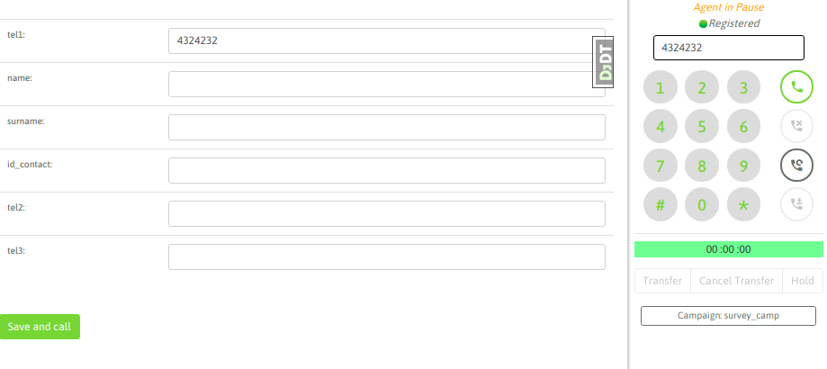

Llamadas manuales desde listado de contactos
**********************************************

Cuando un agente trabaja dentro de una campaña manual puede generar los llamados a partir de listar los contactos
de la campaña, esto es ingresando a Contacts -> Contact list y allí se puede seleccionar
la campaña manual sobre la cual buscar el contacto a marcar. como se muestra en la figura 1

*Figure 1: contact list*

Si se hace click en Mostrar los contactos, aparecen los mismos listados como lo indica la figura 2.

.. image:: images/about_agent_manual_camp_2.png

*Figure 2: contact list*

Entonces, el agente puede generar una llamada hacia uno de los teléfonos listados, a partir de realizar un click
sobre el ícono del teléfono. A partir de ese momento se presenta la información del contacto en la pantalla de agente
y seguidamente se comienza a marcar su teléfono.

.. image:: images/about_agent_manual_camp_3.png

*Figure 3: call contact*

Si la comunicación a finalizado o bien el teléfono no pudo ser contactado, entonces el agente puede intentar marcar
a otro de los números del contacto (si es que el contacto tiene más de un teléfono cargado). Si este es el caso,
entonces el agente puede hacer click sobre cualquiera de los teléfonos extras y automáticamente se buscará contactar
al nuevo teléfono.

.. image:: images/about_agent_manual_camp_4.png

*Figure 4: re-call contact*

Finalmente, el agente debe calificar al contacto a través del combo de calificaciones. Este listado de calificaciones
fue generado por el administrador para cada campaña.

.. image:: images/about_agent_manual_camp_5.png

*Figure 5: call disposition*

Llamadas manuales marcando desde el webphone
********************************************

El agente puede marcar llamadas directamente sobre el webphone. Es común a veces distribuir las llamadas a realizar
por los agentes, a través de una planilla de cálculo o buscando los datos en un CRM externo. La idea es que si un agente
marca una llamada desde el webphone - Figura 6.

*Figure 6: webphone manual call*

Con un *enter* o disparando el llamado desde el botón *dial*, si aún no tiene una campaña pre-seleccionada, el sistema
pregunta por qué campaña procesar la nueva llamada.

*Figure 7: campaign selection*

OMnileads busca primero si el teléfono marcado existe como asignado sobre algún contacto del sistema, si el mismo existe se despliegan los contactos que posean
dicho teléfono y entonces el agente puede indicar marcar a dicho contacto, en este caso la llamada se lanza y los datos
del contacto son desplegados sobre la consola de agente.

*Figure 8: contact selection*

.. image:: images/about_agent_manual_camp_9.png

*Figure 9: contact call*

Llamadas a números sin contacto existente
*****************************************

También puede suceder de que el teléfono marcado desde el webphone no coincida con ningún contacto. Figura 10.

*Figure 10: no contact for the number dialed*

y entonces allí el agente puede o bien directamente marcar el teléfono y luego cargar el contacto - Figura 11.

*Figure 11: call without load contact*

o bien cargar el nuevo contacto a la campaña antes de contactar el teléfono como lo indica la figura 12.

*Figure 12: load contact and call*
