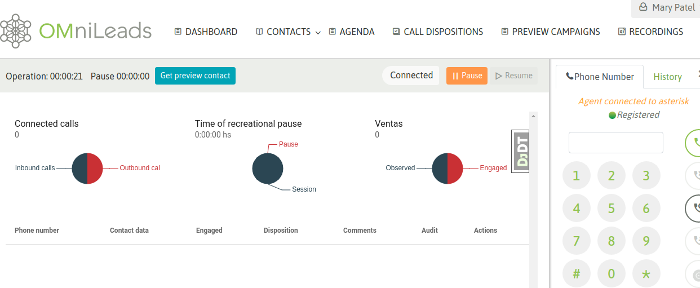

Campañas preview
****************

Cuando un agente trabaja dentro de una campaña preview, antes que nada debe acceder al botón de campañas preview.

.. image:: images/about_agent_prev_camp_1.png

*Figure 1: preview campaigns list*

Allí se van a desplegar todas las campañas preview sobre las que el agente se encuentre asignado. Entonces el agente
debe seleccionar una campaña y ésta le devolverá un contacto para gestionar.

.. image:: images/about_agent_prev_camp_2.png

*Figure 2: pull new contact*

.. image:: images/about_agent_prev_camp_3.png

*Figure 3: contact delivered*

Con el contacto entregado, el agente puede o bien marcar el teléfono del mismo, haciendo click sobre el número, o bien
hacer un nuevo click sobre la campaña preview para que la misma entregue otro contacto.

Suponiendo que se llama a un contacto, simplemente al dar click sobre el teléfono se realiza el llamada y paralelamente
se despliegan los datos del contacto sobre la vista del agente, tal como vimos en las llamadas manuales.

.. image:: images/about_agent_prev_camp_4.png

*Figure 4: contact called*

Si la comunicación a finalizado o bien el teléfono no pudo ser contactado, entonces el agente puede intentar marcar
a otro de los números del contacto (si es que el contacto tiene más de un teléfono cargado). Si este es el caso,
entonces el agente puede hacer click sobre cualquiera de los teléfonos extras y automáticamente se buscará contactar
al nuevo teléfono.

.. image:: images/about_agent_manual_camp_4.png

*Figure 5: re-call contact*

Finalmente, el agente debe calificar al contacto a través del combo de calificaciones. Este listado de calificaciones
fue generado por el administrador para cada campaña.

.. image:: images/about_agent_manual_camp_5.png

*Figure 6: call disposition*

El agente tiene también la posibilidad de seleccionar más rápidamente el próximo contacto a llamar en la última campaña preview con que ha interactuado seleccionando el botón que se muestra en la barra de operación.

*Figure 6: get next preview contact*
