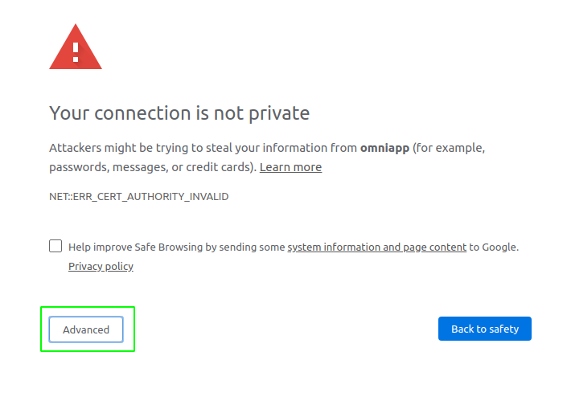
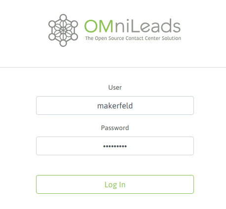
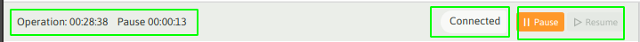
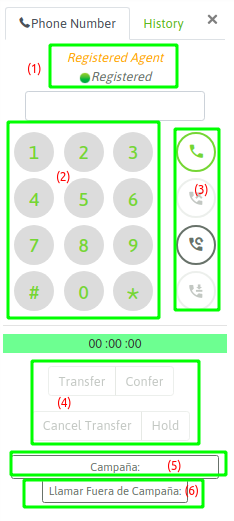
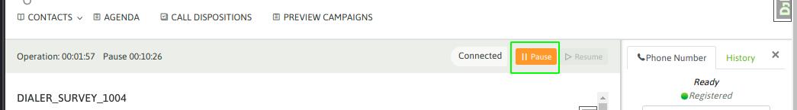
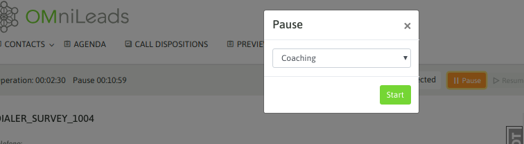
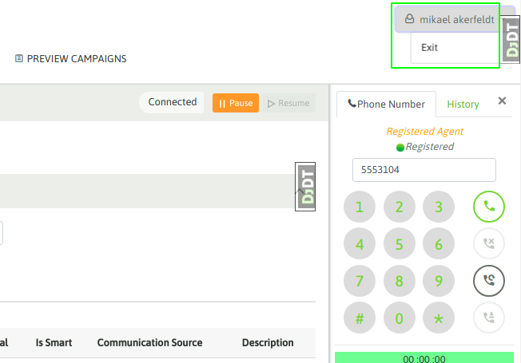

Login
*****

Para acceder a la aplicación se ingresa el URL de su instancia de OMniLeads en su browser.

Si la instancia de OMniLeads no dispone de certificados comerciales, al ingresar al sistema el usuario
se topa con la advertencia de seguridad correspondiente al ingreso a un sitio *https* con un certificado auto-firmado.

En ese caso, simplemente debe aceptar la advertencia y continuar, como lo indican las figuras 1 y 2.

*Figure 1: certificate is not trusted*

.. image:: images/about_agent_login_2.png

*Figure 2: certificate is not trusted*

Al avanzar sobre el sitio, se despliega la pantalla de login, en donde el agente deberá ingresar su usuario y contraseña
para acceder a la aplicación.

*Figure 3: login screen*

Luego de un login exitoso, se despliega la interfaz de agente. Lo primero que debe suceder es una advertencia
del browser que notifica que OMniLeads desea acceder al micrófono del ordenador. Por supuesto, el usuario debe
permitir esta acción, ya que precisa del micrófono para utilizar la aplicación a la hora de gestionar llamadas.

.. image:: images/about_agent_login_5.png

*Figure 4: OMniLeads wants to use your microphone*

Al permir el acceso al micrófono, entonces se procede con el resto del login. Esto implica la reproducción
de un "audio" sobre el auricular del agente anunciando el login exitoso.

Además el agente debe visualizar el webphone desplegado y en estado "Registered" como lo indica la figura 5.

.. image:: images/about_agent_login_3.png

*Figure 5: Succesful agent login*

La consola de agente
********************

La consola de agente es el componente sobre el cual el agente de OMniLeads puede realizar toda la gestión.
En la figura 6 se puede observar su aspecto y además se diseccionó en sub-componentes que son explicados
a continuación.

.. image:: images/about_agent_console.png

*Figure 6: the OMniLeads agent console*

**(1) Gestión de contactos**

En esta sección encontramos las funcionalidades que permiten navegar entre los contactos de la base de las campañas,
visualizar los contactos agendados para ser llamados en el futuro, listar el histórico de todas las calificaciones
que fue realizando el agente y además acceder a las campañas del tipo Preview para solicitar contactos para gestionar.

Todos estos aspectos serán ampliados en las próximas secciones.

(2) Barra de estado

En esta barra tenemos información sobre la sesión.

*Figure 7: status bar*

En la barra de estado hay dos cronómetros que van contabilizando la suma del tiempo de agente en pausa y en estado
de Ready. Su color cambia de acuerdo a si el agente está en estado Ready (gris), En llamada (verde) o En pausa (amarillo)
y además el estado también aparce como leyenda. Finalmente aparecen los botones de pausa y des-pausa, para que el agente
pueda irse a pausa y salir de la misma.

(3) Área de información dinámica

En esta sección de la pantalla aparece toda la información que el agente va solicitando mientras navega en la gestión
de contactos, así como también los datos de los contactos en el momento en que el agente procesa una nueva llamada.

**(4) Webphone**

El webphone OMniLeads es el componente pricipal dentro del módulo de telefonía. A continuación
vamos a repasar los botones del mismo.

*Figure 8: Webphone*

Vamos a dividir al webphone en 5 partes:

  - (1) Estado del webphone. Debe siempre figurar como *Registered*. En caso contrario debe comunicarse con el administrador.

  - (2) Dialpad para marcar llamados manuales o enviar DTMF sobre una llamada conectada.

  - (3) Estos botones permiten disparar las acciones de: llamar, cortar, re-llamar al último número por un lado, siendo el cuarto botón un método para "marcar" la grabación de la llamada con un comentario.

  - (4) Esta serie de botones permiten al agente efectuar las acciones de: realizar una transferencia de llamada, efectuar una conferencia con una tercera parte y poner la llamada en esepra.

  - (5) Este botón permite modificar la campaña sobre la cual se procesa cada llamada manual. También se abordará más adelante en la sección "campañas manuales".

  - (6) Este botón permite efectuar una llamada hacia otro agente, así como también lanzar una llamada saliente a un número externo SIN asociarse a ninguna campaña.

La mayoría de estas funcionalidades son ampliadas en las secciones permitentes de esta documentación.

**(5) Dock**

El dock expone cada herramienta de comunicación. En la versión actual SOLAMENTE está funcional el webphone ya que
OMniLeads actualmente soporta solamente llamadas telefónicas, en versiones futuras se comenzarán a activar otros componentes.

Pausas
*******

El agente puede ingresar en modo pausa para que ninguna llamada de campañas entrantes o predictivas pueda ingresarle.
Como bien se explica en la sección de "Configuración inicial", existen diferentes tipos de pausas que el administrador
puede generar y mantener en el sistema. Por lo tanto el agente al ingresar en el estado de pausa, debe indicar
a qué tipo de pausa.

Para ingresar en una pausa se debe hacer click en el botón "Pausa" dentro de la barra de estado del agente.

*Figure 8: Pause*

Se despliega entonces el menú de selección del tipo de pausa.

*Figure 9: Pause class*

Finalmente, el agente entra en pausa. Debe notarse como cambia hacia el color "amarillo" la barra de estado,
además en la barra se puede leer el tipo de pausa actual y finalmente se puede observar que
el cronómetro de tiempo de pausa comienza a correr, mientras que el de tiempo de operación se frena.

.. image:: images/about_agent_login_9.png

*Figure 10: On Pause*

Logout
*******

Para efectuar un logout se debe acceder al vértice superior izquierdo, tal como lo expone la figura 9.

*Figure 11: agent logout*
