.. _about_api:

**********************
OMniLeads RESTful API
**********************

Esta sección está destinada hacia aquellos desarrolladores que desean ejecutar una integración entre el sistema CRM que mantienen y OMniLeads.
Por lo tanto la terminología y la información aquí expuesta tiene como público objetivo a desarrolladores de software.

OMniLeads dispone de una RESTful API basada en HTTPS / JSON. La API permite el acceso a recursos y servicios del sistema por afuera de la interfaz web de usuario, permitiendo así que sistemas externos puedan integrarse de manera sencilla con OMniLeads.

Las formas de autenticación disponibles para utilizar esta api son por Sesión (el agente debe estar logueado en el sistema) y por Token (a partir del login a la API, con los parámetros usuario y pass de agente), en este caso se debe pasar la siguiente línea en los headers de la petición:

"Authorization: Bearer <token obtenido>"

Por ejemplo:

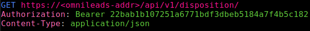

.. note::

  Con el transcurrir de los nuevos releases, esta sección irá siempre ampliándose ya que nuevos endpoints irán surgiendo con el transcurrir de los releases.

A continuación se describen los endpoints disponibles.

Endpoint de Login
*******************

Este método proporciona la posibilidad de autenticarse como usuario del sistema, para luego (en caso de un login exitoso) acceder a otros endpoints disponibles dependiendo el perfil de usuario con el que se ha realizado dicho login.

**URL**: POST https://<omnileads_addr>/api/v1/login

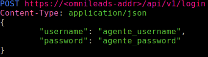

*figure 1: endpoint login request*

+--------------+------------+--------------------------------------------------------------------------+
| field name   | type       | description                                                              |
+==============+============+==========================================================================+
| username     | string     | username del usuario generado en el menú de creación de usuarios de OML  |
+--------------+------------+--------------------------------------------------------------------------+
| password     | string     | password del usuario generado en el menú de creación de usuarios de OML  |
+--------------+------------+--------------------------------------------------------------------------+

**Autenticación exitosa**

Si el login es exitoso, el método devuelve la siguiente salida:

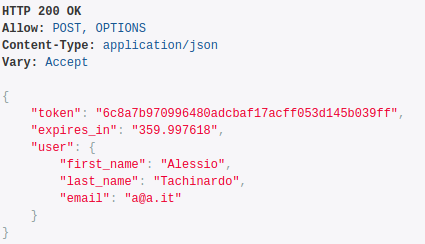

*figure 2: endpoint login request ok*

Como se puede observar en la figura, un login exitoso devuelve entre otros campos un "token" de seguridad. El mismo deberá ser utilizado en las próximas peticiones a la API desde el usuario autenticado. Además en el campo "expires_in" deja asentado el tiempo de vida del token generado.

En caso de que el sistema lance una petición y el token de seguridad haya expirado, entonces se deberá proceder nuevamente con una nueva autenticación.

.. note::
  El tiempo de duración del token de seguridad se configura bajo el parámetro "TOKEN_EXPIRED_AFTER_SECONDS" dentro del archivo "/opt/omnileads/ominicontacto/ominicontacto/settings/production.py"

**Autenticación fallida**

Si el login no es exitoso, el método devuelve la siguiente salida:

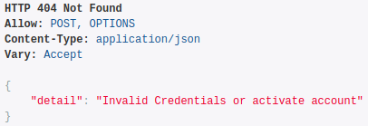

*figure 3: endpint login request fail*

.. _about_api_database_metadata:

Endpoint obtener estructura de Base de Datos de Contactos
*********************************************************
Esta endpoint habilita la posibilidad de obtener información de los campos de una base de datos de contactos de una campaña. Con esta información será posible luego crear un contacto. Las credenciales deberán pertenecer a un Agente (:ref:`about_agent_user`) o a un Supervisor (:ref:`about_supervisor_user`) que estén asociados a la campaña.

**URL**: POST https://<omnileads_addr>/api/v1/campaign/database_metadata/

+---------------------+---------+-----------------------------------------------------------------------------+
| field name          | type    | description                                                                 |
+=====================+=========+=============================================================================+
| idExternalSystem    | integer | Parámetro opcional, si se especifica el sistema intentará localizar la      |
|                     |         | campaña especificada buscando este valor como 'id_externo' de la campaña.   |
|                     |         | En caso de no especificarse el sistema asumirá que el valor                 |
|                     |         | del parámetro 'idCampaign' es el id interno de la campaña en OML            |
+---------------------+---------+-----------------------------------------------------------------------------+
| idCampaign          | string  | Id de la campaña a la que pertenece la base de datos el significado de su   |
|                     |         | valor depende de si se especifica o no el parámetro 'idExternalSystem'      |
+---------------------+---------+-----------------------------------------------------------------------------+

En caso de no haber errores se devolverá un output como este, con los datos de los campos de la base de datos:

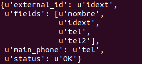

El campo 'fields' indica la lista de todos los campos de la base de datos. El campo 'main_phone' indica cual es es campo correspondiente al teléfono principal. El campo 'external_id' indica cual de los campos corresponde al identificador externo del contacto. En caso de que la base de datos no tenga campo identificador externo, el campo 'external_id' tendrá el valor None.

En caso de haber errores se devolverá un JSON con el campo “status”:”ERROR” y el detalle de los mismos en el campo “errors”. Caso contrario el valor del campo “status” será “OK”.

Endpoint creacion de contacto
*****************************
Esta endpoint habilita la posibilidad de agegar un contacto a una base de datos de contactos de una campaña. Las credenciales deberán pertenecer a un Agente (:ref:`about_agent_user`) o a un Supervisor (:ref:`about_supervisor_user`) que estén asociados a la campaña.

**URL**: POST https://<omnileads_addr>/api/v1/new_contact/

+---------------------+---------+-----------------------------------------------------------------------------+
| field name          | type    | description                                                                 |
+=====================+=========+=============================================================================+
| idExternalSystem    | integer | Parámetro opcional, si se especifica el sistema intentará localizar la      |
|                     |         | campaña especificada buscando este valor como 'id_externo' de la campaña.   |
|                     |         | En caso de no especificarse el sistema asumirá que el valor                 |
|                     |         | del parámetro 'idCampaign' es el id interno de la campaña en OML            |
+---------------------+---------+-----------------------------------------------------------------------------+
| idCampaign          | string  | Id de la campaña a la que pertenece la base de datos el significado de su   |
|                     |         | valor depende de si se especifica o no el parámetro 'idExternalSystem'      |
+---------------------+---------+-----------------------------------------------------------------------------+

Además deberán enviarse los valores de los campos correspondientes a los datos del contacto, y cuyos nombres pueden obtenerse con la api de obtener estructura de de Base de Datos de Contactos (:ref:`about_api_database_metadata`). Es obligatorio enviar un valor para el campo indicado como 'main_phone', y en caso de que la base de datos tenga campo identificador externo, el valor del campo indicado como 'external_id' no deberá existir previamente en otro contacto de la base de datos.

En caso de no haber errores se devolverá un output como este, con los datos del contacto y su id en OML:

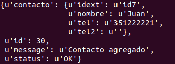

En caso de haber errores se devolverá un JSON con el campo “status”:”ERROR” y el detalle de los mismos en el campo “errors”. Caso contrario el valor del campo “status” será “OK”.

Endpoint de Generación de llamadas
***********************************

Permite generar llamadas (click to call) desde un Sistema CRM Externo. Las credenciales deberán pertenecer a un Agente (:ref:`about_agent_user`).

**URL**: POST https://<omnileads_addr>/api/v1/makeCall

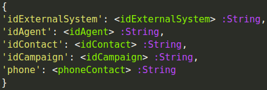

*figure 4: endpint new call request*

+----------------------+------------+--------------------------------------------------------------------------+
| field name           | type       | description                                                              |
+======================+============+==========================================================================+
| idExternalSystem     | string     | Es un parámetro opcional, debe enviarse en caso de que se quiera         |
|                      |            | identificar a la campaña con el ID del sistema CRM externo               |
+----------------------+------------+--------------------------------------------------------------------------+
| idCampaign           | string     | Es un parámetro obligatorio, debe corresponder al identificador de una   |
|                      |            | campaña de OML. Si se envía el parámetro 'idExternalSystem'              |
|                      |            | debe corresponder con el campo "identificador externo" de una Campaña    |
|                      |            | asociada al Sistema Externo indicado                                     |
+----------------------+------------+--------------------------------------------------------------------------+
| idAgent              | string     | Es un parámetro obligatorio, debe corresponder al identificador de un    |
|                      |            | Agente del sistema. Si se envía el parámetro 'idExternalSystem' debe     |
|                      |            | corresponder al campo "identificador externo" de un Agente asociado al   |
|                      |            | Sistema CRM externo                                                      |
+----------------------+------------+--------------------------------------------------------------------------+
| idContacto           | string     | Es un parámetro opcional, si no es enviado se asume que es un contacto   |
|                      |            | nuevo. De ser enviado debe corresponder al identificador de un Contacto  |
|                      |            | de la base de datos de contactos de la Campaña. Si se envía el parámetro |
|                      |            | 'idExternalSystem' deberá corresponder con el campo de la base de datos  |
|                      |            | de contactos marcado como identificador externo                          |
+----------------------+------------+--------------------------------------------------------------------------+

En caso de haber errores se devolverá un JSON con el campo 'status':'ERROR' y el detalle de los mismos en el campo 'errors'. Caso contrario el valor del campo 'status' será 'OK'.

Endpoint listado de opciones de calificación
********************************************

**URL** GET https://<omnileads_addr>/api/v1/campaign/<idc:integer>/dispositionOptions/               (1)

**URL** GET https://<omnileads_addr>/api/v1/campaign/<idc:string>/dispositionOptions/<ids:integer>/  (2)

Este método permite obtener un listado de las opciones de  calificación disponibles para calificar a un contacto en una campaña Las credenciales deberán pertenecer a un Agente (:ref:`about_agent_user`).

Los parámetros de este endpoint se especifican en la url. El mismo tiene dos formas de uso, si usa la variante (1), con un solo parámetro, el valor del parámetro 'idc' deberá ser un entero especificando el id interno de una campaña de OML.

La variante (2) es para ser usada en la interacción desde un sistema de CRM externo hacia OML y en este caso el parámetro 'ids' deberá especificar el id del sistema de CRM externo y el parámetro 'idc' el identificador de una campaña en ese sistema sistema externo.

En el caso de que el endpoint se ejecute sin errores se devolverá un output con una lista de opciones de calificación parecidos al siguiente:

.. image:: images/api_disposition_options.png

En caso de que se no ingrese un id de una campaña o sistema de CRM externo inexistente se devolverá un output parecido a:

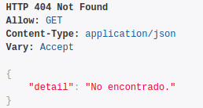

Endpoint listado de calificaciones
************************************

Este método permite obtener un listado de las calificaciones que ha realizado un agente.
Las credenciales deberán pertenecer a un Agente (:ref:`about_agent_user`).

**URL**: GET https://<omnileads_addr>/api/v1/disposition/

En caso de no haber errores se devolverá la lista de calificaciones realizadas por el agente.

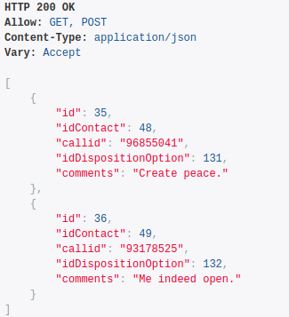

Endpoint crear nueva calificación
**********************************
Esta endpoint habilita la posibilidad de "calificar" una gestión sobre un contacto. Cuando un usuario del CRM finaliza una gestión, es normal que se cierre con una calificación, por lo que con éste método el Sistema CRM externo puede impactar la calificación en OMniLeads. Las credenciales deberán pertenecer a un Agente (:ref:`about_agent_user`).

**URL**: POST https://<omnileads_addr>/api/v1/disposition/

+---------------------+---------+-----------------------------------------------------------------------------+
| field name          | type    | description                                                                 |
+=====================+=========+=============================================================================+
| idExternalSystem    | integer | Parámetro opcional, si se especifica                                        |
|                     |         | el sistema intentará localizar al contacto especificado buscando            |
|                     |         | este valor como 'id_externo' en la en la BD de la campaña.                  |
|                     |         | En caso de no especificarse el sistema asumirá que el valor                 |
|                     |         | del parámetro 'idContact' es el id interno del contacto en OML              |
+---------------------+---------+-----------------------------------------------------------------------------+
| idContact           | string  | Id del contacto que se quiere calificar, el significado de su valor         |
|                     |         | depende de si se especifica o no el parámetro 'idExternalSystem'            |
+---------------------+---------+-----------------------------------------------------------------------------+
| idDispositionOption | integer | El id de la opción de calificación de la campaña  con que se va a calificar |
|                     |         | al contacto, cada campaña define sus propias opciones de calificación,      |
|                     |         | ver el endpoint que permite obtenerlas.                                     |
+---------------------+---------+-----------------------------------------------------------------------------+
| callid              | string  | Parámetro opcional, el id de la llamada                                     |
+---------------------+---------+-----------------------------------------------------------------------------+
| comments            | string  | Las observaciones del agente en la calificación                             |
+---------------------+---------+-----------------------------------------------------------------------------+

En caso de no haber errores se devolverá un output como este, con los datos de la nueva calificacion creada:

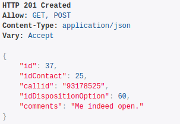

Si se intenta crear una nueva instancia de calificación a un contacto ya calificado en la campaña de devolverá el siguiente error

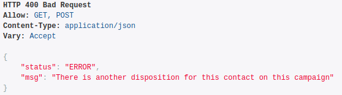

Si no se encuentra el id del contacto en la bd de la campaña se devolverá el siguiente mensaje de error:

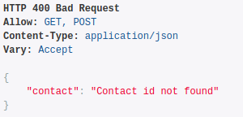

Si no se encuentra el id de la opcion de calificación en la bd de la campaña se devolverá el siguiente mensaje de error:

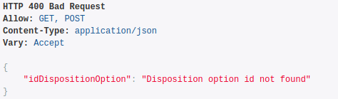

Endpoint crear nuevo contacto y asignarle calificación
*********************************************************
Esta endpoint habilita la posibilidad de "calificar" una gestión al mismo tiempo crear un contacto, es decir, se crea el contacto y se le asocia a la calificación que se va a crear
Las credenciales deberán pertenecer a un Agente (:ref:`about_agent_user`).

**URL**: POST https://<omnileads_addr>/api/v1/new_contact/disposition/

+---------------------+---------+------------------------------------------------------------------------------+
| field name          | type    | description                                                                  |
+=====================+=========+==============================================================================+
| phone               | string  | El número de teléfono del contacto                                           |
+---------------------+---------+------------------------------------------------------------------------------+
| idExternalContact   | string  | Parámetro opcional, el id del contacto en un sistema de CRM externo          |
|                     |         |                                                                              |
+---------------------+---------+------------------------------------------------------------------------------+
| idDispositionOption | integer | El id de la opción de calificación de la campaña  con que se va a calificar  |
|                     |         | al contacto, cada campaña define sus propias opciones de calificación,       |
|                     |         | ver el endpoint que permite obtenerlas.                                      |
+---------------------+---------+------------------------------------------------------------------------------+
| comments            | string  | Las observaciones del agente en la calificación                              |
+---------------------+---------+------------------------------------------------------------------------------+
| callid              | string  | Parámetro opcional, el id de la llamada                                      |
+---------------------+---------+------------------------------------------------------------------------------+
| <optional_bd_field> | string  | Parámetros opcionales, pueden definirse valores para rellenar los datos del  |
|                     |         | contacto a crear, los nombres de campos deben coincidir con los campos de la |
|                     |         | BD de la campaña                                                             |
+---------------------+---------+------------------------------------------------------------------------------+

En caso de no haber errores se devolverá un output como este, con los datos de la nueva calificacion creada:

Si no se encuentra el id de la opcion de calificación en la bd de la campaña se devolverá el siguiente mensaje de error:

Endpoint para modificar una calificación existente
*********************************************************

Esta endpoint habilita la posibilidad de modificar una calificación existente en OMniLeads.

Las credenciales deberán pertenecer a un Agente (:ref:`about_agent_user`).

**URL**: PUT https://<omnileads_addr>/api/v1/disposition/<idDisposition>

+---------------------+---------+-----------------------------------------------------------------------------+
| field name          | type    | description                                                                 |
+=====================+=========+=============================================================================+
| idExternalSystem    | integer | Parámetro opcional, si se especifica                                        |
|                     |         | el sistema intentará localizar al contacto especificado buscando            |
|                     |         | este valor como 'id_externo' en la en la BD de la campaña.                  |
|                     |         | En caso de no especificarse el sistema asumirá que el valor                 |
|                     |         | del parámetro 'idContact' es el id interno del contacto en OML              |
+---------------------+---------+-----------------------------------------------------------------------------+
| idContact           | string  | Id del contacto que se quiere calificar, el significado de su valor         |
|                     |         | depende de si se especifica o no el parámetro 'idExternalSystem'            |
+---------------------+---------+-----------------------------------------------------------------------------+
| idDispositionOption | integer | El id de la opción de calificación de la campaña  con que se va a calificar |
|                     |         | al contacto, cada campaña define sus propias opciones de calificación,      |
|                     |         | ver el endpoint que permite obtenerlas.                                     |
+---------------------+---------+-----------------------------------------------------------------------------+
| callid              | string  | Parámetro opcional, el id de la llamada                                     |
+---------------------+---------+-----------------------------------------------------------------------------+
| comments            | string  | Las observaciones del agente en la calificación                             |
+---------------------+---------+-----------------------------------------------------------------------------+

Si no existe error se devolverá el siguiente tipo de output:

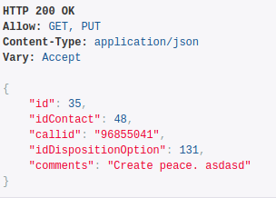

Si en la url se especifica un id de calificación inexistente se devolverá el siguiente output de error:

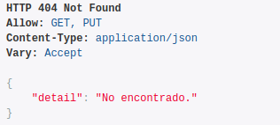

Si se intenta modificar la instancia de calificación, cambiando los parámetros 'idContact' y 'idDispositionOption'y se encuentra que podrían existir dos calificaciones para un mismo contacto en una campaña se mostrará el siguiente mensaje de error:

Si no se encuentra el id del contacto en la bd de la campaña se devolverá el siguiente mensaje de error:

Si no se encuentra el id de la opcion de calificación en la bd de la campaña se devolverá el siguiente mensaje de error:

.. _about_customer_id_request:

Solicitud de enrutamiento hacia el sistema CRM externo
**********************************************************

Esta interacción implica que OMniLeads ejecute una solicitud HTTP-POST (plain/text) hacia el URL del sistema de gestión especificado dentro
del módulo :ref:`about_customer_id_form`, osea en la definición de un nodo "identificación de clientes".

Este POST enviado hacia el sistema de gestión CRM tiene el siguiente aspecto

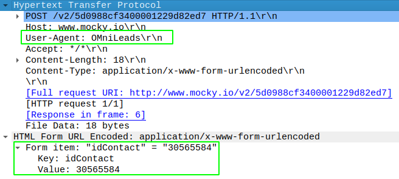

Como podemos observar el "User-Agent" debe llegar como "OMniLeads" y en el cuerpo del Post el número de identificación ingresado en la llamada se envía como "idContact".

**Respuesta que debe generar el servicio web del sistema de gestión CRM**

El servicio recibe de OMniLeads el request HTTP-Post con el número de identificación del cliente y debe generar una respuesta a dicha solicitud.
El sistema tiene la posibilidad de generar tres tipos de respuestas:

* **true**
* **false**
* **X,Y**: donde "X" es un número entero y corresponde con el tipo de destino hacia a donde enviar la llamada identificada e "Y" es el destino puntual para ese tipo de destino. Por ejemplo (1,3) indica que la llamada será enrutada hacia una campaña entrante (1) y puntualmente hacia la campaña entrante cuyo id es (3). La clave asociada a la respuesta es "response"

El formato de respuesta debe ser "JSON".

* Respuesta JSON

  ::

   Content-Type: application/json
   HTTP/1.1 200 OK

    {
      "status": "ok",
      "destination": "value"
    }

Donde "status" puede ser *ok* o *fail* y "destination" podrá ser cualquiera de las 3 respuestas especificadas arriba.

.. important::

  El sistema debe respetar el formato y nombre de parámetros (status y destination)

En caso de generar una respuesta con el destino del enrutamiento, se deben conocer los tipos de destino:

* 1: Campaña entrante
* 2: Condicional basado en tiempo
* 3: IVR
* 5: Hangup de la llamada
* 9: Solicitud de identificación

En un futuro se implementará un endpoint de la API para listar cada destino posible por cada tipo de destino. Mientras tanto, el desarrollador que desee implementar el enrutamiento de llamadas basado en la identificación ingresada en la llamada y el request generado desde OMniLeads, podrá ingresar a la interfaz de OMniLeads y en cada módulo (tipo de destino) listar los mismos y observar el id.

**Ejemplo de respuesta con destino de llamada**: se desea validar cada id enviado desde OMniLeads y responder con dos posibles tipos destinos de enrutamiento. Por un lado una campaña entrante llamada "clientes gold" y otra llamada "clientes bronce".

Para ello suponemos que existen las dos campañas entrantes como se indica en la figura.

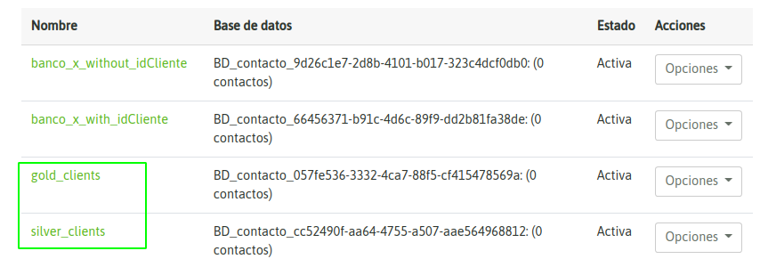

Tan solo con posicionar el mouse sobre el nombre de la campaña, podremos dilucidar el "id" particular de cada una.

Por lo tanto, a partir de conocer los "id" de cada campaña el sistema de gestión a partir de su lógica de negocio, podrá evaluar cada llamada e indicar a OMniLeads hacia donde encaminarla devolviendo el par "X,Y".
