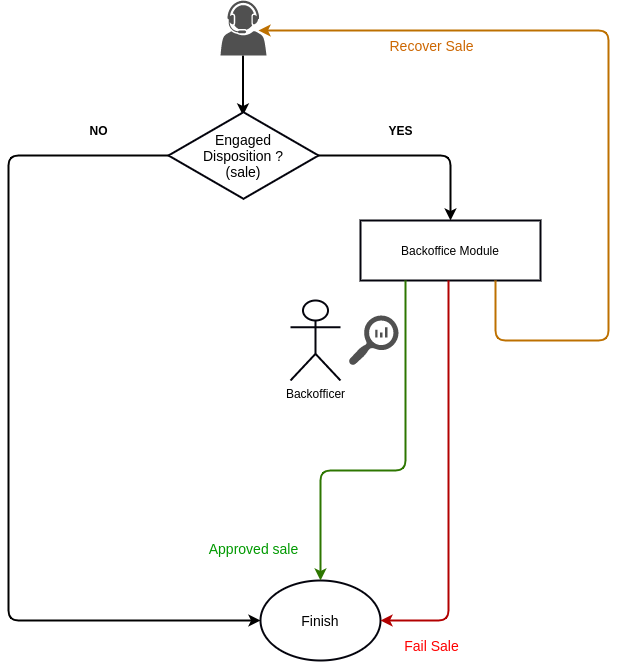
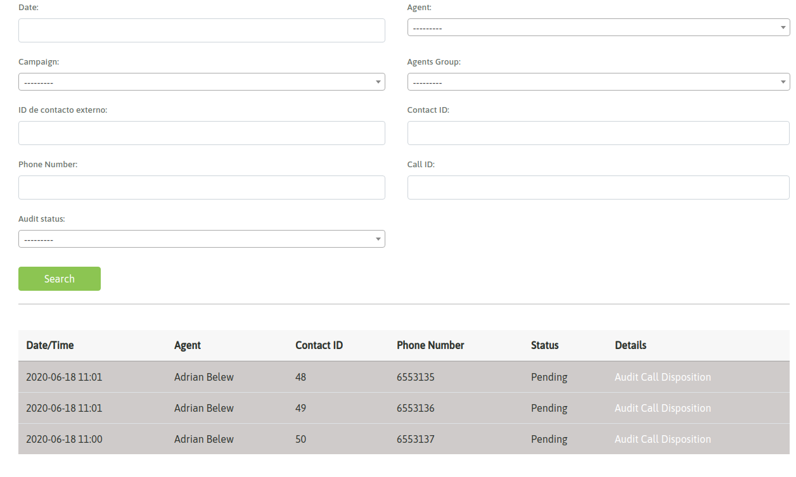
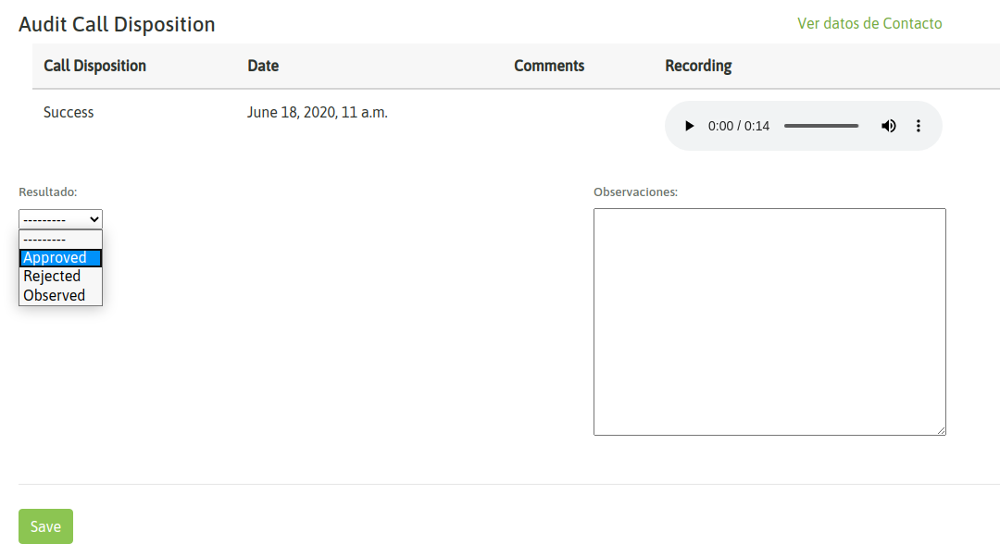
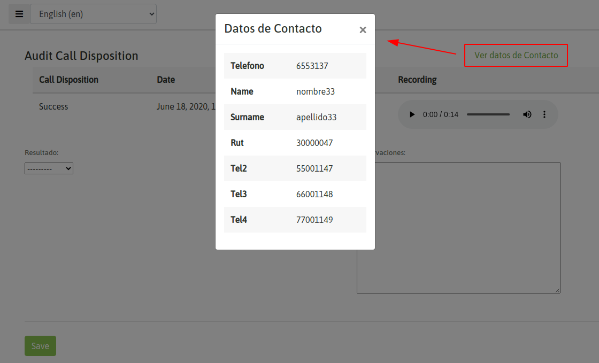
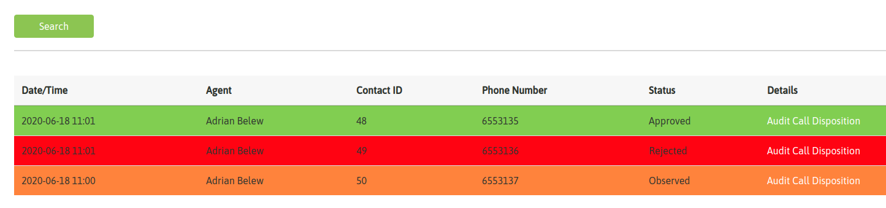
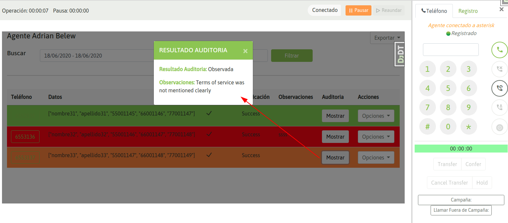
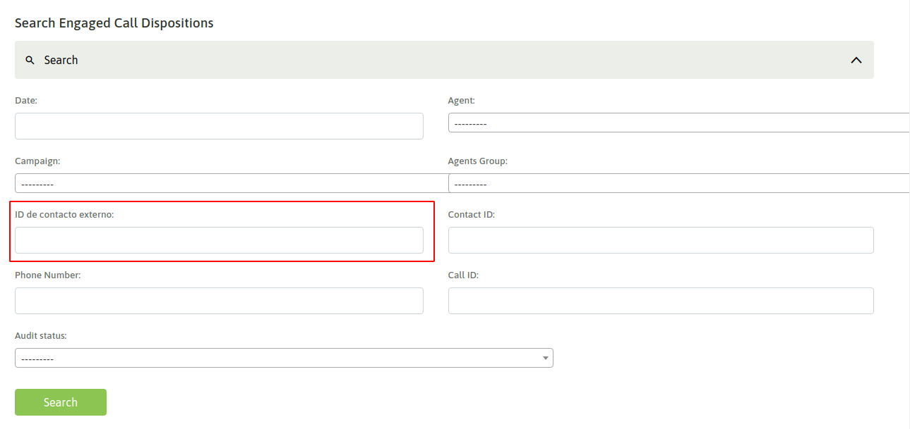
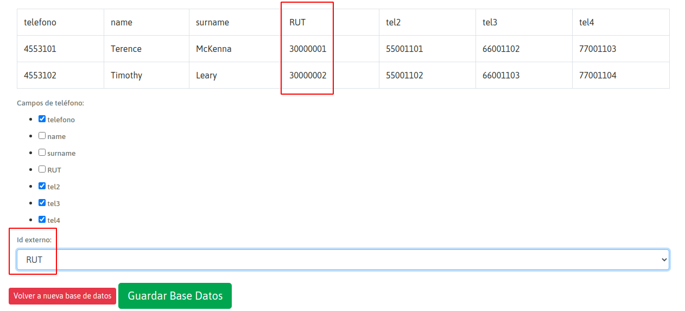

***********************************
Auditoría de gestiones (backoffice)
***********************************

Éste módulo permite definir usuarios del sistema asignados a auditar cada *gestión positiva* generada por un agente en cada campaña. Es común en las operaciones de Contact Center
que el flujo de trabajo implique por un lado a los Agentes y Supervisores coordinando la operación de gestión de comunicaciones y por otro lado el sector de auditorías o backoffice
controlando que cada registro calificado como *Gestión positiva* (o venta) haya sido correctamente intrumentada por el agente.

OMniLeads facilita un módulo en el cual los auditores podrán listar todas las gestiones realizadas por los agentes, para luego inspeccionar una a una validando la autenticidad
de la gestión basado en los parámetros propios de la operación. Los auditores cuentan con la posibilidad de desplegar la información del contacto, del formulario completado
por el agente y de las grabaciones vinculadas a la gestión.

**Diagrama de flujo**

Vamos a tratar de ilustrar el funcionamiento del módulo ayudándonos con el sigueinte diagrama.

Lo primero que debemos aclarar es que solamente los registros calificados con una calificación de gestión (:ref:`about_calificaciones_forms`) serán enviados al módulo de Auditorías. Allí es donde los
auditores podrán luego trabajar sobre cada registro *pendiente*.

Sobre cada registro el auditor podrá ingresar para analizar la gestión.

En la vista detallada se podrá reproducir la/s grabacion/es inherentes a la gestión y además desplegar tanto los datos del contacto como los datos ingresados en el formulario
de gestión.

Los registros auditados pueden ser clasificados como:

* **Gestión aprobada**: el auditor constata mediante el analisis de las grabaciones, datos de contacto y campos completados en el formulario de gestión, que la operación ha sido existosa.

* **Gestión rechazada**: el auditor detecta mediante el analisis de las grabaciones, datos de contacto y campos completados en el formulario de gestión, que la operación no cumple los requisitos para ser aprobada.

* **Gestión observada**: el auditor detecta mediante el analisis de las grabaciones, datos de contacto y campos completados en el formulario de gestión, que la operación ha sido existosa, pero la envía nuevamente al agente (con la explicación pertinente) para que éste vuelva a realizar la gestión volviendo a contactar al contacto.

**Comportamiento de una gestión observada**

Como bien comentamos, las gestiones que el auditor observa son gestiones que el agente debe volver a efectuar buscando sortear las observaciones dejadas por el auditor en pos de
levantar la misma y lograr una posterior aprobación. El agente puede percatarse del resultado de las auditorias realizadas sobre sus gestiones ingresando a la vista de *Calificaciones*
dentro de la pantalla de agente. Allí podrá percatarse de una observación, pudiendo leer la descripción del inconveniente dejada por el auditor.

Una vez que el agente realiza la gestión nuevamente el auditor podrá inspeccionar y finalmente decidir si aprueba, rechaza o vuelve a observar.

**Filtros de búsqueda**

El módulo cuenta con los típicos filtros de búsqueda (por agente, campaña, fecha, etc.). Sin embargo se desea puntualizar el hecho de que es posible buscar registros por
ID de contacto de la base. Es decir utilizar el identificador único del contacto dentro de la Base subida al sistema. Para ello se utiliza el campo *ID contacto externo*.

 .. important::

  Para poder filtrar utilizando el campo mencionado, es necesario que al momento de haber subido la base, se haya indicado el campo correspondiente.

