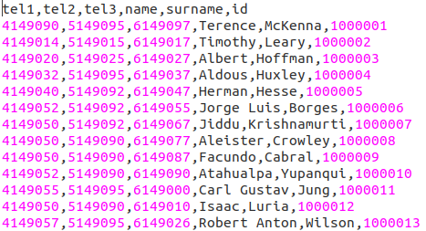
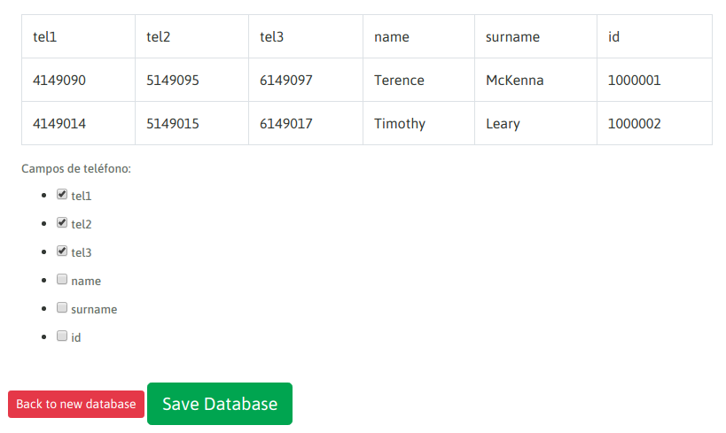
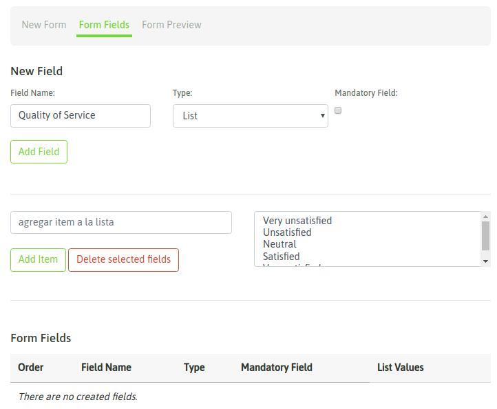
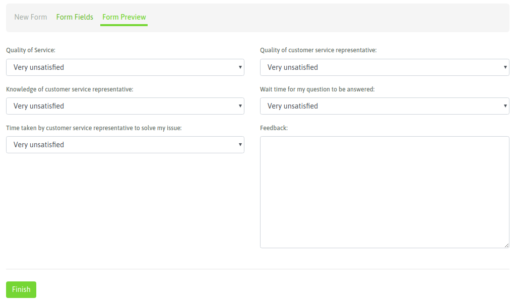
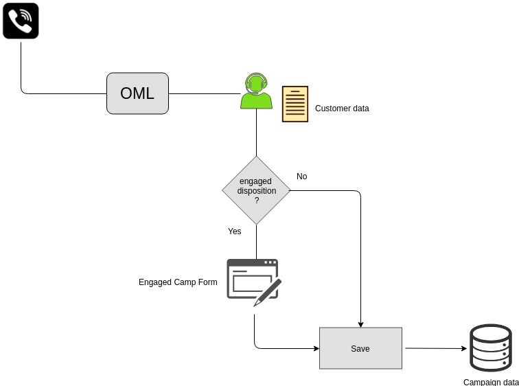

********************
Campañas Telefónicas
********************

Una campaña representa una manera de clasificar dentro de la plataforma a una operación de Contact Center que integra:

- Un grupo de agentes procesando llamadas en un sentido (outbound o inbound).
- Una base de contactos asociada a la campaña.
- Un listado de calificaciones que se despliegan a la hora de clasificar la llamada gestionada por el agente.
- Uno o varios formularios de campaña, a ser desplegados en caso de que el agente asigne una calificación de "gestión" asociada a alguno de los formularios, sobre la llamada en curso. El formulario es desplegado por dicha calificación y el agente puede completar el mismo según los datos del contacto de la llamada en curso.

En la figura 1, se ilustra todo lo citado en los ítems.

.. image:: images/campaigns_elements.png

*Figure 1: the campaigns elements*

El hecho de trabajar bajo campañas, permite a los perfiles de usuarios Supervisor/Administrador extraer información y métricas de cada campañas, así como también realizar monitoreo en tiempo real o buscar grabaciones, entre otras acciones, usando como criterio de filtrado a las campañas.
Podemos contar con diferentes campañas de diferente naturaleza (predictivas, preview, entrantes o manuales), conviviendo de manera simultánea en OMniLeads y dejando registros sobre las llamadas transaccionadas por los agentes.

.. image:: images/oml_bpo.png

*Figure 2: Campaigns, agents, supervisors and backoffice*

Calificaciones
**************

Las calificaciones constituyen un listado de etiquetas disponibles para ser vinculadas a cualquier campaña, de manera tal que luego las llamadas procesadas dentro de una campaña pueda ofrecer dichas calificaciones al agente
afectado a una llamada i así éste ultimo pueda cerrar (temporal o definitivamente) la gestión de la llamada utilizando una de las calificaciones disponibles en la campaña como etiqueta para tipiicar la gestión.

Las calificaciones las define el supervisor o administrador y se pueden relacionar con varios aspectos, por ejemplo:

- El estado del contacto (respondió, no atendió, numero equivocado, etc.)
- El resultado de la gestión (interesado, no interesado, se ofreció producto, se vendió, etc.)
- La predisposición del contactado o el resultado de una encuesta de satisfacción (cliente satisfecho/insatisfecho, etc.)

Las calificaciones pueden ser totalmente arbitrarias y para generarlas se debe ingresar al punto de menú; *Campaigns → Call Dispositions → New Call Dispositions*.

Podemos listar las calificaciones generadas dentro de *Campaigns → Call Dispositions → Call Dispositions*

.. image:: images/campaigns_calldispositions.png

*Figure 3: Call dispositions*

Base de contactos
*****************
Las bases de datos son utilizadas tanto para las campañas entrantes como salientes. En las campañas salientes, los datos que requiere el discador predictivo/preview se extraen de la base de contactos afectada a la campaña, mientras que en las campañas entrantes aportan los datos que se despliegan en la pantalla del agente cada vez que ingresa al sistema alguna comunicación

Deben estar almacenadas en archivos con formato CSV con los campos separados con coma y además generadas en la codificacipón UTF-8 (requisito excluyente). Debe existir al menos una columna
que contenga un teléfono de cada contacto (registro) del archivo, el resto de las columnas puede contener cualquier contenido, generalmente cada registro cuenta con datos complementarios
al teléfono principal. Éstos datos son expuestos en la pantalla de agente a la hora de establecer una comunicación entre ambos (agente y contacto de la base).

*Figure 4: Contacts CSV file - text editor view*

.. image:: images/campaigns_contactdb_2.png

*Figure 5: Contacts CSV file - libreoffice excel view*

Se dispone entonces de una base de contactos (csv) para proceder con la carga del archivo en el sistema accediendo al punto de menú; *Contacts → New contacts database*

.. image:: images/campaigns_upload_contacts.png

*Figure 6: New contact database*

Se debe indicar con un check, cuales columnas son las que almacenan teléfonos, como se indica en la figura 7.

*Figure 7: Tel check*

Finalmente se salva el archivo y el mismo queda disponible como una base de contactos del sistema instanciable por cualquier tipo de campaña.

Formularios
***********
Los formularios de campaña constituyen un elemento que permite recolectar información de la interacción con la persona detrás de la comunicación establecida.
Son diseñados dentro de OMniLeads conjugando en una vista estática diferentes tipos campos (texto, fecha, de multiple selección y área de texto).

Para crear formularios se debe acceder al punto de menú; *Campaigns → New form*. Allí

Los formularios pueden contener campos del tipo:

- **Texto**
- **Fecha**
- **Combo de selección múltiple**
- **Campo de complementarios**

En la figura 8 se ejemplifica un campo del tipo "combo" dentro de la creación de un formulario.

*Figure 8: New campaign form*

Podemos generar un formulario de ejemplo de encuesta de satisfacción con el aspecto de la figura 9.

*Figure 9: Survey campaign form*

Campañas, Calificaciones & Formularios
*****************************************

Para explicar la relación entre éstos componenetes, debemos recordar que múltiples formularios pueden ser asignados a una campaña. La idea es que diferentes calificaciones de una campaña
pueden disparar diferentes formularios, permitiendo así a la operación de recolectar mediante formularios previamentes diseñados, información asociada a la interacción entre el
agente de OMniLeads y la persona en el otro extremo de la comunicación dentro de la campaña.

Resulta importante explicar conceptualmrnte cómo se utilizan los formularios de campaña en OMniLeads. Antes que nada aclarar que en el marco de una campaña a la hora de asignar
calificaciones, se van a poder definir calificaciones normales y calificaciones "de gestión" o "engaged". Éstas últimas son las que disparan los formularios de campaña.

.. image:: images/campaigns_calldispositions_add.png

*Figure 10: Call dispositions inside campaign*

En el ejemplo de la figura 10, contamos con dos calificaciones del tipo engaged, por un lado la calificación "Survey on demand client"
que tiene asociado el formulario "Survey On Demand" y por el otro la calificación "Survey" que dispara el formulario "Survey Clients".

Siempre que haya una llamada activa entre un agente y un contacto de la base de la campaña, el agente dispone de los datos complementarios al teléfono del contacto en su pantalla
junto al combo de selección de calificación para el contacto actual. Si el agente selecciona y guarda una calificación del tipo "gestión", entonces se dispara en la pantalla de agente
el formulario asociado a la calificación dentro de la campaña.

*Figure 11: Engaged dispostions and forms*

Campañas Manuales
*****************

Dentro de este inciso se ejemplifica el paso a paso de cómo administrar :ref:`about_manualcamp`.

Campañas Preview
****************

Dentro de este inciso se ejemplifica el paso a paso de cómo administrar :ref:`about_previewcamp`.

Campañas con discador predictivo
********************************

Dentro de este inciso se ejemplifica el paso a paso de cómo administrar :ref:`about_dialercamp`.

Campañas Entrantes
******************

Al hablar de llamadas entrantes nos toca desplegar cada funcionalidad aplicable al flujo de llamadas entrantes, como bien sabemos una llamada entrante
puede pasar por una serie "nodos" hasta finalmente conectar con un agente de atención. Por lo tanto vamos a ampliar el concepto de "campañas entrantes"
a los siguientes ítems de configuración.

* :ref:`about_inboundcamp`.
* :ref:`about_inboundroutes`.
* :ref:`about_inboundroutespbx`.
* :ref:`about_timeconditions`.
* :ref:`about_ivr`.

Plantillas de Campaña
*********************

En muchas ocasiones los parámetros de una familia de campañas (por ejemeplo campañas preview de encuestas) no varían demasiado salvo por quizás por ejemplo el grupo de agentes asignados, la base de contactos a utilizar
o el supervisor agignado. Entonces en lugar de tener que crear campañas myu similares siempre de cero, se pueden utilizar las plantillas y clonar éstas con los parámetros listos para avanzar más rápidamente en la creación de la nueva campaña.

Esta funcionalidad la otorgan los *Templates* de campañas de OMniLeads.

A partir de generar un template (que se genera como una campaña), se pasa a disponer del mismo, de manera tal que simplemente seleccionando el template y la opción *Create campaign from template* se genera
una nueva campaña con todos los parámetros especificados en el template como configurados en la nueva campaña.

.. image:: images/campaigns_template.png

*Figure 13: templates*

Campañas e Interacción con CRM
*******************************

OMniLeads está diseñado desde una perspectiva en la que se prioriza una integración con el sistema de gestión predilecto del usuario. En lugar de forzar al mismo
a tener que pasar su operación sobre un CRM propio del stack de contact center.

Entre las funcionalidades contempladas se pueden listar:

* Abrir una vista concreta del CRM en una comunicación entrante o saliente, utilizando parámetros de la comunicación (id del agente, id del contacto, id de la campaña, etc.) como información dinámica para invocar al CRM.
* Permitir realizar una llamada "click to call" desde una vista de contacto en el CRM y accionar así una llamada a través de una campaña y agente de OMniLeads.
* Permitir calificar la gestión de un contacto del CRM y que la calificación se impacte en OMniLeads, de manera tal que exista una correlación entre el sistema CRM y el sistema de Contact Center dentro de cada campaña.
* OMniLeads en las llamadas entrantes puede solicitar el ID del llamante y notificar al CRM para que éste decida sobre que campaña de OMniLeads encaminar una llamada.

Ampliamos todos estos conceptos y configuraciones en el siguiente link :ref:`about_crm`.
