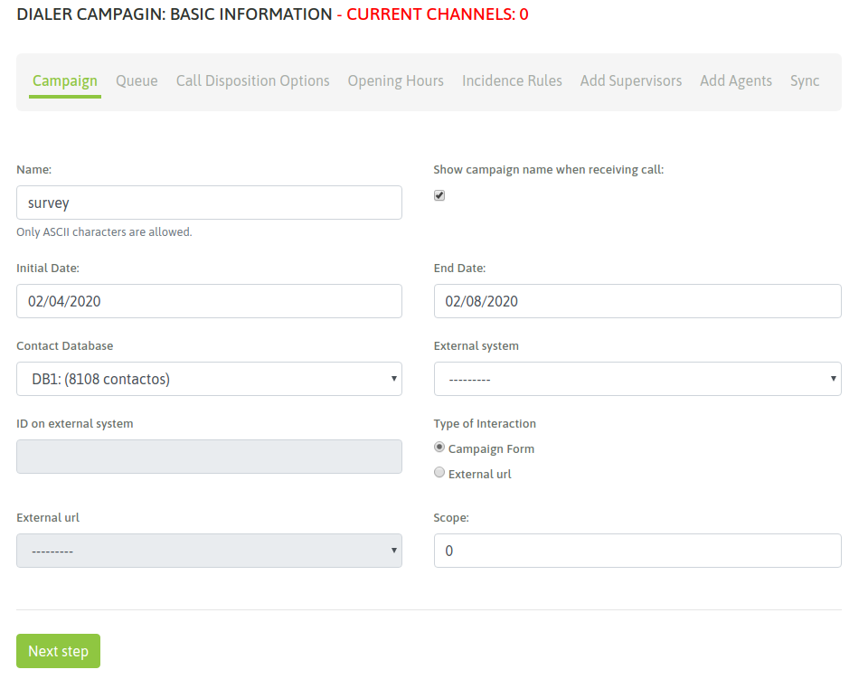
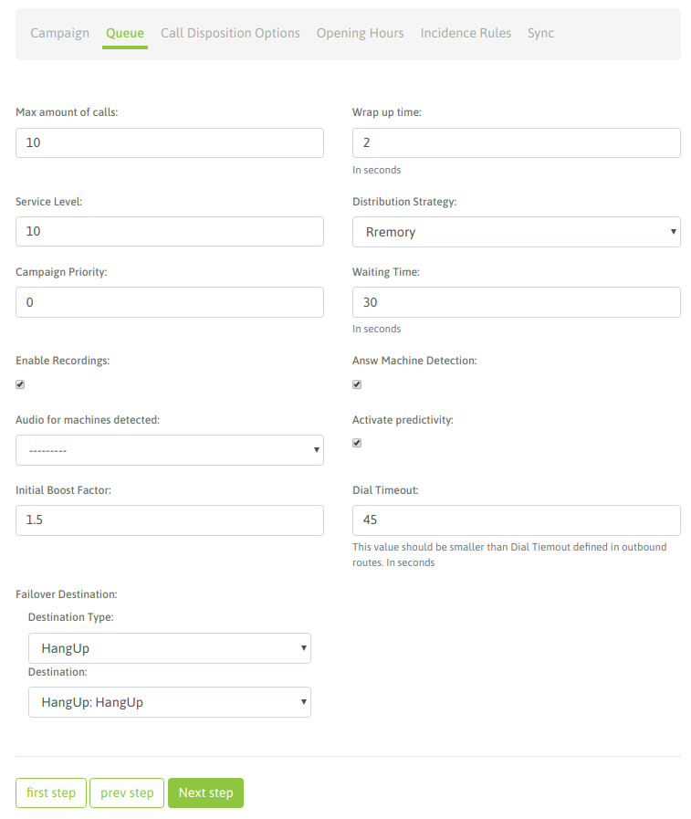
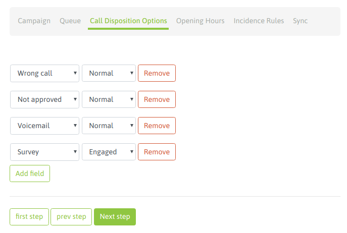
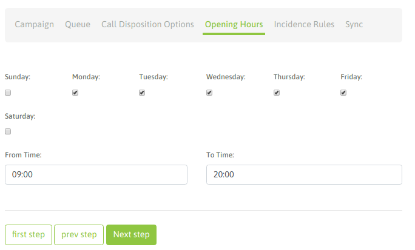
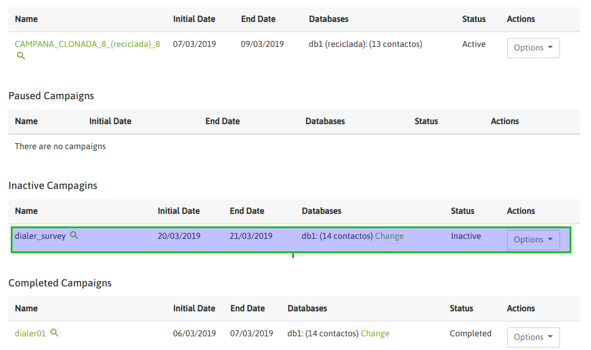
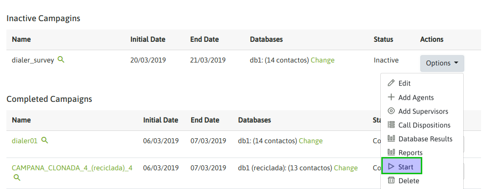
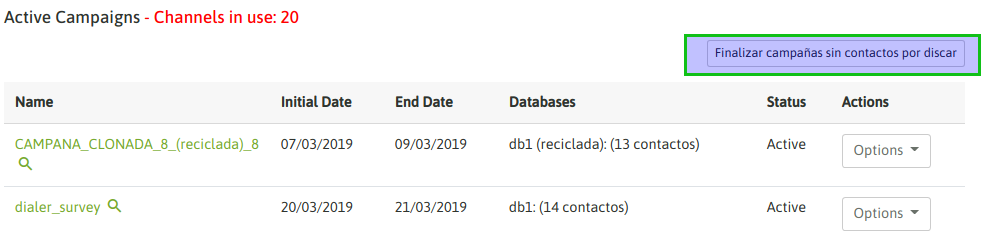
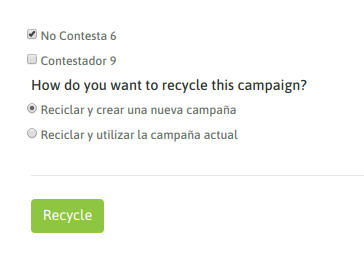
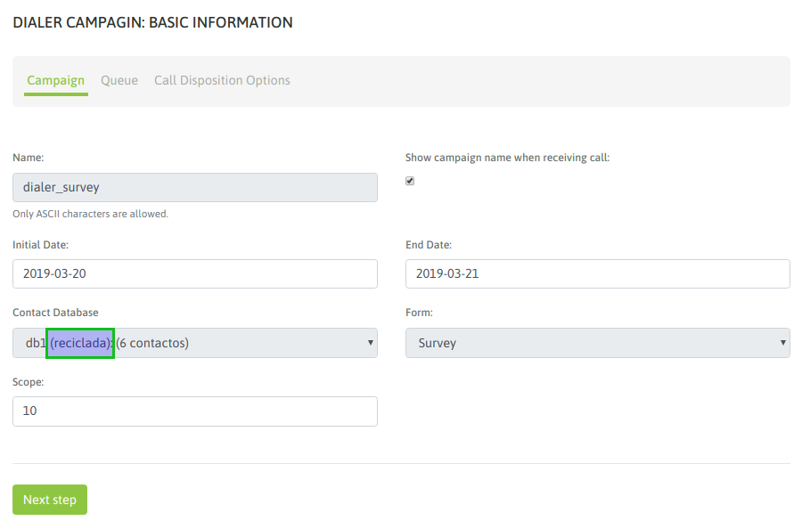
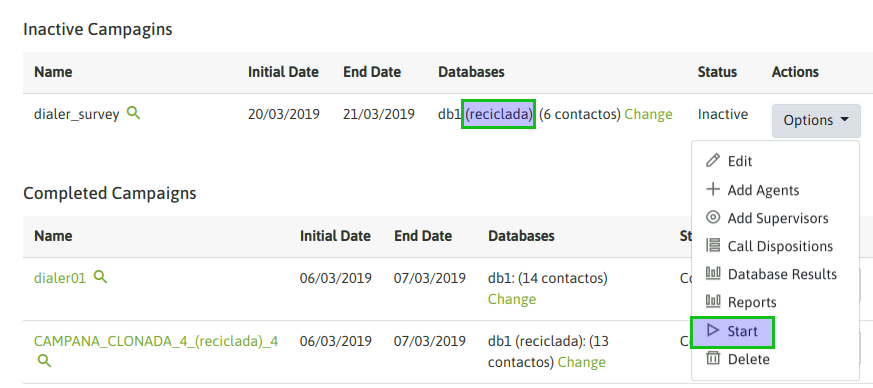

.. _about_dialercamp:

Presentación
*************

OMniLeads pone a disposición el concepto de *campañas con discado automático de llamadas*, a través de un discador predictivo.

.. important::

  No se provee la funcionalidad de discador automático dentro de las prestaciones del software, para este tipo de campañas está contemplada la integración con
  `Wombat Dialer <https://www.wombatdialer.com/>`_.  La utilización de ese software está supeditada a la adquisición de la correspondiente licencia con el
  fabricante del software.

Aclarado el tema del componente *engine dialer*, se procede con la explicación de los pasos necesarios a la hora de generar una campaña con discado predictivo.

Creación campaña dialer
************************

Ingresar al menú  **Campaigns -> Dialer Campaigns -> New Campaigns** en donde se despliegan una secuencia de etapas de configuración.

La primera pantalla luce como la figura 1.

*Figure 1: Campaigns parameters*

- **Name:** nombre de la campaña
- **Show campaign name whe reciving call:** se puede habilitar para que cada llamada conectada por el dialer al agente implique la notificación del nombre de la campaña asociada a dicha llamada.
- **Initial date:** es la fecha en la que, estando activa la campaña y con agentes conectados, comenzará a discar.
- **End date:** es la fecha en la que, estando activa la campaña y con agentes conectados, dejará de discar por más que queden números pendientes de marcar.
- **Contact database:** la base de contactos que el discador utilizará para tomar contactos y generar llamadas.
- **Type of interaction:** aquí se selecciona si la campaña va a utilizar un *formulario de campaña* o va a disparar una *solicitud-http* hacia un *sistema CRM externo*.
- **External URL:** URL (http-request) a disparar cada vez que el discador conecte una llamada hacia un agente.
- **External system:** sistema de gestión externo que se admite para lanzar acciones de *click to call o calificación* sobre contactos de la campaña.
- **ID on external system:**  este campo debe contener el ID que posee la campaña dentro del sistema de gestión externo desde el cual llegarán los *click to call* o *solicitudes de calificación*.
- **Outbound Routes:** Se le asigna una ruta saliente existente a una campaña.
- **CID on Outbound Routes:** Este campo debe contener el CID asignado para una ruta saliente existente a una campaña.
- **Scope:** se define como la cantidad de gestiones positivas que se esperan para la campaña. En la supervisión de la campaña se muestra en tiempo real el porcentaje de avence de la campaña respecto al objetivo definido.

Una vez completados estos campos, se debe dar click al botón "Next", para continuar con la configuración de nuestra campaña.

La siguiente pantalla se establecen más parámetros que modelan el comportamiento de la campaña, como lo expone la figura 2.

*Figure 2: Campaigns parameters*

- **Max amount of calls:** cantidad de llamadas que se permiten poner en cola de espera mientras se espera por la disponibilidad de un agente. Por encima de ese número, la llamada será enviada a la acción "failover".
- **Wrapup time:** es el tiempo de descanso (en segundos) que cada agente dispone entre cada llamada conectada por el discador.
- **Service level:** es un parámetro para medir cuántas de las llamadas fueron conectadas a un agente dentro de esa franja de tiempo (en segundos).
- **Distribution strategy:** método de distribución de llamadas que usará la campaña sobre los agentes. Para campañas salientes, se recomienda RRmemory.
- **Campaign priority:** Es un parámetro lineal en la escala del 1 al 10, que implica cuán importante son las llamadas de esta campaña respecto a otras. Establece prioridades para los agentes que trabajan en varias campañas en simultáneo. Si se deja el valor en “0” (por defecto) se mantiene una equidad con el resto de las campañas.
- **Waiting time:** es el tiempo (en segundos), que la llamada contactada quedará en cola de espera, aguardando que un agente se libere para conectarle la misma.
- **Enable recordings:** habilita que todas las llamadas de la campaña sean grabadas.
- **Detectar contestadores:** habilita la detección de contestadores automáticos.
- **Audio para contestadores:** se puede indicar la reproducción de un audio en caso que se detecte un contestador automático. Para que esté disponible el audio debe subirse previamente desde el menú Audios > Nuevo audio
- **Activar predictividad:** El discador ofrece una configuración que posibilita revisar estadísticas de efectividad de la campaña durante el desempeño de la misma. En función de esos resultados ir variando la cantidad de llamadas generadas por agente disponible de manera tal que se eviten los tiempos muertos entre cada llamadas asignada por el discador a cada agente.
- **Factor de boost inicial:** indica el valor por el cual se desea multiplicar el comportamiento de la predictividad. Por ejemplo: si el discador detectó que puede realizar tres llamadas en simultáneo porque es el resultado que le arroja la estadística de comunicaciones exitosas, colocando “2” en el factor de boost inicial se le pide al discador que duplique ese valor y realizará entonces seis llamadas a la vez.
- **Failover dst:** destino hacia el cual se enviarán las llamadas que hayan sido expiradas sin conectar con un agente (el tiempo de espera agotado).

Luego de completar todos los campos, se debe presionar el botón "Next".

En la siguiente pantalla se configuran las opciones de calificación, seleccionando del desplegable una a una las calificaciones que se utilizarán para las llamadas dentro de la campaña.
Además, se deberá indicar si se trata de una calificación de "Engaged" o de Gestión (la que dispara el formulario de campaña) o bien de una calificación "Sin Acción" que simplemente clasifica el contacto.

*Figure 3: Campaigns parameters - call dispositions*

Se guardan los cambios haciendo click en "Next" y llegamos a la configuración que determina cuáles días de la semana y dentro de cuáles horarios la campaña efectuará llamados (siempre dentro del rango de fechas establecidas en el primer paso de la creación de la campaña).

*Figure 4: Campaigns parameters - days and hours*

Se hace click en "Next" y en este caso se trabaja con las "reglas de incidencia", es decir bajo cuáles condiciones se reintentará contactar a números que dieron Ocupado, Contestador, No Contesta, Temporalmente fuera de cobertura, etc.

.. image:: images/campaigns_dialer_wizard5.png

*Figure 5: Campaigns parameters - days and hours*

Como se puede observar en la figura 5, los campos a completar permiten determinar cada cuántos segundos debe reintentarse la comunicación y cuántas veces como máximo se debe intentar según cada estado.

Los estados telefónicos que podrán reintentarse marcar automáticamente son:

- Ocupado.
- Contestador Automático detectado.
- Destino no contesta.
- Llamada rechazada (Rechazado): cuando la llamada no pudo ser cursada por problemas inherentes a la red telefónica externa.
- Timeout: cuando la llamada se contactó, se conectó pero ningún agente estuvo libre como para gestionar la misma.

Se hace click en "Next" para llegar al último paso de la creación de la campaña.

.. image:: images/campaigns_dialer_wizard6.png

*Figure 6: Campaigns parameters*

En este paso, simplemente se indican tres opciones:

- **Evitar duplicados:** seleccionar esta opción para evitar subir al discador registros con el teléfono principal duplicado.
- **Evitar sin teléfono:** seleccionar esta opción para evitar subir al discador registros de la base de contacto que no posean un teléfono principal.
- **Prefijo:** este campo sirve para indicar al discador si debe anteponer algún prefijo delante de cada número de la base de contactos a la hora de discar cada llamada de la campaña.

Por último, hacemos click en el botón "Finish" para concretar la creación de nuestra campaña.

Activación de campaña
**********************

La campaña recientemente creada figura en el estado de *Inactiva* (figura 7), dentro del listado de campañas predictivas.

*Figure 7: Inactive campaign*

El administrador debe activar la campaña manualmente.

*Figure 8: Activate camp*

Luego de activar nuestra campaña, automáticamente  pasamos a visualizarla en la sección de campañas activas (figura 9)

.. image:: images/campaigns_dialer_ready.png

*Figure 9: Active campaigns*

En el momento en que un agente asignado a nuestra campaña predictiva ingrese a la plataforma, mientras sea dentro del rango de fecha y horario activo de la campaña, entonces
el discador puede comenzar a generar llamadas y entregar éstas hacia los agentes activos en la campaña.

Finalización de campañas dialer
*******************************

Para determinar cuando una campaña predictiva está sin registros por marcar, se debe consultar el estado de la misma haciendo click en el nombre de la campaña (figura 10).

.. image:: images/campaigns_dialer_finish.png

*Figure 10: Campaign pending calls*

En caso de certificar que el valor *Llamadas pendientes* está en cero, se debe proceder con la finalización de la campaña, es decir dar click al botón en cuestión (figura 11).

*Figure 11: Finish dialer campaign*

La campaña pasa al listado de *Campañas finalizadas*.

Reciclado y rotación de bases de contactos
*******************************************

Cada vez que una campaña predictiva se queda sin registros por marcar en su base de contactos, entonces nuestra campaña se puede re-utilizar mediante dos posibilidades:

- **Reciclar la base de contactos**

Esta opción permite al administrador seleccionar contactos de la base con ciertas calificaciones efectuadas por agentes (sobre llamadas conectadas) así como también
calificaciones efectuadas por el discador (sobre llamadas no contactadas; ocupado, no contesta, voicemail, etc.), a la hora de formar un criterio para reciclar la base
de contactos de la campaña actual, para que el discador vuelva a llamar a los contactos que caigan dentro de las calificaciones indicadas en el reciclado.

Para reciclar una campaña finalizada, debemos seleccionar la campaña e ingresar a las opciones para seleccionar la opción *Recycle*

.. image:: images/campaigns_dialer_recycle1.png

*Figure 12: Campaing recycle*

Allí se despliegan dos opciones:

 - *Reciclar sobre la misma campaña*

 Es decir volver a marcar a los contactos seleccionados desde la misma campaña.

 - *Reciclar sobre una nueva campaña clon*

 Es decir volver a marcar a los contactos seleccionados, pero sobre una nueva campaña similar a la original y cuya base de contactos serán la resultante del reciclado.

Para completar el procedimiento se deben seleccionar *las calificaciones* que se deasean volver a llamar y luego pasar por las etapas de configuración de campañas
predictivas en caso de necesitar ajustar cualquier parámetro de configuración de la campaña reciclada.

*Figure 13: Recycle; call dispositions*

*Figure 14: Recycle campaigns parameters*

Al ejecutar el reciclado, la campaña se encuentra en estado de "Inactiva", por lo tanto resta activar la misma para que los contactos reciclados comiencen a ser marcados
por el discador.

*Figure 15: Recycle campaign activate*

- **Reemplazar la base de contactos**

Una campaña puede sustituir su base por otra nueva. Esto permite seguir operando con la misma campaña pero renovar la fuente de contactos a llamar.
De esta manera se sigue el historial de reportes, grabaciones y demás estadísticas en una misma campaña.

Para llevar a cabo un cambio de base, la campaña debe estar pausada o bajo el estado de "finalizada".
A partir de allí se indica la acción de "cambio de base" sobre la campaña en cuestión.

.. image:: images/campaigns_dialer_changedb.png

*Figure 16: database change*

Esto desplegará una pantalla similar a la expuesta en la siguiente figura 17.

.. image:: images/campaigns_dialer_changedb2.png

*Figure 17: database change*

.. important::

  La estructura de la base de contactos que se puede utilizar como sustituta debe ser similar a la base que se desea sustituir.

Una vez llevada a cabo la sustitución es necesario activar nuevamente la campaña.
