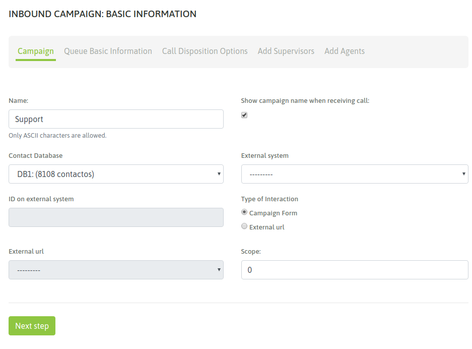
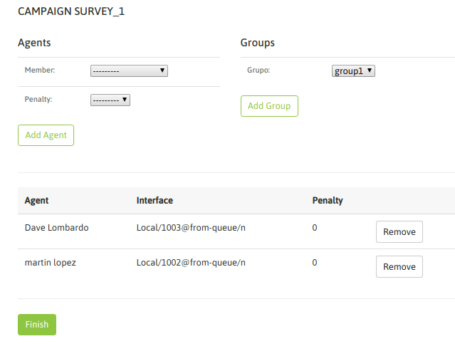
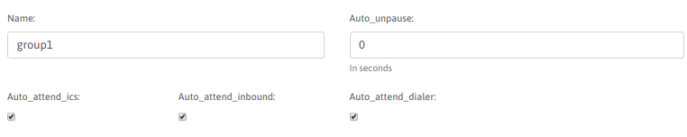

.. _about_inboundcamp:

******************
Campañas entrantes
******************

Cómo crear una nueva campaña
****************************

Para crear una nueva campaña, se debe ir a Campaña → Campañas Entrantes → Nueva campaña.

Se debe completar la primera pantalla del wizard, como lo expone la figura 1.

*Figure 1: Campaigns parameters*

- **Name:** nombre de la campaña.
- **Contact database:** (campo opcional) se utiliza para desplegar datos a partir del número de teléfono que realiza la llamada entrante al sistema.
- **Campaign form:** campo de selección del formulario que se desplegará cada vez que un agente califique un contacto con la calificación "de gestión".
- **External URL:** URL a disparar cada vez que el agente lo indique.
- **Enable recordings:** habilitar que todas las llamadas de la campaña sean grabadas.
- **Scope:** se define como la cantidad de gestiones positivas que se esperan para la campaña. En la supervisión de la campaña se muestra en tiempo real el porcentaje de avence de la campaña respecto al objetivo definido.

**Nota 1:** El tema de la base de contactos en las campañas entrantes (y también manuales) plantea un escenario flexible, ya que es Opcional el asignar una base de contactos a este tipo de campañas.
En este caso, la base de contactos es utilizada si deseamos que cada vez que un contacto realice una comunicación entrante, en base a su “callerid” poder recuperar los datos del mismo, si es que se encuentra registrado el teléfono desde donde llama, dentro de la base de contactos asociada a la campaña.

Para continuar se debe hacer click en “Paso Siguiente” y avanzar con los campos de la segunda pantalla.

.. image:: images/campaigns_in_wizard2.png

*Figure 2: Campaigns parameters*

- **Ring time:** es el tiempo (en segundos) que el teléfono de la consola de agente sonará alertando una nueva llamada.
- **Agent callback time:** es el tiempo (en segundos) que la llamada quedará en la cola de espera, hasta volver a intentar conectarla con otro agente disponible.
- **Welcome message:** permite definir si se reproducirá algún audio sobre la llamada entrante, al ingresar a la cola de espera de nuestra campaña. Para que esté disponible en el selector desplegable debe cargarse previamente el archivo desde el menú "Audios".
- **Max amount of calls:** es el número de llamadas que se permiten poner en cola de espera. Por encima de ese número, la llamada será enviada a la acción “failover”.
- **Service level:** es un parámetro para medir cuántas de las llamadas fueron contestadas dentro de esa franja de tiempo. El valor se expresa en segundos.
- **Distribution strategy:** método de distribución de llamadas que usará la campaña sobre los agentes. Para campañas salientes, se recomienda RRmemory.
- **Campaign priority:** Es un parámetro lineal en la escala del 1 al 10, que implica cuán importante son las llamadas de esta campaña respecto a otras. Establece prioridades para los agentes que trabajan en varias campañas en simultáneo. Si se deja el valor en “0” (por defecto) se mantiene una equidad con el resto de las campañas.
- **Tiempo de espera en cola:** es el tiempo (en segundos), que la llamada contactada quedará en cola de espera, aguardando que un agente se libere para conectarle la misma.
- **Enable recordings:** se debe tildar este check en caso de requerir que los llamados sean grabados.
- **Periodic Announcement:** podemos seleccionar algún audio de nuestro repositorio para reproducir como un anuncio periódico sobre la llamada en espera.
- **Announcement frequency:** cantidad de segundos entre cada reproducción de un anuncio periódico.
- **Failover dst:** destino hacia el cual se enviarán las llamadas que hayan sido expiradas (superó el tiempo de espera asociado).

**Nota 2:** Los parámetros Ring time y Agent callback time, quedan sin efecto en las llamadas que reciban agentes donde su grupo está configurado el atributo de "auto-atención" de llamadas entrantes.

En la tercera pantalla se deben asignar las calificaciones que se requieran para que los agentes úedan clasificar cada llamada de contacto.

.. image:: images/campaigns_in_wizard3.png

*Figure 3: Campaign dispositions*

Finalmente, los agentes pueden ser asignados a la campaña.

*Figure 4: agent assignment*

En el resto del capítulo se detalla todo acerca del enrutamiento de las llamadas desde los vínculos troncales hacia nustras campañas entrantes.

Ringing VS Atención automática de llamadas entrantes
****************************************************
El comportamiento del Webphone del agente frente a una llamada proveniente de una campaña entrante puede ser:

- **Ringing normal** y con una duración asociada al parámetro "Ring time" presente en la creación de la campaña entrante. Durante ese tiempo el teléfono del agente notifica la llamada entrante, aguardando la acción del agente que determine la atención o no de la llamada.

- **Atención automática de la llamada**. Este comportamiento implica que cada llamada entrante enviada a un agente sea atendida automáticamente por el teléfono del agente notificando a éste con un "beep" antes de dejarlo definitivamente en linea con la contraparte de la llamada.

Dicho comportamiento depende de la configuración a nivel "Grupo de Agentes" que posea el agente vinculado a la campaña entrante. Entonces si el grupo tiene activada la Atención Automática de llamadas entrantes, el agente responderá de dicha manera ante cada llamada entrante de cualquier campaña, quedando
sin efecto los parámetros "Ring time" y "Agent callback time" como se mencionó en la "Nota 2" de esta sección.

*Figure 5: agent group config*
