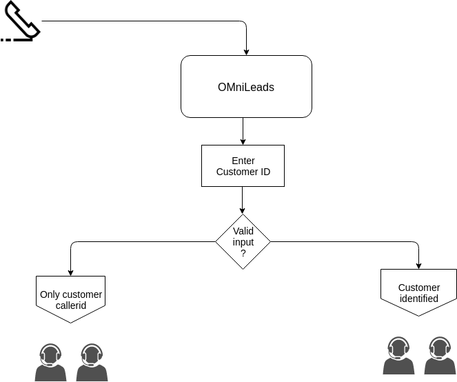
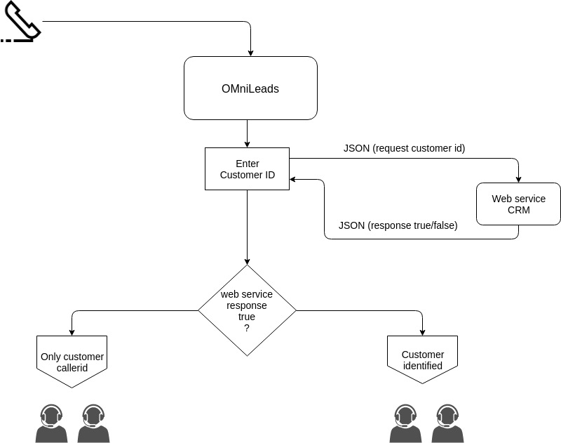
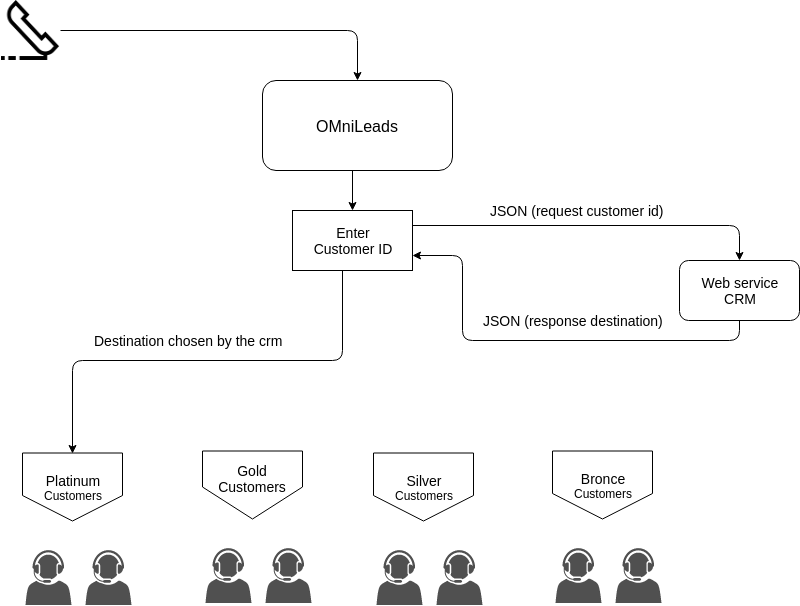
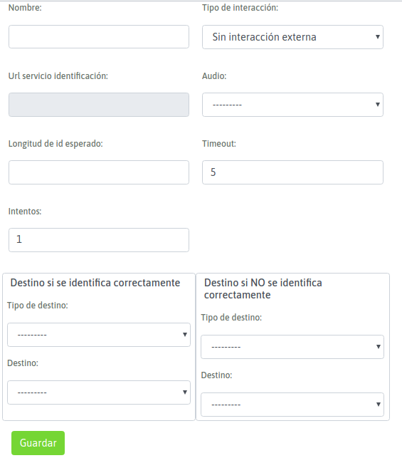

.. _about_customer_id:

*************************************
Identificación de llamada entrante
*************************************

**INTRODUCCIÓN**

Dentro del flujo de una llamada entrante se puede añadir un nodo con la funcionalidad de *identificación de clientes*.
Es decir lanzar una *solicitud de identificación* sobre cada llamada entrante procesada, implementando a su vez la posibilidad de consultar
al un sistema de gestión CRM externo y aguardar que éste último determine una decisión de encaminamiento de las llamadas entrantes provenientes
del exterior a través de una interacción entre OMniLeads y dicho sistema de gestión.

En su funcionamiento más básico el módulo implementa la posibilidad de solicitar la identificación de un cliente que se ha comunicado a
la compañía mediante el ingreso de tonos del teléfono *DTMF*, luego se comprueba si se ha ingresado algún valor y finalmente se envía la llamada
hacia un destino concreto en caso positivo, y hacia otro destino si el resultado fue negativo. Si la configuración involucra interacción
con CRM, entonces el módulo envía el *numero ingresado* por el cliente hacia el CRM y espera por una respuesta de éste mismo, para
decidir hacia donde encaminar la llamada.

En ambos escenarios (modo básico y modo interactivo con CRM), se consigue que la llamada ingrese al Agente con el *ID del cliente* como
índice para obtener toda la información del cliente y desplegarlo en la pantalla de agente (ya sea sobre la vista de contacto o en el CRM externo
configurado para la campaña).

El módulo permite tres modos de funcionamiento:

Solamente solicitar identificación
************************************

Bajo esta configuración cuando una llamada entrante es enviada hacia este nodo, se lanza una solicitud de identificación a través de un
audio reproducido sobre el canal telefónico del cliente que originó la llamada, para luego simplemente validar si el cliente ingresó
o no un valor y así tomar una decisión de encaminamiento hacia las dos alternativas posibles; *destino  A* si se ha ingresado una
identificación o *destino B* si el llamante no lo hizo.

*Figure 1: Customer id without CRM interaction*

Solicitar identificación, notificar al CRM y aguardar respuesta *true / false*
********************************************************************************

Bajo esta configuración cuando una llamada entrante es enviada hacia este nodo, se lanza una solicitud de identificación a través de un
audio reproducido sobre el canal telefónico del cliente que originó la llamada, para luego lanzar una consulta hacia un servicio web (CRM)
previamente configurado.

*Figure 2: Customer id with CRM interaction true/false*

Aquí el sistema de gestión CRM toma partido en lo que respecta al encaminamiento de los clientes que llaman a la compañía, ya que a partir de recibir
desde OMniLeads la *clave de identificación del llamante*, el CRM debe responder al *request* recibido con una respuesta del tipo
*true / false*, por lo cual OMniLeads luego debe encaminar las llamadas hacia cada uno de los dos posibles destinos previamente configurados
*destino A* si el CRM devuelve *true* o *destino B* si el CRM devuelve *false*.

Un ejemplo podría ser el de una compañía que comprueba si el "número de cliente" se encuentra al día con los pagos del servicio y en base a ello
encaminar la llamada hacia una campaña con mayor o menor prioridad en términos de tiempo de espera en cola.

Solicitar identificación, notificar al CRM y aguardar respuesta *destino de la llamada*
***************************************************************************************

Bajo este modo, cuando una llamada entrante invoca la ejecución del nodo, éste último procede con la solicitud de identificación para luego
validar si el cliente ingresó o no un valor, en caso de haber ingresado se ejecuta una consulta hacia un servicio web (CRM) previamente configurado.

*Figure 3: Customer id with interaction and destination chosen by CRM*

El sistema de gestión CRM toma partido respecto al encaminamiento de un cliente que llama a la compañía, ya que a partir de recibir
de OMniLeads en tiempo real la *clave de identificación del llamante*, éste debe responder al *request* recibido con una respuesta
que contenga el nodo destino de OMniLeads hacia donde encaminar las llamadas, siendo posibles una campaña entrante, un IVR, una validación de tiempo,
un destino personalizado, etc.

Un aplicación de esta funcionalidad podría ser, notificar al CRM acerca del *número de cliente* ingresado y que éste último decida hacia qué campaña
entrante de OMniLeads enviar la llamada, utilizando como criterio que plan de suscripción tiene contratado ese *número de client*.

.. _about_customer_id_form:

Crear un nuevo punto de solicitud de identificación de clientes
*****************************************************************

Para generar un nuevo nodo, se debe acceder al punto de menú: "Telefonía - Identificación de clientes"

*Figure 4: New customer id node*

A continuación se detallan los campos del formulario:

+----------------------+------------------------------------------------------------------------------------------------+
| Campo                | Descripción                                                                                    |
+======================+================================================================================================+
|Nombre                | Nombre de referencia del nodo                                                                  |
+----------------------+------------------------------------------------------------------------------------------------+
|Tipo de interacción   | * Sin Interacción: solo se comprueba si hubo o no un ingreso y su logitud                      |
|                      | * Interacción externa tipo 1: se envía id de cliente y se espera "true/false" como respuesta   |
|                      | * Interacción externa tipo 2:se envía id de cliente y se espera un destino como respuesta      |
+----------------------+------------------------------------------------------------------------------------------------+
|URL servicio ident    | Aquí se indica la dirección del servicio web hacia donde enviar el número de identificación    |
+----------------------+------------------------------------------------------------------------------------------------+
|Audio                 | Se trata del audio que se reproduce sobre la llamada entrantes, para solicitar                 |
|                      | la identificación                                                                              |
+----------------------+------------------------------------------------------------------------------------------------+
|Logitud id esperado   | Se puede indicar el largo esperado de código de identificación                                 |
+----------------------+------------------------------------------------------------------------------------------------+
|Timeout               | El tiempo en segudos que el sistema espera a que se ingrese la identificación, en caso de      |
|                      | expirar este tiempo, se comprueba si ya se han sobrepasados la cantidad de re-intentos para    |
|                      | y así ejecutar una nueva petición o derivar la llamada hacia el destino no exitoso             |
+----------------------+------------------------------------------------------------------------------------------------+
|Retries               | La cantidad de intentos erróneos que se permiten al ingresar la identificación                 |
+----------------------+------------------------------------------------------------------------------------------------+
|Destino Identificación| Tipo de destino y destino puntual para dicho tipo al que se derivan las llamadas "positivas"   |
|exitosa               | en los tipo de interacción "sin interacción" e "interacción tipo 1"                            |
+----------------------+------------------------------------------------------------------------------------------------+
|Destino Identificación| Tipo de destino y destino puntual para dicho tipo al que se derivan las llamadas "negativas"   |
|no exitosa            | en los tipo de interacción "sin interacción" e "interacción tipo 1"                            |
|                      |                                                                                                |
+----------------------+------------------------------------------------------------------------------------------------+

.. important::

  Para poder implementar los modos que implican enviar la identificación hacia un servicio web externo, aguardando una respuesta
  del mismo para luego ejecutar el encaminamiento de la llamada, depende de que el sistema de gestión implemente un servicio web
  para recibir las peticiones de este tipo.

  Para los desarrolladores que deseen habilitar en el sistema de gestión este tipo de interacción, pueden encontrar formato en que OMniLeads
  envía la identificación hacia el servicio web en la siguiente sección  :ref:`about_customer_id_request`.

.. _about_customer_id_request:

Solicitud de enrutamiento hacia el sistema CRM externo
**********************************************************

Esta interacción implica que OMniLeads ejecute una solicitud HTTP-POST (plain/text) hacia el URL del sistema de gestión especificado dentro
del módulo :ref:`about_customer_id_form`, osea en la definición de un nodo "identificación de clientes".

Este POST enviado hacia el sistema de gestión CRM tiene el siguiente aspecto

.. image:: images/api_customerid_post.png

Como podemos observar el "User-Agent" debe llegar como "OMniLeads" y en el cuerpo del Post el número de identificación ingresado en la llamada se envía como "idContact".

**Respuesta que debe generar el servicio web del sistema de gestión CRM**

El servicio recibe de OMniLeads el request HTTP-Post con el número de identificación del cliente y debe generar una respuesta a dicha solicitud.
El sistema tiene la posibilidad de generar tres tipos de respuestas:

* **true**
* **false**
* **X,Y**: donde "X" es un número entero y corresponde con el tipo de destino hacia a donde enviar la llamada identificada e "Y" es el destino puntual para ese tipo de destino. Por ejemplo (1,3) indica que la llamada será enrutada hacia una campaña entrante (1) y puntualmente hacia la campaña entrante cuyo id es (3). La clave asociada a la respuesta es "response"

El formato de respuesta debe ser "JSON".

* Respuesta JSON

  ::

   Content-Type: application/json
   HTTP/1.1 200 OK

    {
      "status": "ok",
      "destination": "value"
    }

Donde "status" puede ser *ok* o *fail* y "destination" podrá ser cualquiera de las 3 respuestas especificadas arriba.

.. important::

  El sistema debe respetar el formato y nombre de parámetros (status y destination)

En caso de generar una respuesta con el destino del enrutamiento, se deben conocer los tipos de destino:

* 1: Campaña entrante
* 2: Condicional basado en tiempo
* 3: IVR
* 5: Hangup de la llamada
* 9: Solicitud de identificación

En un futuro se implementará un endpoint de la API para listar cada destino posible por cada tipo de destino. Mientras tanto, el desarrollador que desee implementar el enrutamiento de llamadas basado en la identificación ingresada en la llamada y el request generado desde OMniLeads, podrá ingresar a la interfaz de OMniLeads y en cada módulo (tipo de destino) listar los mismos y observar el id.

**Ejemplo de respuesta con destino de llamada**: se desea validar cada id enviado desde OMniLeads y responder con dos posibles tipos destinos de enrutamiento. Por un lado una campaña entrante llamada "clientes gold" y otra llamada "clientes bronce".

Para ello suponemos que existen las dos campañas entrantes como se indica en la figura.

.. image:: images/api_customerid_choice_dst_1.png

Tan solo con posicionar el mouse sobre el nombre de la campaña, podremos dilucidar el "id" particular de cada una.

Por lo tanto, a partir de conocer los "id" de cada campaña el sistema de gestión a partir de su lógica de negocio, podrá evaluar cada llamada e indicar a OMniLeads hacia donde encaminarla devolviendo el par "X,Y".
