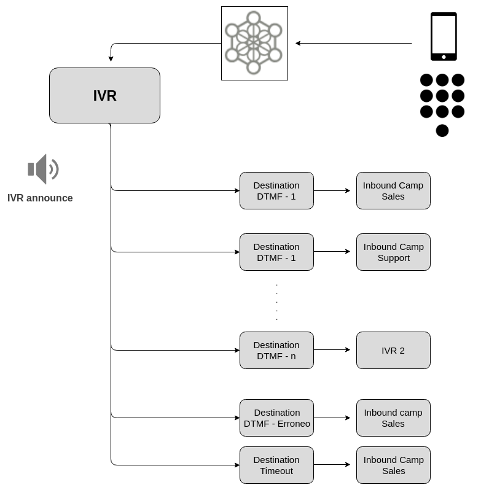
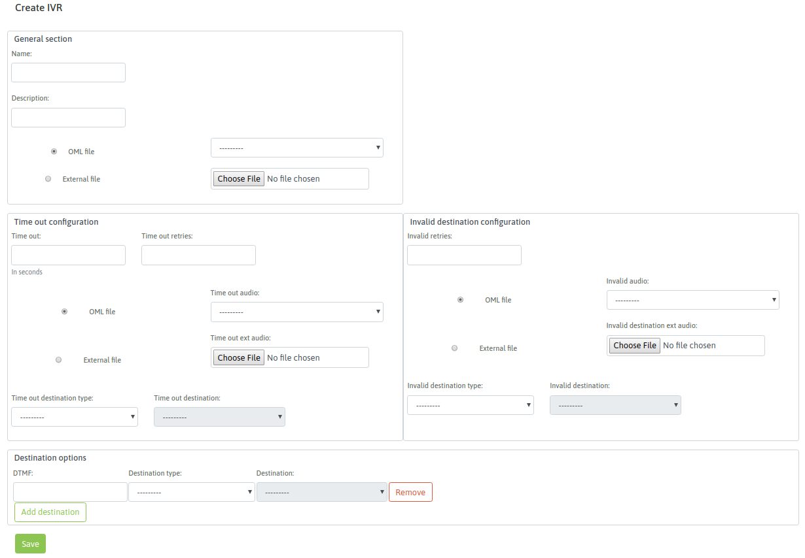

.. _about_ivr:

********************************
IVR - Interactive Voice Response
********************************

Los IVRs hacen posible que la persona que realiza una llamada entrante pueda seleccionar un destino apropiado en base a informar los mismos a través de una grabación y aguardando la interacción a través de los tonos de teclado DTMF.
Con esta herramienta un adminitrador puede enrutar llamadas entrantes hacia un IVR y configurar el mismo para que diferentes DTMFs se conmuten hacia diferetentes campañas entrantes, IVRs o Condicionales de fecha y hora.

*Figure 1: IVR - Interactive Voice Response*

Para generar un nuevo IVR se necesita como mínimo un audio a reproducir (disponible en la biblioteca de audios) y además un destino por defecto hacia a donde enviar la llamadas que pasen por nuestro IVR.

Para añadir un IVR se debe acceder al punto de menú *Telephony -> IVR*, seleccionar Agregar IVR.

Se despliega una pantalla similar a la Figura 1.

*Figure 2: IVR parameters*

El formulario se puede dividir en tres secciones. En la primera contiene los campos:

- **Nombre:** es el nombre del objeto, con este nombre se lista en el listado de IVR.
- **Descripción:** campo opcional dedicado un comentario aclaratorio sobre el objeto.
- **Archivo de OML:** se selecciona esta opción en caso de querer seleccionar como audio principal del IVR, un archivo previamente subido por el módulo de Audios.
- **Archivo externo:** se selecciona esta opción en caso de querer seleccionar como audio principal del IVR, un archivo y subirlo en el mismo instante al sistema.

Luego sigue las secciones para configurar acciones de timeout y opciones inválidas.

- **Time out:** es la cantidad de segundos que se aguarda a que el “llamante” introduzca un DTMF a partir de la finalización de la reproducción del audio del IVR.
- **Time out retries:** son la cantidad de intentos que el IVR ofrece al “llamante” a la hora de dar falla por “timeout”. Es decir se permite una cierta cantidad de intentos fallidos por timeout, para luego ejecutar la acción de timeout por defecto (Tipo de destino time out).
- **Time out audio:** cada vez que se da un timeout por no ingreso de DTMF, se puede reproducir un audio subido previamente al módulo de audio de OML, que indique el error.
- **Time out ext audio:** cada vez que se da un timeout por no ingreso de DTMF, se puede reproducir un audio que se puede seleccionar y subir en el momento, que indique el error.
- **Tipo de destino time out:** en caso de cumplire la cantidad de “retries” de timeout, la llamada es enviada por el IVR hacia el tipo de destino por defecto para los timeout de IVR. En este campo se indica dicha clase de destino.
- **Destino time out:** finalmente se selecciona puntualmente el objeto dentro de la familia de tipo de destino.

- **Invalid retries:** son la cantidad de intentos que el IVR ofrece al “llamante” a la hora de dar falla de destino ingresado inválido. Es decir se permite una cierta cantidad de intentos fallidos por opción inválida, para luego ejecutar la acción de opción inválida, por defecto (Tipo de destino invalid).
- **Invalid audio:** cada vez que se da un ingreso de opción inválida, se puede reproducir un audio subido previamente al módulo de audio de OML, que indique el error.
- **Invalid ext audio:** cada vez que se da un ingreso de opción inválida, se puede reproducir un audio que se puede seleccionar y subir en el momento, que indique el error.
- **Tipo de destino opción incorrecta:**  en caso de cumplire la cantidad de “retries” de opción incorrecta, la llamada es enviada por el IVR hacia el tipo de destino por defecto para los ingresos de opciones incorrectas del IVR. En este campo se indica dicha clase de destino.
- **Destino para opción incorrecta:** finalmente se selecciona puntualmente el objeto dentro de la familia de tipo de destino.

Finalmente la tercera sección despliega tantas filas como opciones de DMTF implique el IVR.
Por cada fila, se puede asignar un DTMF a un destino de conmutación de la llamada.

Como bien se conoce, la idea es seleccionar un “tipo de destino” y un “destino particular dentro del tipo”, para cada DTMF del IVR que se brinda como opción.

Finalmente al seleccionar el botón guardar, se dispondrá del IVR.

 .. note::
  Es posible anidar un IVR dentro de otro.
