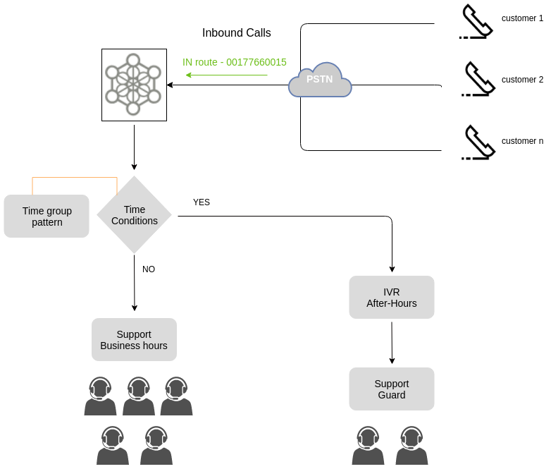

.. _about_timeconditions:

********************************************
Enrutamiento condicionado por fechas y horas
********************************************

OMniLeads permite configurar el enrutamiento de llamadas entrantes hacia diferentes destinos internos a partir de comparar la fecha/hora en que se procesa una llamada y un patrón configurado, de manera tal que se pueda planificar de antemano
si una llamada debe ir hacia un destino u otro basandonos en dicha comparación.

Por ejemplo una llamada podria ir hacia una campaña entrante "en fechas y horas de atención al cliente" y hacia un IVR fuera de ese rango definido.

Cada elemento de este tipo generado, puede ser invocado por otros como el destino de:

- una ruta entrante
- una opción de un IVR
- el failover de una campaña entrante
- otro elemento similar

*Figure 1: Time conditions*

Para llevar a cabo este tipo de configuiraciones se disponen de dos módulos que trabajan juntos.

- **Grupos horarios**

Este módulo permite agrupar patrones de fechas y horas así también como fechas y horarios puntuales dentro de un elemento interno de OMniLeasds, para luego puede ser invocado por los condicionales de tiempo, módulo complementario que permite realizar un enrutamiento comparando la fecha/hora de la llamada con la de un grupo de éstos.
Para definir o editar grupos de horarios, se debe acceder al punto de menú **Telefonía -> Grupos horarios**. Para añadir un nuevo grupo se debe presionar el botón "Agregar nuevo grupo".

La pantalla de grupos horarios se expone en la figura 2.

.. image:: images/campaigns_in_tc1.png

*Figure 2: Time groups*

Una vez generados los *Grupos de tiempos* podemos invocarlos desde el módulo complementario *Condicionales de tiempos*

- **Validaciones de tiempo**

Este módulo permite comparar la fecha y hora en el momento de procesar una llamada, con un grupo horario asignado como patrón de comparación. Luego en base a la coincidencia o no con alguna franja de fecha/hora del grupo, la llamada se envía hacia el destino positivo o negativo de la comparación.

Para generar un elemento Condicional de tiempo, se debe acceder a **Telephony -> Time conditions**

La pantalla de configuración es similar a la figura 3.

.. image:: images/campaigns_in_tc2.png

*Figure 3: Time conditions*

Finalmente tenemos disponible este elemento de enrutamiento para ser utilizado por ejemple como destino de una ruta entrante.
