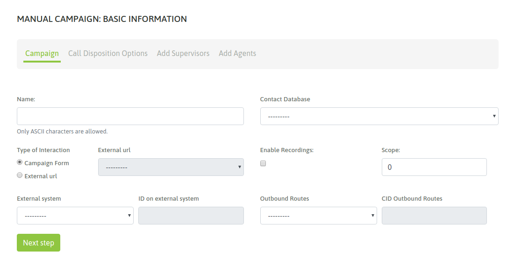
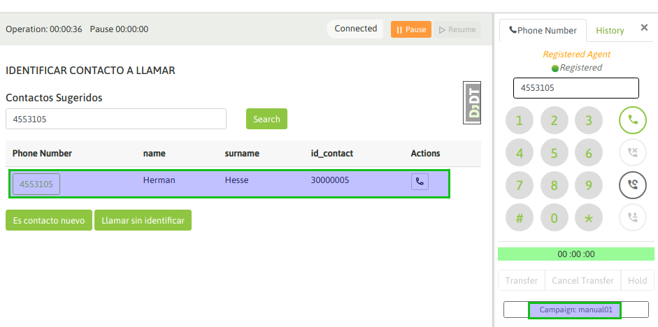
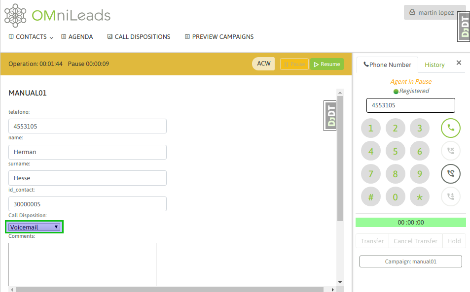
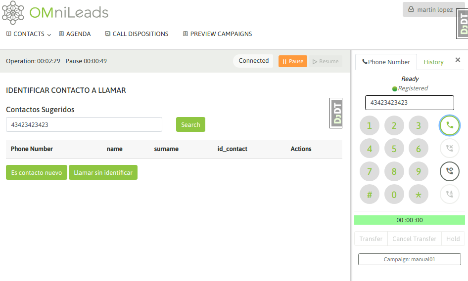
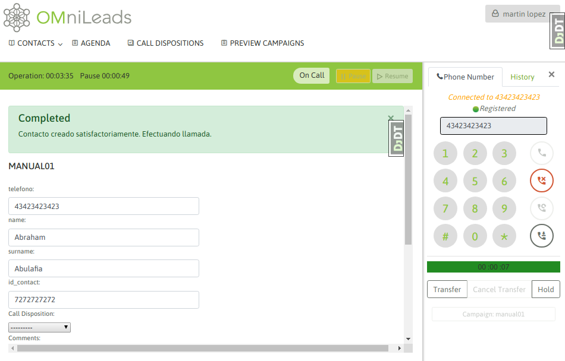

.. _about_manualcamp:

Creación campaña manual
************************

Para crear una nueva campaña manual se debe ingresar al punto de menú *Manual Campaigns -> New  Campaign*. El proceso de creación consta de
un wizard de dos pantallas.

La primera pantalla nos invita a indicar una serie de parámtros de la campaña, como lo indica la figura 1.

*Figure 1: Campaigns parameters*

- **Name:** nombre de la campaña
- **Contact database:** se utiliza para desplegar datos extras al teléfono a la hora de ejecutar una llamada a un contacto de la campaña.
- **External system:** aquí se adjudica el sistema de gestión externo que ejecutaría "click to call" sobre la campaña, en caso de así desearlo.
- **ID on external system:**  este campo debe contener el ID que posee la campaña dentro del sistema de gestión externo desde el cual llegarán los *click to call* o *solicitudes de calificación*.
- **Type of interaction:** indica si la campaña va a operar con formularios de OMniLeads o bien va a ejecutar una invocación hacia un CRM por cada llamada conectada.
- **External URL:** en caso de haber seleccionado la invocación a un URL externo en cada llamada, aquí se indica cual de los CRMs definidos debe invocar la campaña.
- **Enable recordings:** habilitar la grabación de todas las llamadas que se cursen por la campaña.
- **Scope:** se define como la cantidad de gestiones positivas que se esperan para la campaña. En la supervisión de la campaña se muestra en tiempo real el porcentaje de avence de la campaña respecto al objetivo definido.

.. note::
  El tema de la base de contactos en las campañas manuales (y también entrantes) plantea un escenario flexible, ya que es Opcional el hecho de asignar una base de contactos
  a este tipo de campañas. En este caso, la base de contactos es utilizada si deseamos que cada vez que un agente marca un teléfono que corresponde con un contacto
  de la base, se puedan recuperar los datos (columnas extras al teléfono) del mismo. Además el hecho de trabajar con una base de contactos en una campaña manual
  permite calificar cada contacto llamado.

En la segunda pantalla se deben asignar las calificaciones que se requieran para que los agentes puedan clasificar cada llamada realizada al contacto. Como se puede apreciar
en la figura 2, en nuestro ejemplo manejamos dos calificaciones que disparan dos formularios diferentes.

.. image:: images/campaigns_calldispositions_add.png

*Figure 2: Call dispositions*

En los siguientes pasos se pueden añadir supervisores y agentes a nuestra campaña.

.. image:: images/campaigns_manual_wizard_3.png

*Figure 3: agent assignment*

Interacción de agente con campaña
*********************************

Finalmente contamos con nuestra nueva campaña manual. cuando un agente asignado a la misma realice un login a la plataforma y comience a marcar llamadas desde
su webphone, el sistema le permitirá seleccionar la campaña sobre la cual va a asignar cada llamada manual generada desde el webphone, tal como se expone
en la figura 4.

.. image:: images/campaigns_manual_agconsole1.png

*Figure 4: Manual call camp selection*

Cuando un agente se encuentra online y marca un teléfono correspondiente a un contacto de la base de la campaña, el contacto cuyo teléfono coincide con el teléfono marcado por el agente
es desplegado como contacto a seleccionar y así desplegar sus datos en la pantalla de agente, también se permite generar un nuevo contacto. Entonces el agente puede o bien confirmar que la llamada se dispara hacia
el contacto listado o sino también crear un nuevo contacto y marcarlo.
Los datos (extras al teléfono) del contacto son desplegados en la pantalla de agente

*Figure 5: Contact selection*

Si se selecciona llamar al contacto listado, entonces los datos del mismo son desplegados en pantalla, como lo expone la figura 6.

.. image:: images/campaigns_manual_agconsole3.png

*Figure 6: Contact data*

De esta manera el agente puede asignar una calificación sobre el contacto llamado; figura 7.

*Figure 7: call disposition for contact*

Por otro lado, si el teléfono marcado no corresponde a ningún contacto de la base entonces el sitema permite al agente buscar el contacto en la base o generar un nuevo contacto. En caso de tratarse
de una campaña sin base de contactos, entonces cada llamado que realice un agente implica que se genere el contacto asociado a la llamada marcada (figura 8 y 9).

*Figure 8: new contact add to campaign database 1*

.. image:: images/campaigns_manual_agconsole6.png

*Figure 9: new contact add to campaign database 2*

Entonces al momento de marcar a un número que no devuelva un contacto, el agente pasará por una vista en la que primero el agente debe añadir el contacto como un registro de la base de la campaña para luego marcar.
Finalmente se despliegan el nuevo contacto y la opción de clasificar la llamada con alguna calificación (figura 10).

*Figure 10: new contact called*

Campaña con base de datos Multinum
***********************************

Como sabemos, OMniLeads admite que cada contacto de una base posea "n" números de teléfono de contacto, de manera tal que si el contacto no es encontrado en su número principal
(el primero de nuestro archivo CSV de base), pueda ser contactado a los demás números. En este caso, cada número de teléfono (que indicamos en la carga de la base) se genera
como un link dentro de los datos del contacto presentados sobre la pantalla de agente. Al hacer click sobre dicho link, se dispara una llamada hacia ekl número de teléfono extra
del contacto. En la figura 11 se muestra dicho escenario.

.. image:: images/campaigns_prev_agconsole3.png

*Figure 11: Multinum contact database*

Por lo tanto, el agente puede intentar contactar a todos los números disponibles como "link" en la ficha del contacto, hasta finalmente calificar y pasar a uno nuevo.
