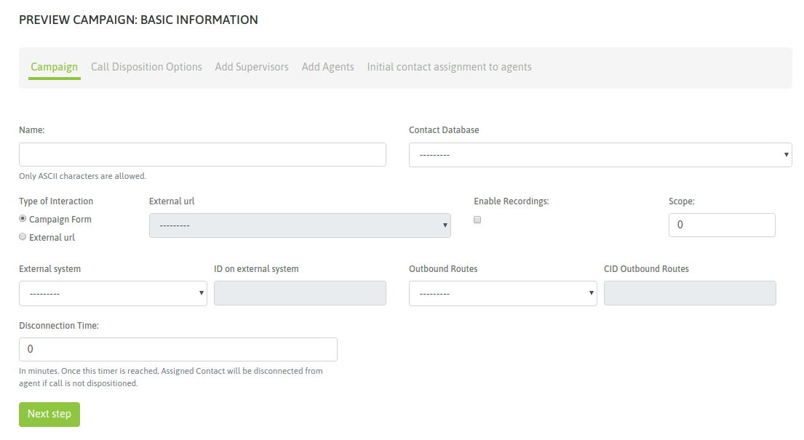
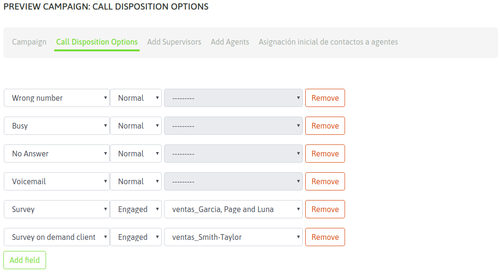
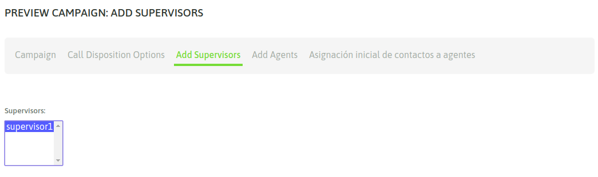
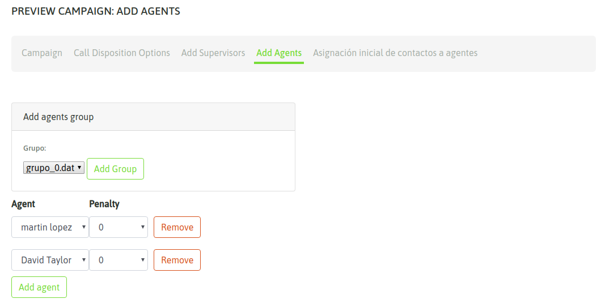
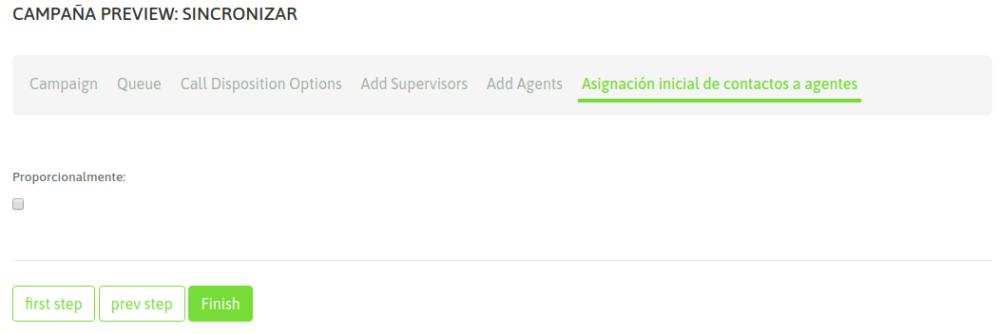
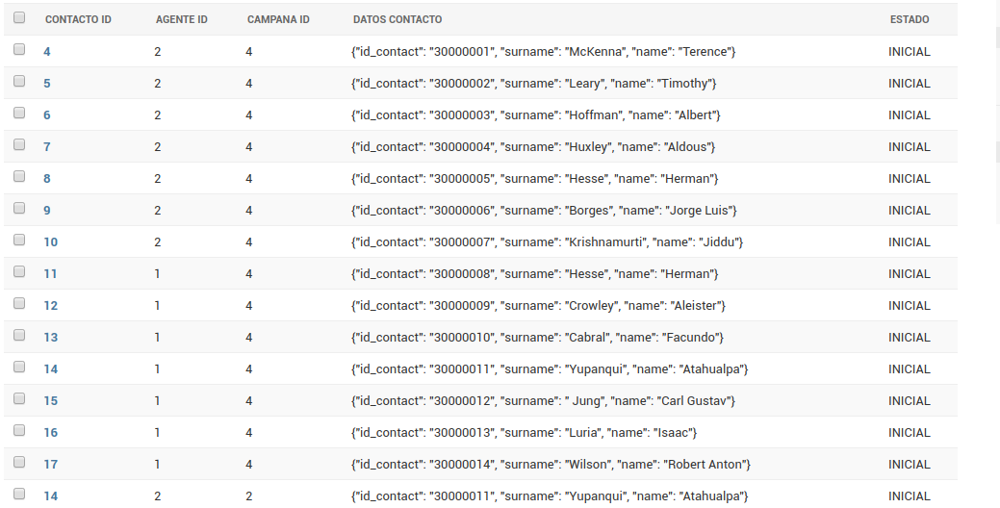
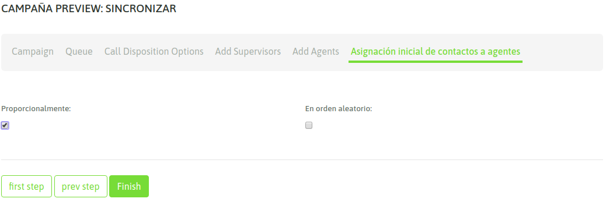
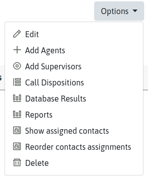
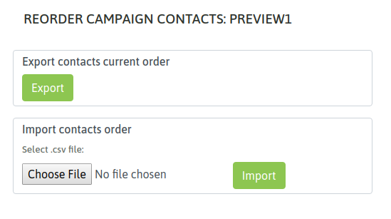
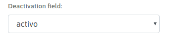

.. _about_previewcamp:

Creación campaña preview
************************

Para crear una nueva campaña preview se debe ingresar al punto de menú *Campaigns -> New  Campaign*. El proceso de creación consta de
un wizard de dos pantallas.

En la primera etapa se deben indicar una serie de parámetros de campaña, como lo indica la figura 1.

*Figure 1: Campaigns parameters*

- **Name:** nombre de la campaña.
- **Contact database:** la base de contactos que utilzará el discador preview a la hora de entregar contactos bajo demanda a cada agente.
- **External system:** aquí se adjudica el sistema de gestión externo que ejecutaría "click to call" sobre la campaña, en caso de así desearlo.
- **ID on external system:**  este campo debe contener el ID que posee la campaña dentro del sistema de gestión externo desde el cual llegarán los *click to call* o *solicitudes de calificación* de contactos.
- **Type of interaction:** indica si la campaña va a operar con formularios de OMniLeads o bien va a ejecutar una invocación hacia un CRM por cada llamada conectada.
- **External URL:** en caso de haber seleccionado la invocación a un URL externo en cada llamada, aquí se indica cual de los CRMs definidos debe invocar la campaña.
- **Enable recordings:** habilita que todas las llamadas de la campaña sean grabadas.
- **Outbound Routes:** Se le asigna una ruta saliente existente a una campaña.
- **CID on Outbound Routes:** Este campo debe contener el CID asignado para una ruta saliente existente a una campaña.
- **Scope:** se define como la cantidad de *gestiones positivas* esperadas en la campaña. En la supervisión de la campaña se muestra en tiempo real el porcentaje de avence de la campaña respecto a este objetivo definido.
- **Disconection time:** es el tiempo que el *discador preview* reserva un contacto asignado a un agente, luego de ese tiempo el contacto se libera de manera tal que pueda ser demandado por otro agente.

En la segunda pantalla se deben asignar las calificaciones que se requieran como disponibles para los agentes a la hora de clasificar cada llamada a cada contacto.

*Figure 2: Call dispositions*

Luego resta asignar a los supervisores y agentes que podrán trabajar en la campaña.
En la figura 3 y 4 se ejemplifica una asignación de agentes a una campaña.

*Figure 3: supervisor assignment*

*Figure 4: agent assignment*

Por último, en la etapa final del wizard se permite opcionalmente realizar una preasignación de contacto a agentes.
Esta preasignación puede realizar en dos variantes.

La primera variante es mostrada en la siguiente imagen:

Asignación de contactos
************************

Si se le selecciona la opción de asignar proporcionalmente el sistema realizará una asignación inicial de contactos a agentes en la misma proporción permitiendo que en la consola de agente cuando el agente pida un contacto de la campaña se le entreguen solo contactos libres o de la lista de los que se le hayan asignados. Ver esta distribución en el admin en la siguiente figura:

Al momento de seleccionar la opción se preasignación proporcional el sistema muestra la opción de seleccionar aleatoriamente:

Esta opción permite que los contactos sean asignados en orden aleatorio a los agentes, como se muestra a continuación:

Finalmente nuestra campaña queda disponible para comenzar a operar. Por lo tanto cuando los agentes asignados a la misma realicen un login a la plataforma, deberían
disponer de la campaña preview tal como se expone en la figura 5.

.. image:: images/campaigns_prev_agconsole1.png

*Figure 5: Preview agents view*

Interacción de agente con campaña
*********************************

Si el agente hace click sobre el teléfono entonces se dispara la llamada, se visualizan los datos (extras al teléfono) del contacto llamado, en la vista de agente
permitiendo a su vez al agente clasificar la llamada con alguna de las calificaciones asignadas a la campaña.

.. image:: images/campaigns_prev_agconsole2.png

*Figure 6: Contact called*

Campaña con base de datos Multinum
***********************************

Como sabemos, OMniLeads admite que cada contacto de una base posea "n" números de teléfono de contacto, de manera tal que si el contacto no es encontrado en su número principal
(el primero de nuestro archivo CSV de base), pueda ser contactado a los demás números. En este caso, cada número de teléfono (que indicamos en la carga de la base) se genera
como un link dentro de los datos del contacto presentados sobre la pantalla de agente. Al hacer click sobre dicho link, se dispara una llamada hacia ekl número de teléfono extra
del contacto. En la figura 7 se muestra dicho escenario.

.. image:: images/campaigns_prev_agconsole3.png

*Figure 7: Multinum contact database*

Por lo tanto, el agente puede intentar contactar a todos los números disponibles como "link" en la ficha del contacto, hasta finalmente calificar y pasar a uno nuevo.

Gestión de la entrega de contactos
***************************************

Una vez creada la campaña los contactos disponibles para cada agente serán entregados siguiendo un orden establecido en el modelo AgenteEnContacto, esta funcionalidad permite editar ese orden usando la exportación/importación de archivos en formato .csv.

La idea es que el administrador puede descargarse el orden actual de contactos hacia un archivo .csv, reordenar las filas y luego importar dicho archivo con lo cual el nuevo orden se impacte en el orden de la asignación de contactos a agentes en la campaña.

A esta funcionalidad se puede acceder usando el menú de la campaña preview

Ver imágenes 8 y 9

*Figura 8: Accesso a página de reordenamiento de entrega de contactos*

*Figura 9: Página de reordenamiento de entrega de contactos*

También es posible marcar como desactivados los contactos que se desee, los cuales no serán entregados a ningun agente.

Esto es posible definiendo en la misma vista un campo de desactivación para la campaña de entre las columnas de datos de la base de contactos. Ver Figura 10.

*Figura 10: Campo de desactivación de contactos*

Después de realizar la exportación del orden actual de contactos se puede editar la columna de desactivación con los valores 0 ó FALSE lo cual, luego de la importación del archivo .csv indicará al sistema que no se deben entregar esos contactos a ningun agente.
Cualquier otro valor distinto a estos hace que el sistema asuma que el contacto puede entregarse.
