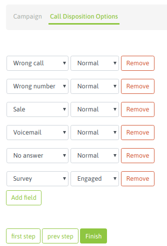
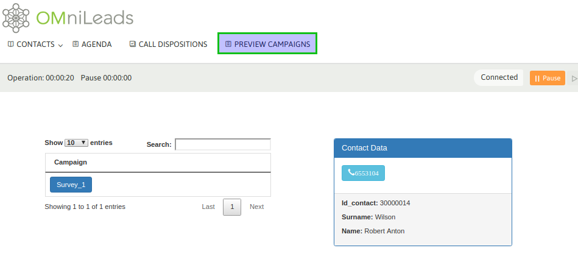

*****************
Preview Campaigns
*****************

Para crear una nueva campaña preview se debe ingresar al punto de menú *Campaigns -> New  Campaign*. El proceso de creación consta de
un wizard de dos pantallas.

La primera pantalla nos invita a indicar una serie de parámtros de la campaña, como lo indica la figura 1.

.. image:: images/campaigns_prev_wizard1.png

*Figure 1: Campaigns parameters*

- **Name:** nombre de la campaña
- **Contact database:** la base de contactos que utilzará el discador preview a la hora de entregar llamadas a los agentes
- **Campaign form:** campo de selección del formulario que se desplegará cada vez que un agente califique un contacto con la calificación "de gestión".
- **External URL:** URL a disparar cada vez que el agente lo indique.
- **Enable recordings:** habilitar que todas las llamadas de la campaña sean grabadas.
- **Scope:** se define como la cantidad de gestiones positivas que se esperan para la campaña. En la supervisión de la campaña se muestra en tiempo real el porcentaje de avence de la campaña respecto al objetivo definido.
- **Disconection time:** es el tiempo que el discador preview reserva un contacto a un agente, antes de volverlo como disponible para ser procesado por otro.

En la segunda pantalla se deben asignar las calificaciones que se requieran como disponibles para os agentes a la hora de tipificar cada llamada de cada contacto.

*Figure 2: Call dispositions*

Una vez lista la campaña solo resta asignar a los agentes que podrán trabajar en la misma, opteniendo contactos para marcar.
En la figura 3 y 4 se ejemplifica una asignación de agentes a una campaña.

.. image:: images/campaigns_prev_ag1.png

*Figure 3: agent assignment*

.. image:: images/campaigns_prev_ag2.png

*Figure 4: agent assignment*

Cuando un agente asignado a la campaña realice un login a la plataforma, debería disponer de la campaña preview tal como se expone en la figura 5.

*Figure 5: Preview agents view*

Si el agente hace click sobre el teléfono entonces se dispara la llamada, se visualizan los datos (extras al teléfono) del contacto marcado en la vista de agente, permitiendo a su vez al agente tipificar la llamada con alguna de las calificaciones asignadas a la campaña.

.. image:: images/campaigns_prev_agconsole2.png

*Figure 6: Contact called*
