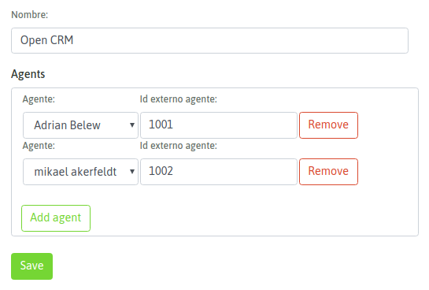
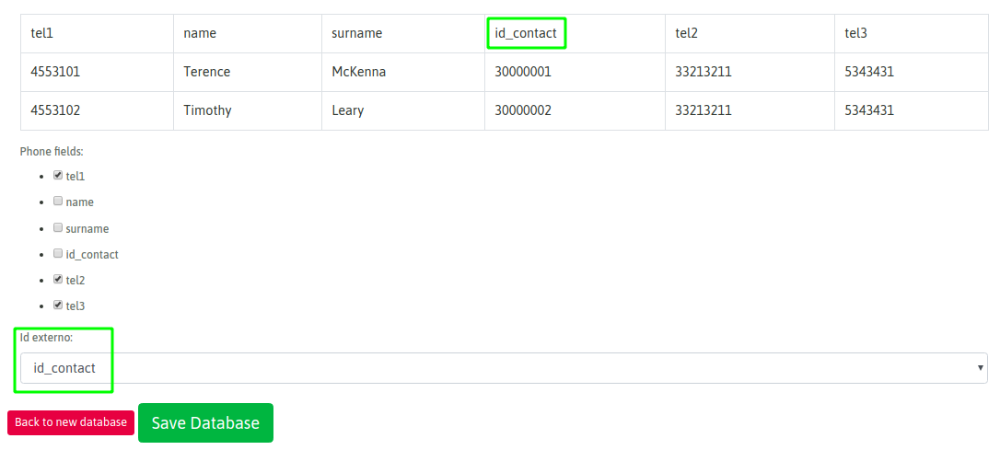
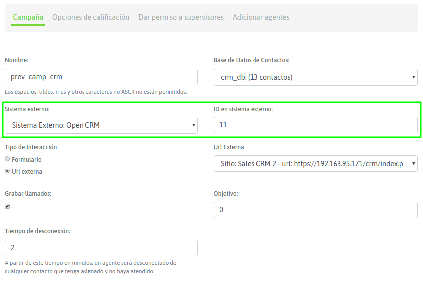

.. _about_crm2oml:

****************************************
Interacción desde el CRM hacia OMniLeads
****************************************

Desde un sistema CRM se pueden ejecutar peticiones a partir de accesar a los endpoints de la :ref:`about_restful_api`. A lo largo de esta sección vamos a explicar como
activar las acciones que se pueden efectuar desde un CRM externo.

* **Click to call**: un usuario del CRM que se encuentre en la vista de un contacto podrá ejecutar una llamada hacia el número del contacto a partir de realizar un click sobre dicho número dentro del CRM. El click dispara una llamada a un método de la API de OMniLeads para que éste último encamine la llamada hacia el exterior y la enlace con el agente pertinente.

* **Calificación de gestión**: cada llamada conectada a un agente puede ejecutar una llamada al CRM pasando parámetros de la propia llamada. Luego cuando el usuario determina que ha finalizado la gestión del contacto dentro del CRM procede con la "calificación" de dicha gestión sobre el CRM, pero a partir de acceder a un método de la API de OMniLeads esta calificación podrá ser efectuada a nivel contacto de OMniLeads permitiendo así una correlación entre la campaña y los contactos del CRM y la gestión del usuario a nivel Contact Center dentro de OMniLeads.

Para implementar las acciones enumeradas, los desarrolladores del sistema CRM deben implementar dichas funcionalidades a partir de consumir la :ref:`about_restful_api`.
Una vez disponibles las funcionalidades del lado del CRM, se deben ejecutar las siguientes configuraciones para comenzar a operar en el marco de las integraciones.

Interrelación de entidades entre el CRM y OMniLeads
*****************************************************

Como bien sabemos, cada llamada procesada por OMniLeads implica una relación con una Campaña, un Agente y en la mayoría de los casos un Contacto. Podríamos
hablar de la "Trinidad; Agente - Contacto - Campaña".

Dentro del universo CRM también sabemos que tenemos la misma relación entre el Usuario de CRM, la campaña que está gestionando y los contactos asociados a la campaña.
Por lo tanto la interrelación que titula esta sección hace referencia al hecho de poder relacionar cada agente, campaña y contacto de campaña de OMniLeads con su par
dentro del CRM. De manera tal que a la hora de ejecutar un "click to call" o "calficación de un contacto" dentro del CRM, se ejecute la acción asociada
y con la "trinidad" correspondiente dentro de OMniLeads, forjando así una correlación entre ambos sistemas.

OMniLeads tiene sus identificadores (agente, campaña y contactos de la campaña) autogenerados, aunque el escenario típico es que dentro del CRM también existen
y por lo tanto se desea efectuar la relación con los de OMniLeads, por lo que se expone a continuación como sincronizar estos identificadores entre ambos sistemas.

**Relación de Agentes de OMniLeads y Usuarios del CRM**

El primer paso es dar el alta de un Sistema Externo y asociar los agentes de OMniLeads con usuarios del CRM a través de ingresar el ID (identificador)
del usuario en el CRM, como se indica en la figura 1.

*Figure 1: new external crm*

Por lo tanto cada agente identificado podrá interactuar desde el CRM.

**Relación entre base de contactos de OMniLeads y CRM**

Para generar una interrelación de una base de contactos se dispone de un campo selector de ID externo a la hora de subir una nueva base de contactos, como se muestra
en la figura 2.

*Figure 2: new crm contact database*

Este valor deberá ser único para cada contacto de la base de datos, por lo que no podrán cargarse dos contactos con el mismo valor en una misma base de datos.
Cada contacto solo podrá tener un identificador externo.

En el ejemplo de la figura 2 se asume que la columna "id_contact" es la que posee el ID de cada contacto de acuerdo al CRM. Por lo tanto OMniLeads considera
dicho valor para cada contacto de la base a la hora de efectuar una interacción con el CRM.

**Relación entre campañas de OMniLeads y CRM**

A la hora de dar de alta una campaña contamos contamos con campos relacionados a la integración con CRM. Recordemos que en la sección de interacción desde OML
hacia el CRM presentamos el campo; Tipo de interacción "URL externa" para poder lanzar una llamada al CRM por cada llamada conectada al agente, en esta sección
donde presentamos las interacciones desde el CRM hacia OML, vamos trabajar con los campos "Sistema externo" e "ID en sistema externo" respectivamente (Figura 3).

*Figure 3: new camp crm to oml interaction*

Por lo tanto, se debe seleccionar el CRM que ejecutará las peticiones hacia OML (Sistema externo) por un lado y además se debe indicar el ID de la campaña
correspondiente que deseamos vincular (ID en sistema externo). Cada campaña solamente podrá tener una vinculación con una campaña del CRM externo.

Luego avanzamos con la creación de la campaña con todos los pasos que ya conocemos.

.. note::

   Cuando se lleva adelante la vinculación expuesta pueden surgir las siguiente excepciones

* Cuando a una campaña se le asignen agentes que no tengan identificador externo en el Sistema Externo seleccionado.
* Cuando a una campaña se le asigne una base de datos que ya este asignada a una campaña asociada a OTRO Sistema Externo.
* Cuando a una campaña se le asigne un Sitio Externo que ya esté siendo utilizado en una campaña asociada a OTRO Sistema Externo.

 También aparecerán notificaciones en caso de que al editar un Sistema Externo, falte asignar identificadores externos a Agentes utilizados en Campañas relacionadas con el Sistema Externo.
