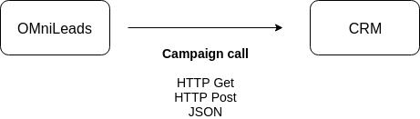
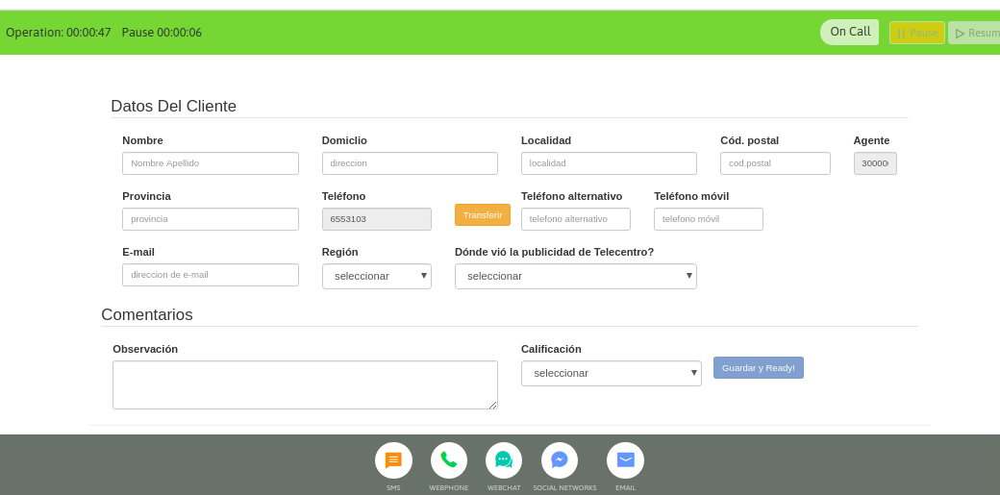
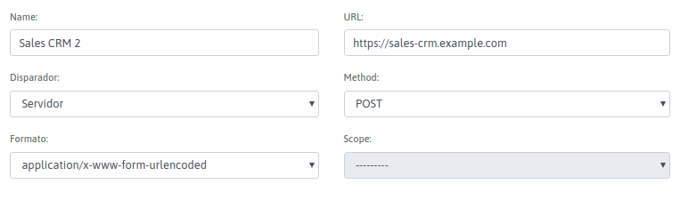
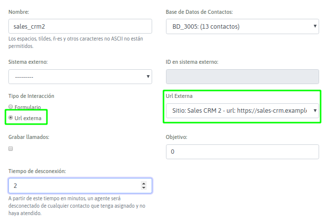
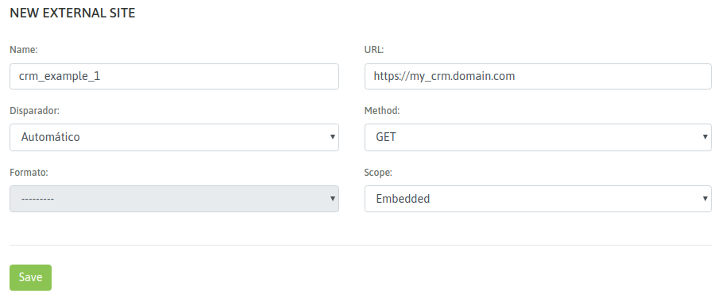
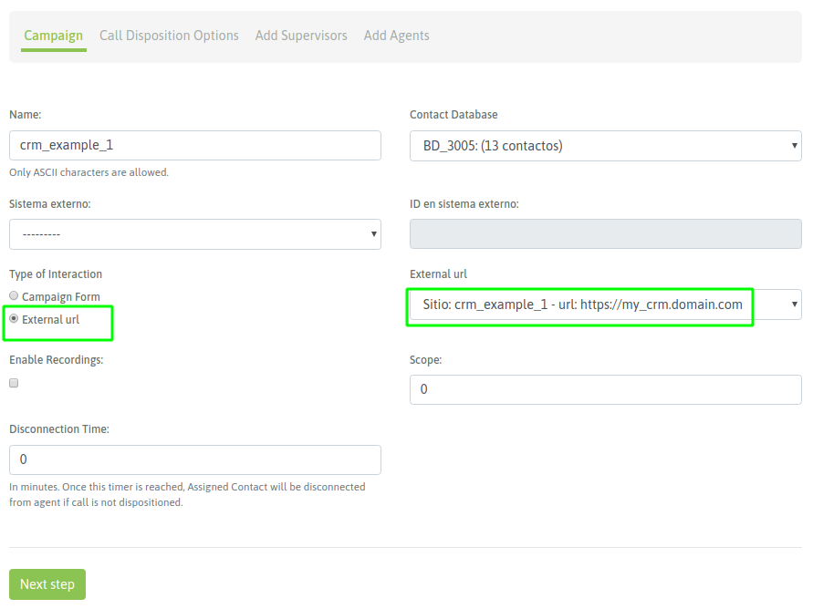
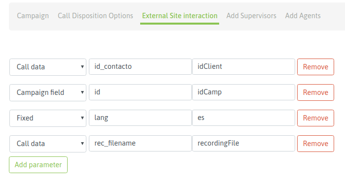
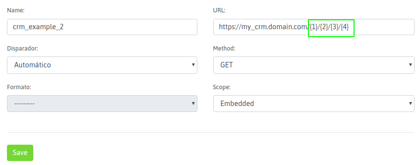
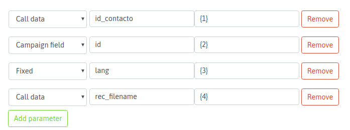

.. _about_oml2crm:

****************************************
Interacción desde OMniLeads hacia el CRM
****************************************

**Cada campaña puede invocar un CRM o vista particular**

OMniLeads ejecutará llamados o notificaciones hacia el CRM cuando un agente dispare una llamada dentro de una campaña que ha sido configurada para disparar
precisamente una URL hacia un CRM externo. Esto puede ocurrir en campañas entrantes, preview o con discador predictivo.

*Figure 1: campaign calls and crm*

La idea de esta interacción es que el agente disponga de una vista del contacto de la llamada en el CRM. OMniLeads permite que esta invocación al URL
del CRM involucre parámetros de la llamada, del contacto y/o parámetros personalizados dentro del contexto de la campaña que ejecuta la llamada al CRM.

A su vez dependiendo de la configuración aplicada en la campaña, el resultado del URL invocado puede estar embebido dentro de la consola de agente, puede dispararse
una nueva pestaña en el navegador por cada llamada o bien simplemente enviar un HTTP-Post JSON hacia el CRM.

*Figure 2: CRM and agent console*

Finalmente debemos considerar que la ejecución de la URL del CRM por parte de OMniLeads puede ser automática (es decir al momento de generarse la llamada)
o bien disparada por el agente a partir de accionar un botón que dispara la invocación al CRM.

Todos los detalles de configuración asociados a este escenario de integración se cubren dentro de esta sección.

Activar un nuevo CRM
*********************

El primer paso que se debe realizar es dar de alta la entidad "CRM externo" con su dirección web (URL) y demás configuraciones inherentes al formato de interacción que se desea realizar.
Entonces se debe acceder al punto de menú; *Campaigns - External Sites - New Site*.

*Figure 3: new crm*

Como se expone en la *figura 3*, en este paso simplemente debemos nombrar al recurso, indicar la dirección URL del recurso al cual hay que invocar luego desde en cada llamada dentro de una campaña, el tipo de
interacción (GET, Post o JSON) con el cual se invocará y finalmente indicar si el sistema debe abrir una nueva pestaña en el browser, realizar la petición y embeber el resultado dentro de la consola del agente o
enviar una notificación (JSON) al CRM con los parámetros de cada nueva llamada conectada al agente.

Vamos a listar cada campo del formulario (*figura 2*):

- **Nombre**: nombre de referencia
- **URL**: se trata de la dirección web a invocar en cada llamada. Aquí solamente declaramos el recurso web a invocar. Como veremos más adelante, los parámetros son personalizados en cada campaña.
- Disparador: aquí se permite seleccionar la forma en que se va a invocar la dirección web URL del CRM.
      * Seleccionamos "Agente" si seleccionamos esta opción entonces cuando la llamada conecte con un agente, éste es quien acciona la ejecución de la URL del CRM  a través de una petición Ajax desde el navegador.
      * Seleccionamos "Automático" si deseamos que se dispare la ejecución de la URL del CRM al momento en que la llamada ingresa a la consola de agente a través de una petición Ajax desde el navegador.
      * Seleccionam*Figure 3: new crm*os "Servidor" si deseamos que se genere una petición HTTP Post hacia el CRM.
- **Método**: la ejecución del URL del CRM puede ser mediante peticiones del tipo GET o POST
- **Formato**: en caso de ejecutar una petición del tipo HTTP-POST, se puede indicar el formaro html.
- **Objetivo**: si el "disparador" es Automático o Agente, entonces el resultado de la petición realizada al URL del CRM puede ser desplegada o bien de manera "embebida" en la consola del agente o sino abriendo una nueva "pestaña" en el browser del agente.

Una vez generado el CRM con sus parámetros de configuración, podemos afectarlo a diferentes campañas para que éstas invoquen al CRM en cada llamada conectada a un agente.

Configuración de Campañas telefónicas con interacción CRM
**********************************************************

Los cuatro tipo de campañas de OMniLeads permiten activar una ejecución de una invocación al CRM por cada llamada conectada sobre un agente.
En este punto vamos a ejemplificar cómo realizar esta configuración, en el wizard de creación de una campaña (*figura 3*).

Todas las campañas cuentan con la posibilidad de indicar que disparen un formulario o un CRM al momento en que se conecta una llamada con un agente.
En dicha configuración se puede indicar ejecutar un CRM y luego indicar el CRM en particular que deseamos accionar desde nuestra campaña.

*Figure 4: CRM campaign activate*

Luego queda realizar la asignación de parámetros a enviar hacia el CRM. Esto se establece también dentro de la configuración de una campaña (*figura 5*).

.. image:: images/crm_camp_params.png

*Figure 5: CRM campaign params*

En esta etapa de la configuración de cualquier campaña, podemos indicar cada uno de los parámetros disponibles en OMniLeads y que se deben enviar hacia el CRM cada vez que se conecte una llamada a un agente.
Dichos parámetros disponibles se agrupan en cuatro familias:

* **Dato de campaña**, conformado por los parámetros;
     * **id**: es el id de la campaña
     * **nombre**: representa al nombre de la campaña
     * **tipo**: es el tipo de campaña

* **Dato de llamada**, conformado por los parámetros;
     * **call_id**: es el identificador de la transacción dentro de OMniLeads.
     * **agent_id**: se trata del id del agente que está procesando la llamada que disparó la petición al CRM.
     * **telefono**: es el teléfono del contacto con el cual se ha conectado la llamada con el agente.
     * **id_contacto**: es el id interno del contacto en la campaña.
     * **rec_filename**: el nombre del archivo que contiene la grabación de la llamada conectada al agente.

* **Dato de base de contactos**, serían parámetros disponibles a partir de las columnas de la base de contactos de campaña actual. Entonces quiere decir que podemos citar a cualquier columna de la base como parámetro a enviar en una llamada al CRM.

* **Parámetro Fijo**, se puede fijar un parámetro a enviar en cada llamada.

Una vez descriptos cada parámetro del sistema, se observa en la *figura 5* que por cada parámetro a enviar se deben completar tres campos:

* **1er Campo**: corresponde al tipo de parámetro (dato de campaña, de llamada, de base de contactos o fijo).

* **2do Campo**: corresponde con el nombre puntual del parámetro a enviar (por ejemplo "nombre" si es un dato de campaña).

* **3er Campo**: es el nombre de cada parámetro, esperado del lado del CRM.

Ejemplo 1: invocación a un CRM utilizando GET
*********************************************

Vamos a suponer que se desea ejecutar el URL: **https://my_crm.domain.com?idClient=321321321&idCamp=11&lang=es&recordingFile=prev-115-20190604-2-4149014-1559667982.424.wav**

Como se puede leer en nuestra URL de ejemplo, en cada ejecución se debe facilitar como parámetros:

* ID del contacto
* ID de la campaña que invoca al crm
* Un parámetro "lang=es"
* La grabación de la llamada actual

Cómo implementaríamos entonces este requerimiento desde lo que hemos cubierto en este capítulo ?

**Generar el nuevo CRM**

En la *figura 6* se ejemplifica la implementación del CRM propuesto como ejemplo.

*Figure 6: CRM definition*

Por lo tanto ahora pasamos a ejemplificar la configuración de la campaña para que invoque al CRM con los parámetros especificados arriba.

En la *figura 7*, se expone como configurar la campaña para que trabaje con el CRM de este ejemplo.

*Figure 7: Campaign and CRM*

El último paso tiene que ver con la asignación de los parámetros necesarios para cada invocación al CRM, en la *figura 8* ejemplificamos este paso.

*Figure 8: Campaign CRM parameters*

Finalmente resaltamos la relación entra las columnas 2 y 3 de cada parámetro, ya que hacen a la asignación de los parámetros del sistema bajo los nombres de parámetros esperados del lado del CRM.

Ejemplo 2: invocación a un CRM utilizando GET y Clean URLs
***********************************************************

Vamos a suponer que se desea ejecutar una `Clean URL <https://en.wikipedia.org/wiki/Clean_URL>`_  : **https://my_crm.domain.com/idClient/idCamp/lang/recordingFile**

por ejemplo:
https://my_crm.domain.com/321321321/11/es/prev-115-20190604-2-4149014-1559667982.424.wav

Como se puede leer en nuestra URL de ejemplo, en cada ejecución se debe facilitar como parámetros:

* ID del contacto
* ID de la campaña que invoca al crm
* Un parámetro "lang=es"
* La grabación de la llamada actual

Cómo implementaríamos entonces este requerimiento desde lo que hemos cubierto en este capítulo ?

**Generar el nuevo CRM**

En la *figura 9* se ejemplifica la implementación del CRM propuesto como ejemplo.

*Figure 9: CRM definition with clean URL*

En la figura se resaltan los "holders" necesarios para trabajar con Clean URLs. A la hora de generar el URL a ejecutar, se deben especificar los parámetros
entre llaves que van a ser generados en la petición. Parámetros que luego se asignarán a la hora de generar la campaña que invocará el CRM externo.

Por lo tanto ahora pasamos a ejemplificar la configuración de la campaña para que invoque al CRM con los parámetros especificados arriba.

La diferencia respecto a las URLs estándares (HTTP GET) que se expuso en el *ejemplo 1*, es que a la hora de asignar parámetros en la campaña, se deben utilizar "los holders" en lugar de los "Nombres de parámetros", como se ejemplifica en la *figura 10*.

*Figure 10: Campaign and CRM parameters*

Finalmente resaltamos la relación entra las columnas 2 y 3 de cada parámetro, en el marco de las "clean URLs" .
