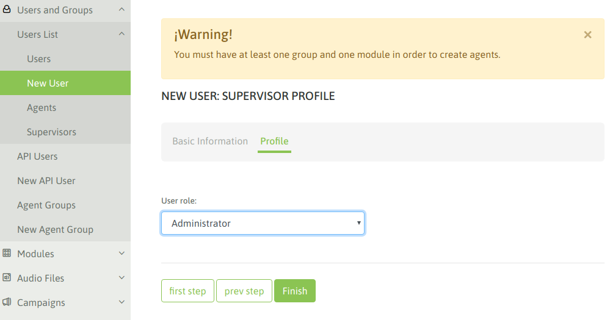
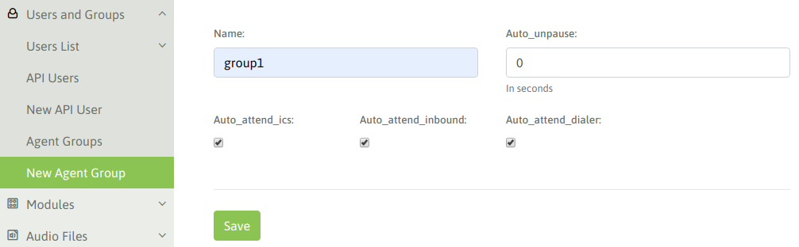
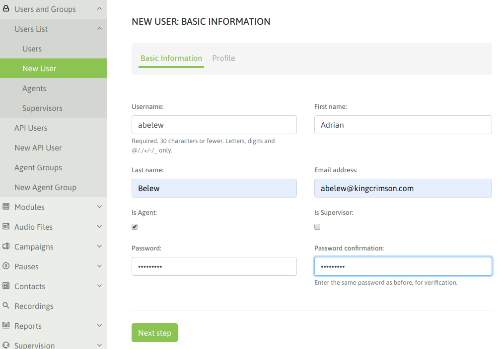
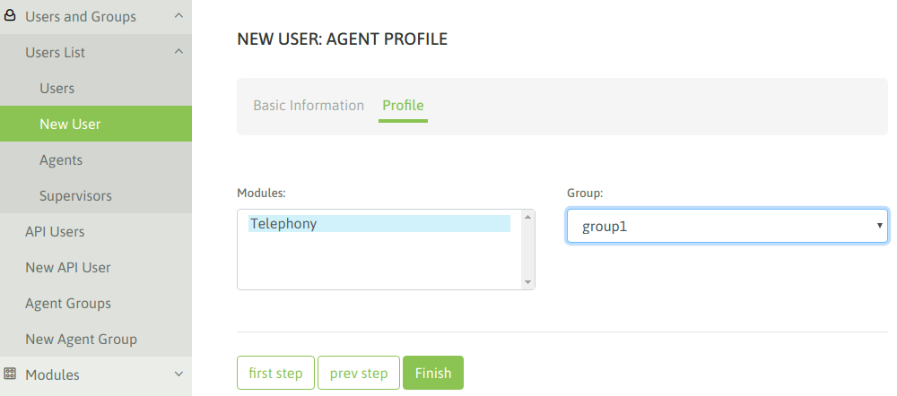

.. _about_initial_settings:

*********************
Configuración Inicial
*********************

Nuestra plataforma se encuentra instalada y por lo tanto disponible para comenzar a configurar todo lo necesario para montar nuestra operación de Contact Center.
En esta sección vamos a avanzar con los pasos iniciales como registrar la instancia, crear nuestro primer usuario supervisor, generar grupos de agentes, agentes y sus pausas, para finalmente
concluir el capítulo con un login de agente.

.. _about_omnileads_register:

Registro de la instancia
**************************

Este paso no es obligatorio ya que el sistema puede funcionar perfectamente sin realizar un registro. No obstante SI es condición obligatoria tener la instancia registrada si se desea
adquirir un Addon o suscribir la plataforma al soporte de fabricante.

Finalmente para aquellos integradores certificados (que han aprobado el programa de certificación oficial de OMniLeads), a partir de registrar la instancia se podrá *firmar* la instalación
con el código de certificación logrando así una visibilidad de que la plataforma ha sido instalada/configurada por una persona certificada.

 .. image:: images/initial_settings_14.png

*Figure 1: omnileads registration*

Se deben completar los campos allí solicitados y luego recibirá un email con el código de la instancia.

.. image:: images/initial_settings_16.png

*Figure 2: Email notification*

Luego cada vez que ingresemos a la sección de registro, se obtendrá una salida que informa el hecho de haber registrado ya la instancia.

.. image:: images/initial_settings_15.png

*Figure 3: omnileads registered*

.. _about_supervisor_user:

Crear usuario supervisor
************************

Lo primero que vamos a realizar es generar un usuario supervisor con el cual desde ahora en más vamos a realizar todas las tareas administrativas del sistema, dejando relegado
al usuario "admin" como acceso de último recurso y para el personal de IT.

Para generar un nuevo usuario debemos acceder al punto de menú *User list -> New user*

Allí completamos los campos solicitados como se ilustra en la figura 4.

 .. image:: images/initial_settings_01.png

*Figure 4: new supervisor user*

En el paso siguiente del wizard debemos seleccionar el perfil de supervisor, siendo posible seleccionar:

- **Supervisor gerente:** este perfil de usuario puede gestionar casi todos los menúes de la paltaforma a excepción de las configuraciones de parámetros de telefonía como por ejemplo troncales SIP y enrutamiento de llamadas.
- **Administrador:** es un super-usuario que posee los mismo permisos que el usuario "admin"
- **Cliente:** es un perfil que tan solo puede acceder a la supervisión de tiempo real y grabaciones de llamadas sobre las campañas que le fueron asignadas como permitidas.

*Figure 5: supervisor / admin*

En nuestro caso generamos un usuario supervisor / administrador. A continuación nos logueamos con dicho usuario para continuar las gestiones.

Crear módulo de telefonía
*************************

En este punto se debe generar cada módulo de sistema, actualmente se dispone de la funcionalidad de telefonía, por lo que vamos a añadir dicho módulo. No obstante hacia el futuro
se estarían añadiendo SMS y Chat.

Para generar el módulo de telefonía debemos acceder a *Modules -> Enable module*

.. image:: images/initial_settings_04.png

*Figure 6: Enable telephony module*

Guardamos los cambios y avanzamos !

Instalar idiomas extras
************************

Los audios genéricos que los agentes o teléfonos externos escucharán vienen por defecto en inglés siendo configurables en las rutas entrantes o rutas salientes, de manera tal que si el canal telefónico se encuentra con alguna indicación a través de un audio genérico dentro del flujo entrante o saliente de una llamada, éste podrá ser reproducido de acuerdo al idioma indicado.

Si la instancia precisa utilizar otros idiomas, se pueden instalar a través del punto de menú "Telephony-Add audio files", en donde se podrán instalar los idiomas:

* Español
* Italiano
* Sueco
* Portugués
* Francés
* Ruso

.. image:: images/telephony_i18n_audio.png

*Figure 7: i18n audio promps*

Crear grupo de agentes
**********************

Llega el turno de crear los grupos de agentes de nuestro contact center. Para generar un nuevo grupo *Usuarios y grupos -> Nuevo grupo de agentes* y se desplegará
un formulario similar al de la figura 8.

*Figure 8: New agent group*

Los campos allí desplegados son:

- **Name:** es el nombre que se desea asignar al grupo de agentes.
- **Auto_unpause:** para comprender este parámetro debemos explicar que en OMniLeads luego de cada llamada procesada por un agente (de cualquier naturaleza), el agente es forzado a ingresar en una pausa ACW (after call work), en la cual permanece inactivo para las campañas asignadas de manera tal que pueda completar la calificación de la llamada actual y recién seguir operando. Ahora bien, para salir de dicha pausa inducida por el sistema existen dos posibilidades y allí entra nuestro parámetro, ya que por un lado si dejamos el valor en "0" el agente debe salir de la pausa, ahora si colocamos un número (por ejemplo 5 segundos), esto implicará que el agente asignado a este grupo luego de caer en una pausa inducida ACW, el sistema lo vuelva a dejar online a los X segundos (según lo indicado en este parámetro).
- **Auto_attend_ics:** si este valor está checkeado entonces las llamadas provenientes del Addon de OMniLeads ICS (Interactive Contact System), llamadas derivadas del IVR blaster press-one serán atendidas automáticamente por el agente sin dar la posibilidad de que exista ring en su webphone.
- **Auto_attend_inbound:** si este valor está checkeado entonces las llamadas provenientes de campañas entrantes serán conectadas al agente sin brindar la posibilidad de ring y answer por parte del agente.
- **Auto_attend_dialer:** si este valor está checkeado entonces las llamadas provenientes de campañas con discador predictivo serán conectadas al agente sin brindar la posibilidad de ring y answer por parte del agente.

.. _about_agent_user:

Crear agentes
*************

Una vez disponibles los grupos de agentes y su configuración, podemos proceder con la creación de usuario agentes del contact center.

*Figure 9: New agent*

Se debe seleccionar el grupo de agentes y los módulos disponibles para nuestro nuevo agente.

*Figure 10: New agent*

Podemos listar nuestros usuarios, deberíamos contar con al menos un par de agentes.

.. image:: images/initial_settings_08.png

*Figure 11: Users*

Crear pausas de agente
**********************

Los agentes pueden entrar en una pausa cada vez que quieran quedar indispuestos para el procesamiento de llamados, de esta manera se evita que una campaña entrante o con discador
le asigne una nueva llamada. Además los estados de pausa son útiles para registrar productividad y medir los tiempos de sesión del agente.

Las pausas las pueden generar los supervisores y se clasifican en pausas Recreativas y Productivas.

.. image:: images/initial_settings_09.png

*Figure 12: New pause*

A la hora de presentar los reportes de sesión de agente, las pausas totalizadas se dividen en pausas recreativas y pausas productivas. Esto permite medir la productividad de nuestros agentes
de una manera más exacta.

.. image:: images/initial_settings_10.png

*Figure 13: New pauses*

Una vez generados nuestros agentes, podemos proceder con nuestro primero login de agente !

Primer login de agente
**********************

Finalmente tenemos todo listo para probar nuestro primer agente.

.. important::

 Tener en cuenta que para obtener un login exitoso debemos debemos contar con un **MICROFONO disponible:** en la estación de trabajo desde la cual se harealizado el login de agente. Si no se cumple entonces el login será defectuoso.

Una vez que accedemos con nuestro agente, si todo va bien deberemos toparnos con un popup que solicita el permiso de tomar el control del micrófono, como se ilustra en la figura 14.

.. image:: images/initial_settings_11.png

*Figure 14: First login - microphone webrtc*

Al habilitar el permiso, debemos escuchar un audio que el sistema reproduce indicando el login exitoso y además la pantalla de agente debe lucir como la figura 15.

.. image:: images/initial_settings_12.png

*Figure 15: First login - webphone connected*
