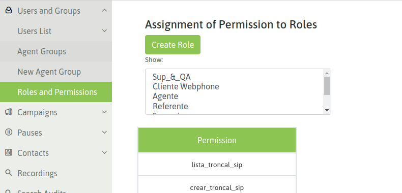
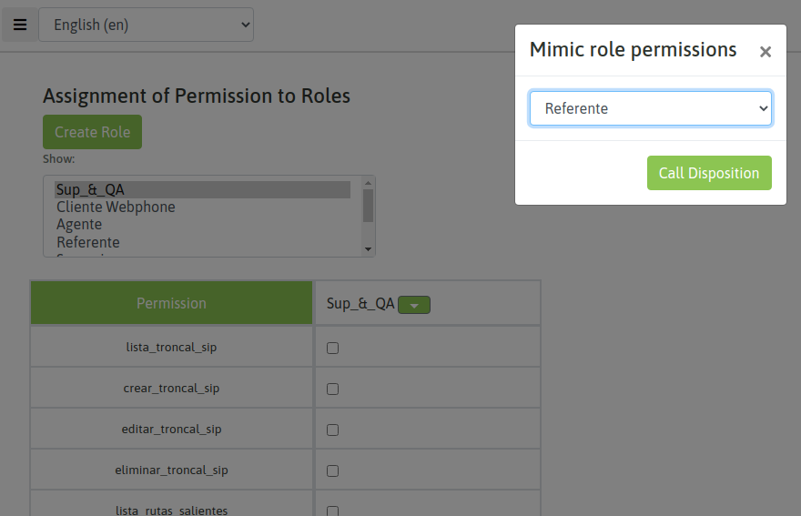
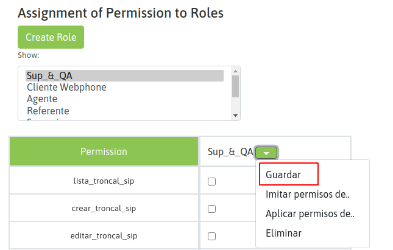
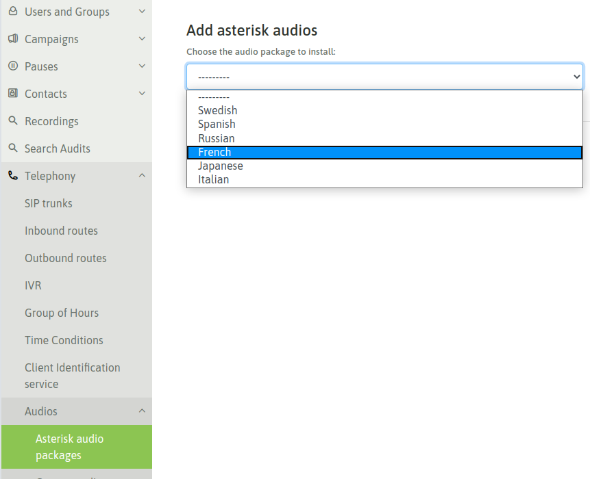
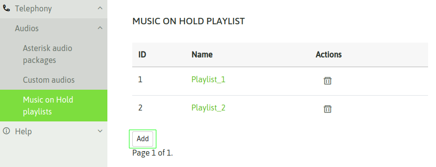
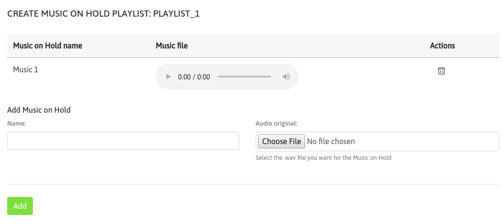
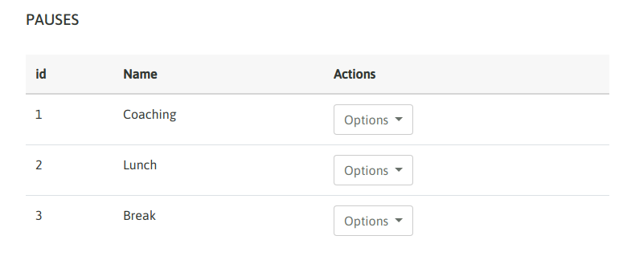
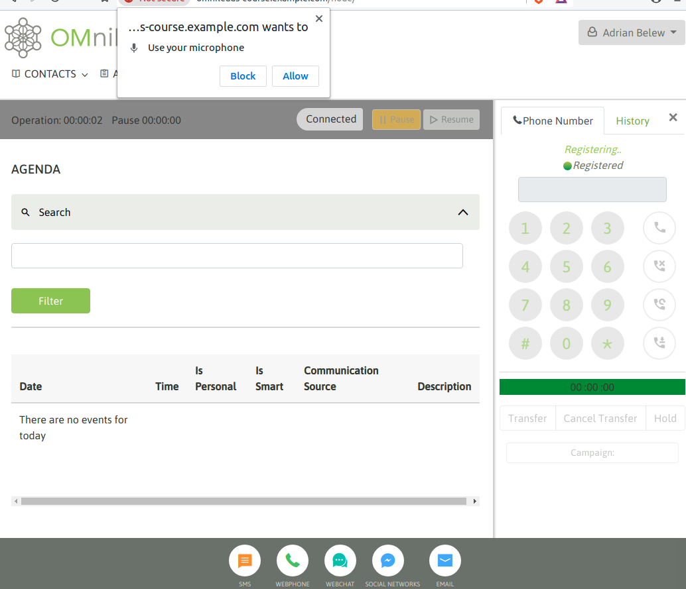
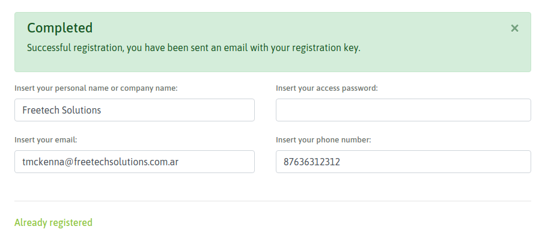
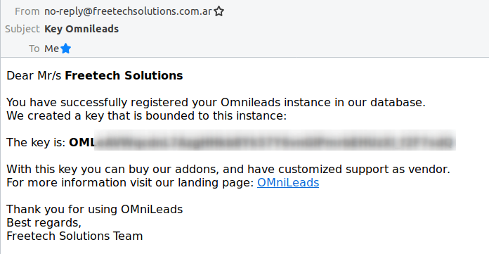

.. _about_initial_settings:

*********************
Configuración Inicial
*********************

La aplicación se encuentra instalada y por lo tanto en esta sección se plantean los pasos de configuración post-instalación.

.. _about_roles:

Roles y permisos
****************

En esta sección del módulo citado, se pueden listar los Roles predefinidos en el sistema y además el administrador podrá personalizar cualquiera de ellos, así como también
generar sus propios Roles personalizados para la operación.

A continuación se listan los roles predefinidos:

* **Referente**: los usuarios generados a partir de este rol podrán solo listar todas las campañas, consultar reportes generales de agentes y llamadas, acceder a la supervisión de agentes y campañas.
* **Supervisor**: los usuarios generados a partir de este rol podrán trabajar con todas las campañas a las que estén asignados (crear, modificar, eliminar y listar), acceder a la supervisión y reportes generales de llamadas y agentes. También podrán crear usuarios y grupos de agentes, pero sólo podrán editar o eliminar agentes que esten asignados a alguna campaña a la que ellos mismos estén asignados. Buscar grabaciones de sus campañas, listar y subir bases de contactos y acceder al módulo de telefonía donde podrán trabajar con algunas secciones.
* **Gerente**: los usuarios generados a partir de este rol podrán realizar todas las acciones de un supervisor y además puede visualizar el módulo de Auditorías.
* **Administrador**: los usuarios generados a partir de este rol tienen acceso a todo el sistema. Solamente los administradores pueden editar o borrar usuarios con perfil Administrador.

Para generar un *Rol personalizado*, se debe acceder al módulo de *Usuarios y grupos*, sección *Roles y permisos*, luego allí indicar *Crear rol*.
Al nuevo rol se le asigna un nombre y luego se marcan los permisos que tendrá. Para no iniciar de cero, el usuario puede partir de una base de permisos de cierto perfil y luego seguir personalizando
(añadiendo o limitando permisos) hasta dejar su rol listo.

A continuación se ejemplifica la creación de un nuevo rol:

* Crear un nuevo rol: crear un nuevo rol y asignar un nombre al mismo.

.. image:: images/users_and_roles_02.png

Se puede *imitar persmisos de un grupo* o *aplicar permisos de un grupo* existente. La diferencia radica en que la primera opción pone los mismos permisos mientras que la segunda opción
suma los permisos a los que ya han sido checkeados en el nuevo rol.

* Guardar el nuevo rol: finalmente se guarda el nuevo rol creado.

.. _about_users:

Usuarios
*********

Vamos a diferenciar entre usuarios del tipo Agente y Administrativos. Los usuarios *Agente* son quienes gestionan las comunicaciones y los usuarios *Administrativos* gestionan la aplicación.

.. important::
  Antes de crear un usuario *Agente* al menos debe existir un *Grupo de agentes*

Para crear un usuario se debe acceder a la sección *Usuarios -> Nuevo usuario*.

  .. image:: images/users_and_roles_05.png

Allí se despliega un formulario a completar con los datos del nuevo usuario.

Grupos de Agentes
*****************

En esta sección se administran los grupos de agentes, grupos que serán invocados en diferentes módulos del sistema, como puede ser a la hora de asignar usuarios a campañas,
o en la extracción de reportes así como tambien en el módulo de supervisión.

**Crear grupo de agentes**

.. image:: images/initial_settings_04.png

Los campos allí desplegados son:

- **Name:** es el nombre que se desea asignar al grupo de agentes.
- **Auto_unpause:** para comprender este parámetro debemos explicar que en OMniLeads luego de cada llamada (de cualquier naturaleza) procesada por un agente, el agente es forzado a ingresar en una pausa ACW (after call work), en la cual permanece inactivo para las campañas asignadas de manera tal que pueda completar la calificación de la llamada actual y recién seguir operando. Ahora bien, para salir de dicha pausa inducida por el sistema existen dos posibilidades y allí es donde entra nuestro parámetro, ya que por un lado si dejamos el valor en "0" el agente debe salir explícitamente de la pausa para seguir operando, ahora bien si colocamos un número (por ejemplo 5 segundos), esto implicará que el agente asignado a este grupo luego de caer en una pausa inducida ACW, el sistema lo vuelva a dejar online a los X segundos (según lo indicado en este parámetro).
- **Auto_attend_inbound:** si este valor está checkeado entonces las llamadas provenientes de campañas entrantes serán conectadas al agente sin brindar la posibilidad de notificación (Ring) y opción de atender por parte del agente.
- **Auto_attend_dialer:** si este valor está checkeado entonces las llamadas provenientes de campañas con discador predictivo serán conectadas al agente sin brindar la posibilidad de notificación (Ring) y opción de atender por parte del agente.

Adicionar paquetes de audios en otros idiomas
**********************************************

Los audios genéricos que los agentes o teléfonos externos escucharán vienen por defecto en inglés siendo configurables en las rutas entrantes o rutas salientes, de manera tal que si el canal telefónico se encuentra con alguna indicación a través de un audio genérico dentro del flujo de una llamada, éste podrá ser reproducido de acuerdo al idioma indicado.

Si la instancia precisa utilizar otros idiomas, se pueden instalar a través del Módulo *Telefonía* en la sección *Paquetes de audio*, en donde se podrán adicionar nuevos idiomas.

Musica de espera
****************

Dentro del módulo *Telefonía*, la sección *Música de espera*, permite gestionar *listas de reproducción* con archivos en el formato *Wav 16 bits*. Las listas aquí generadas, podrán ser utilizadas en las *campañas entrantes* a la hora de poner a los llamantes en cola de espera.
No podrán eliminarse playlists que estén en uso por alguna campaña o que tengan archivos asignados.

Una vez creada una nueva lista deberán agregarse las músicas deseadas, a través de archivos de formato **.wav** a cargarse desde su computadora.
Sólo estarán disponibles para su uso en campañas entrantes las playlist que tengan al menos una música cargada.

Crear pausas de agente
**********************

Los agentes pueden entrar en una pausa cada vez que deseen quedar desafectados para atender nuevas comunicaciones, de esta manera se evita que una campaña entrante o con discador predictivo
le asigne una nueva llamada. Además los estados de pausa son útiles para registrar productividad y medir los tiempos de sesión del agente.

Las pausas las pueden generar los usuarios con dicho permiso y se clasifican en pausas Recreativas y Productivas.

.. image:: images/initial_settings_08.png

A la hora de presentar los reportes de sesión de agente, las pausas totalizadas se dividen en pausas recreativas y pausas productivas. Esto permite medir la productividad de nuestros agentes
de una manera más exacta.

Primer login de agente
**********************

.. important::

 Tener en cuenta que para obtener un login exitoso debemos debemos contar con un **MICROFONO disponible:** en la estación de trabajo desde la cual se ha realizado el login de agente. Si no se cumple entonces el login será defectuoso.

Una vez que accedemos con nuestro agente, si todo va bien se desplegará un popup que solicita el permiso para tomar el control del micrófono.

Al habilitar el permiso, debemos escuchar un audio que el sistema reproduce indicando el login exitoso.

.. image:: images/initial_settings_11.png

.. _about_omnileads_register:

Registro de la instancia
**************************

Este paso no es obligatorio ya que el sistema puede funcionar perfectamente sin realizar un registro. Sin embargo SI es necesario tener la instancia registrada a la hora de
adquirir un Addon o suscribir la plataforma al soporte de fabricante.

Finalmente para aquellos integradores certificados (que han aprobado el programa de certificación oficial de OMniLeads), a partir de registrar la instancia se podrán firmar la instalación
con el código de certificación logrando así dejar una constancia de que la plataforma ha sido desplegada y configurada por un *IT admin* certificado por el fabricante.

 .. image:: images/initial_settings_13.png

Se deben completar los campos allí solicitados y luego recibirá un email con el código de la instancia.

.. image:: images/initial_settings_15.png

Luego cada vez que ingresemos a la sección de registro, se obtendrá una salida que informa el hecho de haber registrado ya la instancia.

El registro de la instancia pide como valores obligatorios el nombre del usuario o empresa, la dirección de email y la contraseña, es opcional el campo teléfono.

Una vez que se ha registrado la instancia satisfactoriamente se el enviará un email a la dirección ingresada con el valor de la clave asignada a la instancia.
En caso de que quiera que se le reenvíe el email con la llave de la instancia un vez registrado puede usar el botón "Reenviar".

Es importante tener en cuenta que si quiere registrar varias instancias con una misma dirección de email debe ingresar también la misma contraseña. En otro caso use una dirección de email diferente.

Addons comerciales disponibles
******************************

El sistema brinda información sobre los addons comerciales disponibles a través de la siguiente página:

Desde aquí haciendo click en los nombres de los addons puede accederse a sus sitios y adquirirlos para instalarlo en su instancia actual.
