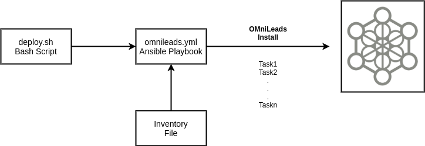
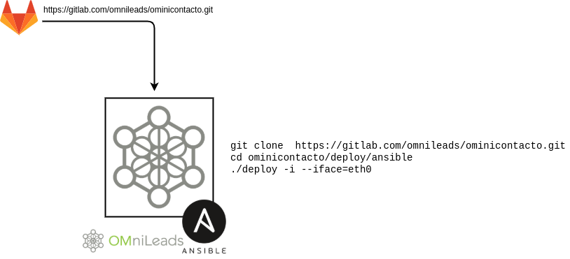
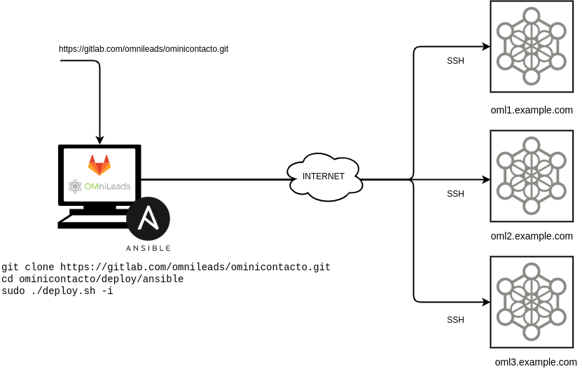
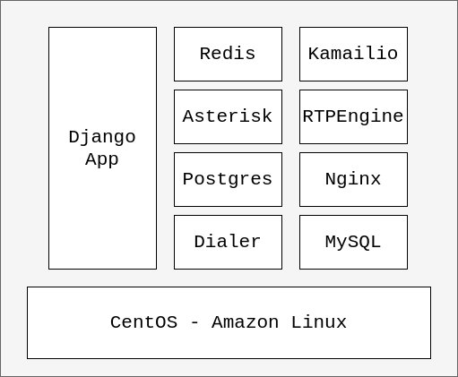
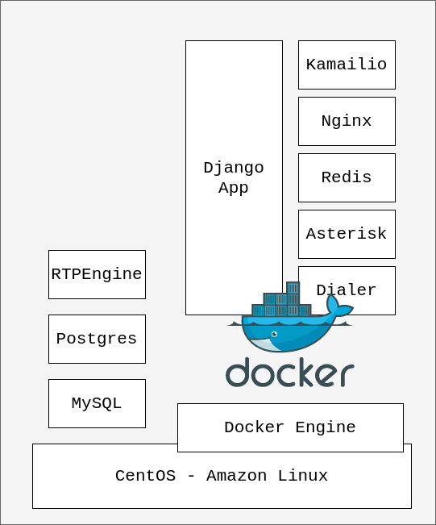

.. _about_install:

******************************
Instalación de OMniLeads
******************************

La instalación está basada en `Ansible <https://docs.ansible.com/ansible/latest/index.html>`_ y el código se encuentra versionado dentro del repositorio de OMniLeads. Más específicamente
la instalación consta de un `Archivo de Inventario <https://docs.ansible.com/ansible/latest/user_guide/intro_inventory.html>`_ donde se deben especificar explícitamente
cada parámetro de la App (usuarios, passwords, NAT, etc.) y un script bash que al ejecutarse entre otras acciones, termina invocando el `Playbook de Ansible  <https://docs.ansible.com/ansible/latest/cli/ansible-playbook.html>`.

Éste último es quien realiza los pasos de automatización de la configuración sobre el Host que alojará nuestra App.

Existen dos formas en las que se puede ejecutar la instalación (Self-hosted y Deployer-Nodes).

.. _about_install_method_selfhosted:

Método de instalación Self-Hosted
*********************************

Bajo esta modalidad el proceso de instalación y gestión de actualizaciones se maneja utilizando el bash script *deploy.sh* directamente sobre el host
que va a alojar OMniLeads. Por lo tanto sobre dicho host se debe descargar el repo de la App, allí se trabaja con el archivo de inventario para luego lanzar el instalador.

Por cada instancia de OMniLeads que se administre, se deberá ingresar por SSH, descargar el repositorio y correr la instalación. Luego las actualizaciones también
implicarán que el administrador se conecte a cada instancia y ejecute los pasos necesarios en cada servidor gestionado.

Esta opción se hace algo inviable en la medida que aumenta la cantidad de servidores productivos bajo mantenimiento.

.. _about_install_method_deployer:

Método de instalación Deployer-Nodes
************************************

En esta modalidad se plantea utilizar un *deployer* (basada en Ubuntu 18.04 o Debian 10) y luego desde este único deployer instalar y gestionar actualizaciones de un número ilimitado
de instancias con OMniLeads, facilitando y centralizando la gestión.

En esta modalidad, el host a gestionar debe permitir el acceso SSH de *root* o *sudo* para poder desplegar la App desde el *deployer*.

Más allá del método de instalación seleccionado (Self-Hosted ó Deployer-Node), OMniLeads puede ser desplegado bajo dos posibles arquitecturas.

.. _about_install_tradicional:

Despliegue de OMniLeads arquitectura tradicional (AIO)
******************************************************

OMniLeads puede correr como una aplicación tradicional desplegando una instalación de todos los componentes sobre un server físico, máquina virtual o VPS. Siempre y cuando se utilice como base
GNU/Linux CentOS-7 o Amazon Linux. A este tipo de instalación lo llamamos **OMniLeads AIO (All In One)**.

.. _about_install_contenedores:

Despliegue de OMniLeads sobre contenedores Docker
*************************************************

.. danger::

	 Estamos realizando una refactorización importante del despliegue de OMniLeads sobre contenedores Docker. Solo estará disponible el despliegue que presentamos en esta documentación hasta el release 1.11.X

OMniLeads puede ser desplegado utilizando contenedores `Docker <https://www.docker.com>`_, esto extiende la posibilidad de ejecución de la aplicación sobre diversas
distrubuciones de GNU/Linux.

Se resalta el hecho de que mediante este formato es posible desplegar OMniLeads sobre instancias de Issabel-PBX & FreePBX, de manera tal que dentro del mismo
host conviva el software de PBX y OMniLeads como módulo de Contact Center.

Archivo de inventario
*********************
El archivo de *inventario* es el componente fundamental en la instalación y administración (actualizaciones, cambios de passwords de componentes, clusterización, etc.) de la App.
Es fundamental entender el mismo en su totalidad antes de comenzar a desplegar OMniLeads.

.. toctree::
  :maxdepth: 3

  install_inventory_file.rst

Instalación de OMniLeads
************************
Ahora si, luego de haber leído y comprendido bien el marco conceptual introductorio, se procede con la exposición de los pasos necesarios para ejecutar la instalación
de la App.

.. toctree::
  :maxdepth: 3

  install_run.rst

Primer acceso al sistema
*************************

Una vez instalado el software, remitirse a esta sección para el primer acceso:

.. toctree::
  :maxdepth: 3

  install_first_access.rst

FAQ y errores comunes
**********************

.. toctree::
  :maxdepth: 3

  install_faq.rst
