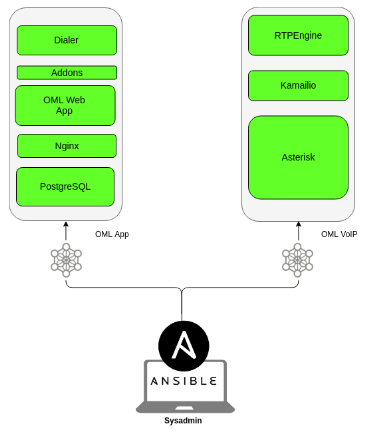
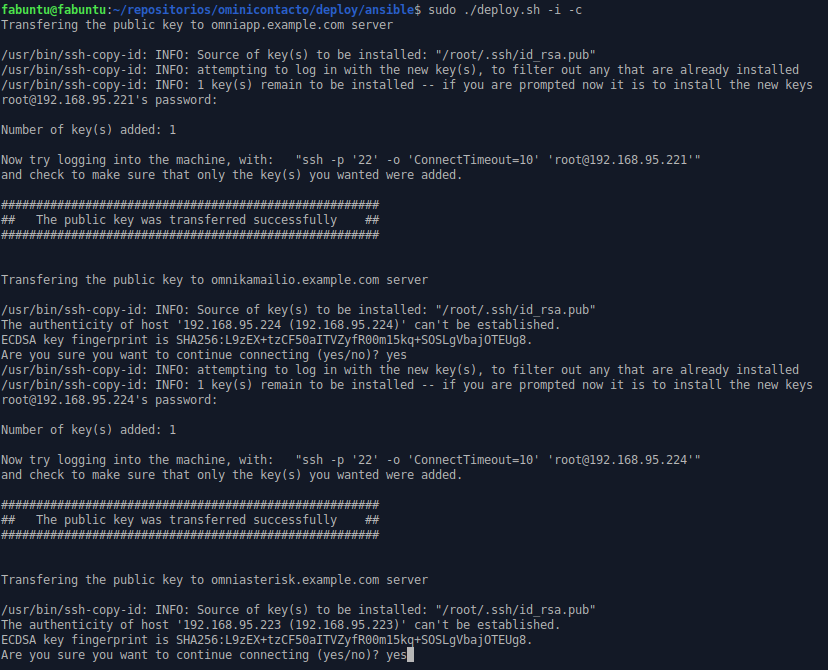

.. _about_install_cluster:

*******************************
Horizontal Cluster Installation
*******************************

OMniLeads puede ser desplegado de manera tal que los componentes queden separados en diferentes hosts. A diferencia de la instalación AIO (All In One) que despliega todo OMniLeads en un único host, este método de instalación permite dividir la carga de los servicios en más de un host.

Puntualmente existen dos formas de instalar en cluster horizontal:

OMniLeads in two:
^^^^^^^^^^^^^^^^^
- Host1 (omlvoip): Asterisk y Kamailio + rtpengine
- Host2 (omlapp): Aplicación web, Postgres y Dialer

*Figure 1: Cluster in 2 hosts*

OMniLeads in five:
^^^^^^^^^^^^^^^^^^
- Host1 (omlapp): Aplicación web
- Host2 (kamailio): Kamailio + rtpengine
- Host3 (asterisk): Asterisk
- Host4 (database): Postgresql
- Host5 (dialer): Wombat dialer + MySQL

.. image:: images/install_cluster_in_5.png

*Figure 2: Cluster in 5 hosts*

Pre-requisitos
^^^^^^^^^^^^^^
Los hosts sobre los cuales vamos a desplegar los servicios en cluster deben cumplir con los siguientes requisitos:

- GNU/Linux CentOS 7.6 (minimal), Debian 9 (netinstall) ó Ubuntu Server 18.04
- Al menos 20 GB de espacio en disco
- Al menos 4 GB de memoria RAM
- Si es *Ubuntu / Debian*; Instalar el paquete *sudo*, *openssh-server* y *phyton-minimal*, permitir login SSH con el usuario *root* y reiniciar el servicio de ssh para que se tomen los cambios:

::

  apt-get install sudo openssh-server python-minimal -y
  sed -i 's/#PermitRootLogin prohibit-password/PermitRootLogin yes/' /etc/ssh/sshd_config
  _about_install_remote_deployerh.

- Es muy importante dejar la hora correctamente configurada en cada host.
- Configurar una *dirección IP* y un *hostname* fijo en cada host destino de la instalación.

Preparación en la máquina que ejecuta la instalación remota:
^^^^^^^^^^^^^^^^^^^^^^^^^^^^^^^^^^^^^^^^^^^^^^^^^^^^^^^^^^^^
Al igual que :ref:`about_install_remote`, para desplegar OMniLeads en cualquiera de los dos configuraciones de clusters, debemos proceder con la ejecución del script de
deploy desde una estación de trabajo GNU/Linux (deployer), remarcando el hecho de que el repositorio y por lo tanto el script de deploy se encuentran en esta estación
remota. Para generar nuestro host "deployer", repasar: :ref:`about_install_remote_deployer`.

Se considera entonces que el usuario dispone del repositorio clonado en su Linux Workstation (OMniLeads deployer) !

Preparación del archivo *inventory*:
^^^^^^^^^^^^^^^^^^^^^^^^^^^^^^^^^^^^
Para este tipo de despliegue, se deben configurar los parámetros *hostname* y *dirección IP* de cada host-componente de nuestro cluster.

.. code-block:: bash

 ###############################################################
 # If you  are installing a cluster in bare-metal.              #
 # Uncomment this lines and change IP and hostnames of servers  #
 ################################################################
 [omniapp]
 oml-app.example.com ansible_ssh_port=22 ansible_user=root ansible_host=10.10.10.100
 [kamailio]
 oml-voip.example.com ansible_ssh_port=22 ansible_user=root ansible_host=10.10.10.101
 [asterisk]
 oml-voip.example.com ansible_ssh_port=22 ansible_user=root ansible_host=10.10.10.102
 [database]
 oml-app.example.com ansible_ssh_port=22 ansible_user=root ansible_host=10.10.10.103
 [dialer]
 oml-app.example.com ansible_ssh_port=22 ansible_user=root ansible_host=10.10.10.104

Como se puede apreciar, se agrupan los componentes Aplicación web + Database + Dialer bajo un *hostname* y *dirección IP* por un lado, y por otro lado Asterisk + Kamailio
bajo otro *hostname* y *dirección IP*. De esta manera se despliegan dichos componentes en dos hosts destino independientes entre si.

- Ejemplo para *OMniLeads in five*

.. code-block:: bash

 ###############################################################
 # If you  are installing a cluster in bare-metal.              #
 # Uncomment this lines and change IP and hostnames of servers  #
 ################################################################
 [omniapp]
 oml-app.example.com ansible_ssh_port=22 ansible_user=root ansible_host=10.10.10.100
 [kamailio]
 oml-kam.example.com ansible_ssh_port=22 ansible_user=root ansible_host=10.10.10.101
 [asterisk]
 oml-ast.example.com ansible_ssh_port=22 ansible_user=root ansible_host=10.10.10.102
 [database]
 oml-postgres.example.com ansible_ssh_port=22 ansible_user=root ansible_host=10.10.10.103
 [dialer]
 oml-dialer.example.com ansible_ssh_port=22 ansible_user=root ansible_host=10.10.10.104

Como se puede apreciar, se separan todos los componentes Aplicación web, Database, Dialer diferentes *hostname* y *dirección IP*, ya que cada componente corre
bajo un host dedicado e independiente.

Al igual que en las otras instalaciones, las variables y passwords de los diferentes componentes se pueden modificar en la sección  *[everyyone:vars]*.
Introducir el parámetro "time zone" adecuado para su instanacia.

.. code-block:: bash

 ###############################################################
 ###############################################################
 # Below are the variables used for every kind of installation #
 ###############################################################
 ###############################################################

 [everyone:vars]

 ###############
 # Credentials #
 ###############

 ############
 # Database #
 ############
 postgres_database=omnileads
 postgres_user=omnileads
 postgres_password=my_very_strong_pass
 #############
 # Admin web #
 #############
 admin_pass=my_very_strong_pass
 #######################################
 # AMI for wombat dialer and OMniLeads #
 #######################################
 ami_user=omnileadsami
 ami_password=5_MeO_DMT
 #####################################################
 # Wombat dialer credentials and MYSQL root password #
 #####################################################
 dialer_user=demoadmin
 dialer_password=demo
 #mysql_root_password=my_very_strong_pass
 ################################################################################################
 # Set the timezone where the nodes are UNCOMMENT and set this if you are doing a fresh install #
 ################################################################################################
 #TZ=America/Argentina/Cordoba
 #################################################################################
 # OMniLeads behind nat:                                                         #
 #  External port is the outside port where OML web server will listen requests  #
 #  External hostname is the dns external users will connect to                  #
 #################################################################################
 #external_port=
 #external_hostname=
 #####################################################################
 # Trusted Certificates:                                             #
 #   If you want to use your own certificate/key pair, copy them in  #
 #   ominicontacto/deploy/certs/ and type here the name of the files #
 #####################################################################
 #trusted_cert=
 #trusted_key=
 ####################################################################################################
 # Session Cookie Age (SCA) is the time in seconds that will last the https session when inactivity #
 # is detected in the session (by default is 1 hour)                                                #
 ####################################################################################################
 SCA=3600
 ###############################################################################################
 # Ephemeral Credentials TTL (ECTTL) is the time in seconds that will last the SIP credentials #
 # used to authenticate a SIP user in the telephony system (by default 8 hours)                #
 ###############################################################################################
 ECCTL=28800
 #################################################################################################
 # MONITORFORMAT refers to the format that your recordings will be converted.                    #
 # Mp3 is the preferred format because the small size of file.                                   #
 # If you want your recordings in format "wav" (asterisk default recording format), change this  #
 # variable to wav.                                                                              #
 # The conversion of recordings is scheduled to be done at 01:00 am everyday.                    #
 # You can edit this # changing crontab of omnileads user                                        #
 #################################################################################################
 MONITORFORMAT=mp3
 ####################################
 # Language of schedule disposition #
 ####################################
 schedule=Agenda

Ejecución del script de instalación:
^^^^^^^^^^^^^^^^^^^^^^^^^^^^^^^^^^^^

La instalación de OMniLeads se realiza mediante el script *deploy.sh*, ubicado dentro de la carpeta deploy/ansible con respecto a la carpeta
raíz del proyecto (ominicontacto).

Una vez configuradas las variables citadas, se procede con la ejecución del script de instalación (uitilizando sudo).

::

  sudo ./deploy.sh -i

*Figure 3: remote root passwords*

La diferencia respecto de las otras instalaciones, es que el script nos pide las contraseñas del usuario *root* de cada host destino de la instalación de nuestro cluster.

El tiempo de instalación dependerá mayormente de la velocidad de conexión a internet del host sobre ek que se está corriendo el deplot de  OML, ya que se deben descargar, instalar y configurar varios paquetes correspondientes a los diferentes componentes de software que conforman el sistema.

Si la ejecución de la instalación finaliza exitosamente, se despliega una vista como la de la figura 8.

.. image:: images/install_ok_cluster.png

*Figure 4: OMniLeads installation ended succesfuly*

Primer acceso a OMniLeads:
^^^^^^^^^^^^^^^^^^^^^^^^^^

Si la ejecución de la instalación fue exitosa, entonces podemos realizar un :ref:`about_first_access`.

Errores comunes:
^^^^^^^^^^^^^^^^

- Alguno de los hosts no tiene internet o no resuelve dominios (configuración de DNS).

*Compruebe el acceso a internet de cada host (por ej: actualizando paquetes - apt-get update | yum update).*

- Timeout de algún paquete que se intenta bajar. Puede volver a intentar ejecutar el deploy y si vuelve a fallar, la opción puede ser

*Instalar el paquete desde la terminal.*

- Falla por mala sintaxis o falta de definición de *hostname* y *dirección IP* en el archivo *inventory*.

*Revisar archivo inventory*

- No se configuró correctamente el acceso ssh del host destino de la instalación.

*Revisar estado del firewall. Comprobar acceso remoto por ssh con el usuario root*

- En caso de contar con algún host Ubuntu-Debian, recordar que se deben instalar paquetes como *sudo, openssh-server o python-minimal* antes de correr el script de *deploy.sh*
