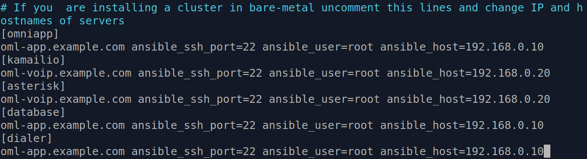
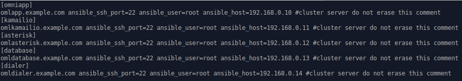
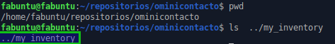

*******************************
Horizontal Cluster Installation
*******************************

OMniLeads puede ser desplegado de manera tal que los componentes queden separados en diferentes hosts. A diferencia de la instalación AIO (All In One) que despliega todo OMniLeads en un único host, este método de instalación permite dividir la carga de los servicios en más de un host.

Puntualmente existen dos formas de instalar en cluster horizontal:

OMniLeads in two:
^^^^^^^^^^^^^^^^^
- Host1 (omlvoip): Asterisk y Kamailio + rtpengine
- Host2 (omlapp): Aplicación web, Postgres y Dialer

.. image:: images/install_cluster_in_2.png

*Figure 1: Cluster in 2 hosts*

OMniLeads in five:
^^^^^^^^^^^^^^^^^^
- Host1 (omlapp): Aplicación web
- Host2 (kamailio): Kamailio + rtpengine
- Host3 (asterisk): Asterisk
- Host4 (database): Postgresql
- Host5 (dialer): Wombat dialer + MySQL

.. image:: images/install_cluster_in_5.png

*Figure 2: Cluster in 5 hosts*

Pre-requisitos
^^^^^^^^^^^^^^
Los hosts sobre los cuales vamos a desplegar los servicios en cluster deben cumplir con los siguientes requisitos:

- GNU/Linux CentOS 7.6 (minimal), Debian 9 (netinstall) ó Ubuntu Server 18.04
- Al menos 20 GB de espacio en disco
- Al menos 4 GB de memoria RAM
- Si es *Ubuntu / Debian*; Instalar el paquete *sudo*, *openssh-server* y *phyton-minimal*, permitir login SSH con el usuario *root* y reiniciar el servicio de ssh para que se tomen los cambios:

.. note::

   En versiones menores a CentOS 7.6 es necesario primero hacer un yum update y luego reebotear el server

::

  apt-get install sudo openssh-server python-minimal -y
  sed -i 's/#PermitRootLogin prohibit-password/PermitRootLogin yes/' /etc/ssh/sshd_config
  systemctl restart ssh

- Es muy importante dejar la hora correctamente configurada en cada host.
- Configurar una *dirección IP* y un *hostname* fijo en cada host destino de la instalación.

Preparación en la máquina que ejecuta la instalación remota:
^^^^^^^^^^^^^^^^^^^^^^^^^^^^^^^^^^^^^^^^^^^^^^^^^^^^^^^^^^^^
Al igual que en la instalación "desde ansible remoto", para desplegar OMniLeads en cualquiera de los dos tipos de clusters, debemos proceder con la ejecución del script de deploy a partir de contar con el proyecto clonado sobre una estación de trabajo con GNU/Linux (deployer). Desde la misma se ejecuta la instalación del cluster. Para generar nuestro host "deployer", sugerimos repasar el ítem "Preparación en la máquina que ejecuta la instalación remota" dentro de la sección
"instalación desde ansible remoto".

Se considera entonces que el usuario dispone del repositorio clonado en su Linux Workstation (OMniLeads deployer) !

Preparación del archivo *inventory*:
^^^^^^^^^^^^^^^^^^^^^^^^^^^^^^^^^^^^
Para este tipo de despliegue, se deben configurar los parámetros *hostname* y *dirección IP* de cada host-componente de nuestro cluster.

- Ejemplo para *OMniLeads in two*

*Figure 3: Cluster in 2 hosts, inventory file*

Como se puede apreciar en la figura 3, se agrupan los componentes Aplicación web + Database + Dialer bajo un *hostname* y *dirección IP* por un lado, y por otro lado Asterisk + Kamailio bajo otro *hostname* y *dirección IP*. De esta manera se despliegan dichos componentes en dos hosts destino independientes entre si.

- Ejemplo para *OMniLeads in five*

*Figure 4: Cluster in 5 hosts, inventory file*

Como se puede apreciar en la figura 4, se separan todos los componentes Aplicación web, Database, Dialer diferentes *hostname* y *dirección IP*, ya que cada componente corre
bajo un host dedicado e independiente.

Al igual que en las otras instalaciones, las variables y passwords de los diferentes componentes se pueden modificar en la sección  *[everyyone:vars]*

.. image:: images/install_inventory_passwords.png

*Figure 5: Passwords and parameters of services*

- Introducir el parámetro "time zone" adecuado para su instanacia. Es **Importante** que realice este paso o la instalación no se va a poder realizar.

.. image:: images/install_inventory_timezone.png

*Figure 6: inevntory - Time Zone parameter*

Es importante aclarar que cada vez que se corre el script "./deploy.sh" ya sea para instalar, re-instalar, actualizar, modificar la dirección IP de OML, etc.,
el archivo de inventory se vuelve a "cero". No obstante se genera una copia del archivo (my_inventory), de manera tal que se cuente con los parámetros
del sistema utilizados en la última ejecución del script.
La copia en cuestión se ubica en el path donde ha sido clonado el repositorio de OML y bajo el nombre de "my_inventory" como lo expone la figura 6.

*Figure 7: inevntory copy, my_inventory file*

Ejecución del script de instalación:
^^^^^^^^^^^^^^^^^^^^^^^^^^^^^^^^^^^^

La instalación de OMniLeads se realiza mediante el script *deploy.sh*, ubicado dentro de la carpeta deploy/ansible con respecto a la carpeta
raíz del proyecto (ominicontacto).

Una vez configuradas las variables citadas, se procede con la ejecución del script de instalación (uitilizando sudo).

::

  sudo ./deploy.sh -i

.. image:: images/install_deploysh_cluster.png

*Figure 8: remote root passwords*

La diferencia respecto de las otras instalacines, es que el script nos pide las contraseñas del usuario *root* de cada host
destino de la instalación de nuestro cluster.

El tiempo de instalación dependerá mayormente de la velocidad de conexión a internet del host sobre ek que se está corriendo el deplot de  OML, ya que se deben descargar, instalar y configurar varios paquetes correspondientes a los diferentes componentes de software que conforman el sistema.

Si la ejecución de la instalación finaliza exitosamente, se despliega una vista como la de la figura 8.

.. image:: images/install_ok_cluster.png

*Figure 9: OMniLeads installation ended succesfuly*

Primer acceso a OMniLeads:
^^^^^^^^^^^^^^^^^^^^^^^^^^

Si la ejecución de la instalación fue exitosa, entonces vamos por el primer acceso a OMniLeads.

.. toctree::
   :maxdepth: 2

   install_first_access.rst

Errores comunes:
^^^^^^^^^^^^^^^^

- Alguno de los hosts no tiene internet o no resuelve dominios (configuración de DNS).

*Compruebe el acceso a internet de cada host (por ej: actualizando paquetes - apt-get update | yum update).*

- Timeout de algún paquete que se intenta bajar. Puede volver a intentar ejecutar el deploy y si vuelve a fallar, la opción puede ser

*Instalar el paquete desde la terminal.*

- Falla por mala sintaxis o falta de definición de *hostname* y *dirección IP* en el archivo *inventory*.

*Revisar archivo inventory*

- No se configuró correctamente el acceso ssh del host destino de la instalación.

*Revisar estado del firewall. Comprobar acceso remoto por ssh con el usuario root*

- En caso de contar con algún host Ubuntu-Debian, recordar que se deben instalar paquetes como *sudo, openssh-server o python-minimal* antes de correr el script de *deploy.sh*
