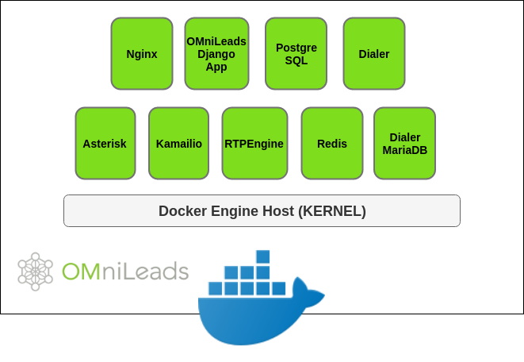
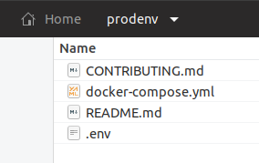
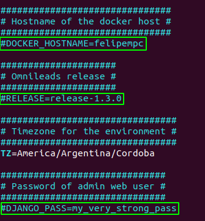
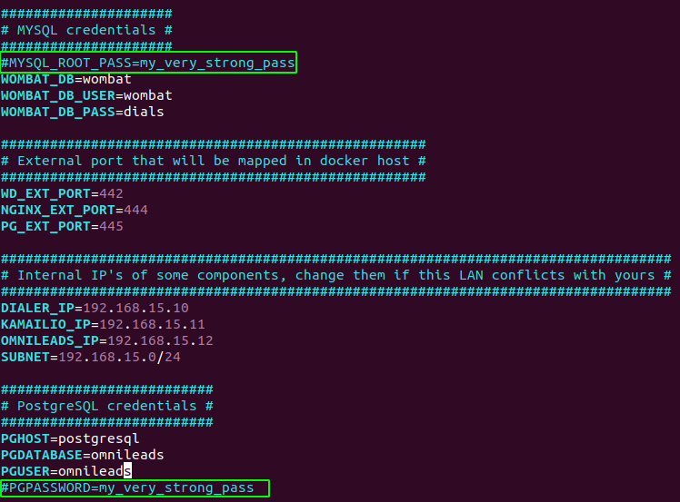
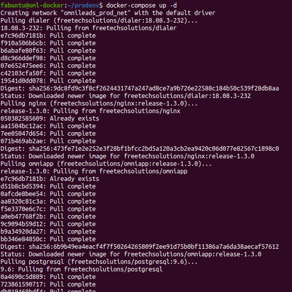
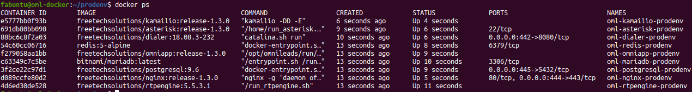
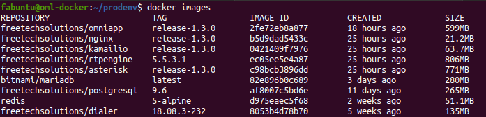
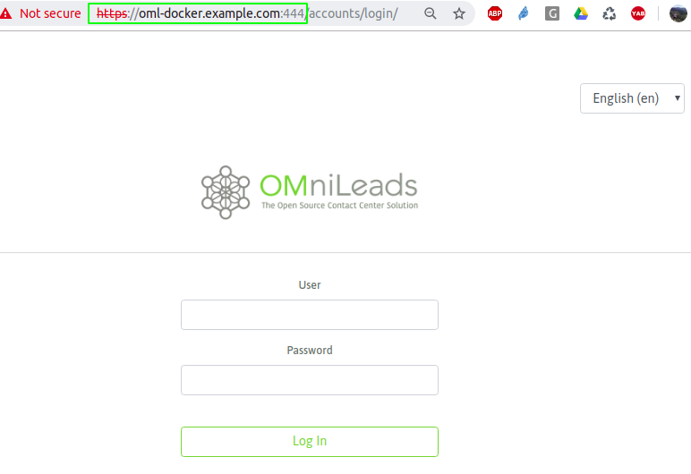

.. _about_install_docker:

**************************
Deploy utilizando Docker
**************************

OMniLeads puede ser desplegado como una suite de contenedores Docker, en este apartado vamos a cubrir los pasos necesarios para ejecutar el sistema bajo esta arquitectura.

.. note::

  Antes de avanzar aclaramos que todo lo expuesto a continuación, tiene garantías en cualquier host GNU/Linux que corra Docker-Engine. Sin embargo con el correr del  tiempo,
  vamos a ir adicionando los pasos a seguir para que esto pueda ser ejecutado tanto en MAC OSX como en Windows.

Asumimos que el lector dispone tanto del "Docker-Engine" como de "docker-compose" en su estación de trabajo.

En caso contrario, instalar:

* https://docs.docker.com/install/.
* https://docs.docker.com/install/linux/linux-postinstall/ (si lo instala sobre GNU/Linux)
* https://docs.docker.com/compose/

OMniLeads es un sistema complejo en el cual subyacen diferentes componentes:

  - Nginx
  - Django / Python
  - Asterisk
  - Kamailio
  - RTPEngine
  - Postgres
  - Redis
  - Dialer
  - Database Dialer

*Figure 1: OML & Docker*

En nuestro repositorio se encuentra todo lo necesario para ejecutar la aplicación con Docker, vamos a posicionarnos dentro del subdirectorio "ominicontacto/deploy/docker".

.. code-block:: bash

  cd ominicontacto/deploy/docker

Allí entonces contamos con la carpeta "prodenv" la cual debemos copiar y pegar en cualquier ubicación dentro del "docker-engine" host.

.. code-block:: bash

  cp -a ./prodenv ~/

Luego pasamos a listar los archivos existentes inicialmente dentro de la carpeta mencionada anteriormente:

* El archivo oculto **.env**, donde residen las variables de entorno.
* El archivo **docker-compose.yml**, donde se especifica cada micro-servicio con su contenedor parametrizado para implementarlo.
* El archivo **README.md** con las indicaciones para levantar el entorno.
* El archivo **CONTRIBUTING.md** para aquellos entusiastas dockerizados que deseen aportar sus conocimientos al proyecto.

*Figure 2: prodenv folder*

Variables de entorno
********************

Antes de lanzar la ejecución del "docker-compose" que levanta el entorno (todos los contenedores), debemos establecer algunos parámetros del sistema dentro del archivo oculto
".env". En este archivo se configuran variables de entorno que serán utilizadas por los contenedores.

El archivo se encuentra documentado con comentarios, no obstante vamos a citar los principales parámetros a continuación:

Como podemos observar en la figura, se deben ajustar las variables:

* **DOCKER_HOSTNAME**: es el nombre del host que está ejecutando el docker-engine.
* **RELEASE**: es el release de OMniLeads que se desea desplegar
* **TZ**: la zona horaria
* **DJANGO_PASS**: es la contraseña del usuario admin de la aplicación.

*Figure 3: env variables*

Las otras variables que vamos a repasar son:

* MYSQL_ROOT_PASS: la contraseña para el motor MySQL (necesario para el módulo Dialer)
* PGPASSWORD: la contraseña del usuario "omnileads" de PostgreSQL

*Figure 4: env variables*

Una vez ajustadas las variables marcadas, estamos en condiciones de ejecutar el deploy de OMniLeads.

.. note::

   Las direcciones IP citadas en el archivo, SOLAMENTE deben modificarse en caso de que su dirección de red (donde se ejecuta el docker-engine) coincida con el rango
   de las direcciones aquí citadas.

   .. image:: images/env-3.png

Deploy de la aplicación
************************

Para ejecutar el despliegue de la aplicación debemos lanzar el comando "docker-compose" dentro de nuestro directorio "prodenv".

.. code-block:: bash

  docker-compose up -d

Si es la primera vez que lo ejecutamos, se va a demorar un tiempo en descargar las imágenes de cada componente. Esto luce de la siguiente manera.

*Figure 5: docker-compose up*

Una vez finalizada la ejecución del comando (la opción -d nos permite recuperar la terminal), podemos ejecutar el comando "docker ps" y "docker images" para visibilizar
que los contenedores están activos y sus imagenes disponibles.

*Figure 6: docker ps*

*Figure 7: docker images*

Listo para utilizar !
************************

Para acceder debemos apuntar con https al "hostname" del docker-engine y puerto 444 (si dejó el puerto por defecto en ".env").

*Figure 8: login*

Ahora si, podemos continuar con la `configuración inicial <https://documentacion-omnileads.readthedocs.io/es/latest/initial_settings.html>`_

.. note::

   Es importante aclarar que el login de Agente en OMniLeads **SI o SI** tiene que ser accediendo a la aplicación mediante su hostname, **NO** utilizando la dirección IP.
   Por lo tanto si el hostname del docker-engine no lo resuelve nuestro DNS local, debemos cargar esta resolución en cada "archivo de hosts" de cada estación de agente.
   En `este link <https://documentacion-omnileads.readthedocs.io/es/latest/install_first_access.html#about-first-access>`_ se explica cómo llevarlo a cabo.
