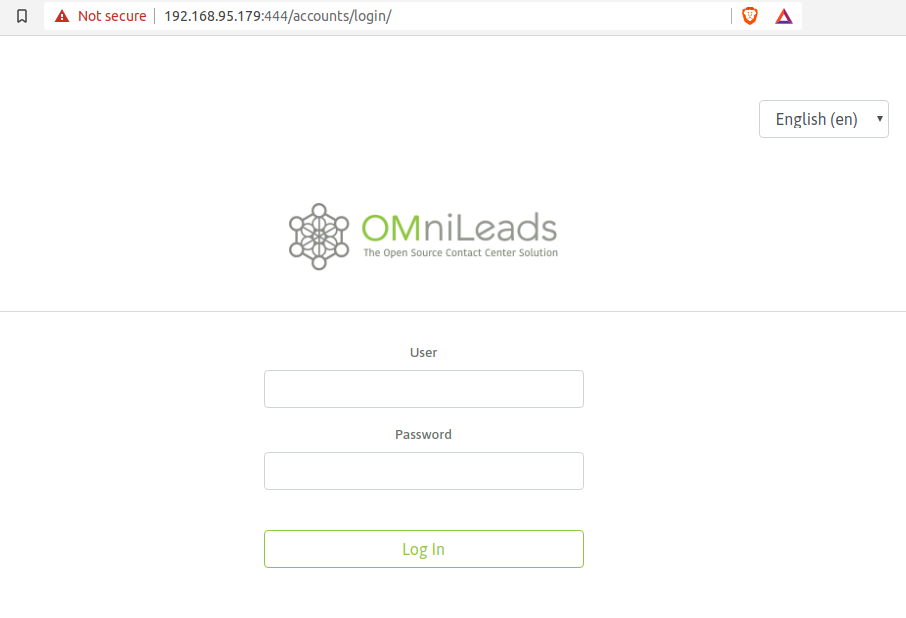

.. _about_install_docker_linux:

*******************************************
Instalación sobre CentOS7 utilizando Docker
*******************************************

A partir de la versión 1.4.0, OMniLeads puede ser desplegado en producción utilizando Docker. En esta sección se cubren todos los aspectos necesarios
para correr la aplicación utilizando esta novedosa tecnología de "virtualización" sobre CentOS-7 como sistema operativo subyacente.

Al ejecutar el proceso de instalación disponible en el repositorio, se procede con la instalación de:

  * Docker
  * docker-compose
  * PostgreSQL
  * MySQL
  * RTPEngine

Estos componentes serán instalados y se van a ejecutar directamente sobre el sistema operativo de base.

Por otro lado los componentes restantes de la aplicación, serán ejecutads como contenedores Docker.

En la siguiente figura se presenta un esquema representativo acerca del cómo se despliega OMniLeads.

  .. image:: images/install_docker_centos.png
        :align: center

Como se puede observar los componentes: Asterisk, Kamailio, Nginx, Wombat Dialer, Redis y OMni-App se ejecutan en contenedores, mientras que RTPengine, PostgreSQL y MySQL sobre el sistema operativo base.

Procedimiento de instalación
****************************

Como primer paso se procede con el ingreso al host Linux para luego descargar el repositorio de OMniLeads y una vez clonado el repositorio
debemos posicionarnos sobre el path *relativo*; ominicontacto/deploy/docker/prodenv.

  .. code-block:: bash

    yum -y install git
    cd /var/tmp
    git clone https://gitlab.com/omnileads/ominicontacto.git
    cd ominicontacto/deploy/docker/prodenv

Una vez ubicados en el *Path* indicado, se debe editar el archivo *.env* en pos de asociar valores a variables utilizadas para el deploy de OMniLeads.

.. _about_install_docker_env:

Variables de entorno *.env*
****************************

En este archivo se configuran variables de entorno que serán utilizadas por los contenedores.

El archivo se encuentra documentado con comentarios, no obstante vamos a citar los principales parámetros a continuación.

Las variables *DOCKER_HOSTNAME* y *DOCKER_IP* se corresponden con la dirección IP LAN asignada a la interfaz principal del host Linux.

Luego tenemos a la variable *RELEASE* que hace alusión a la versión de OMniLeads que se desea desplegar, la variable *TZ* (Time Zone) y la variable *DJANGO_PASS* la cual implementa
la contraseña del usuario web admin de OMniLeads.

.. code-block:: bash

  ###############################################################################
  #                       IP and hostname of the docker host:                   #
  #  If you want to use a hostname to connect web OMnileads type your hostname  #
  #  If not type the IP address in both variables                               #
  ###############################################################################
  #DOCKER_HOSTNAME=your.hostname.com
  #DOCKER_IP=X.X.X.X

  #####################
  # Omnileads release #
  #####################
  #RELEASE=release-1.3.4

  ################################
  # Timezone for the environment #
  ################################
  TZ=America/Argentina/Cordoba

  ##############################
  # Password of admin web user #
  ##############################
  #DJANGO_PASS=my_very_strong_pass

Ponemos el foco en el bloque de variables inherentes a MySQL, donde se deben editar las variables *MYSQL_ROOT_PASS* con el valor de la contraseña del usuario root de MySQL. En CentOS-7 MySQL queda sin password
a la hora de conectar desde *localhost*, en tal caso descomentar el parámetro y dejarlo vacío (MYSQL_ROOT_PASS=), si es que usted no generó un password de root.
Con respecto al segundo parámetro a configurar *MYSQL_HOST*, se debe utilizar la dirección IP LAN del host.

.. code-block:: bash

  #####################
  # MYSQL credentials #
  #####################
  #MYSQL_ROOT_PASS=my_very_strong_pass
  #MYSQL_HOST=X.X.X.X
  WOMBAT_DB=wombat
  WOMBAT_DB_USER=wombat
  WOMBAT_DB_PASS=dials

Finalmente nos concentramos sobre los parámetros *PGHOST* correspondiente a la dirección IP LAN del host y *PGPASSWORD* es la contraseña del usuario omnileads del motor PostgreSQL que utiliza la aplicación.
Aquí debemos elegir una contraseña a nuestro antojo.

.. code-block:: bash

  ##########################
  # PostgreSQL credentials #
  ##########################
  #PGHOST=X.X.X.X
  PGDATABASE=omnileads
  PGUSER=omnileads
  #PGPASSWORD=my_very_strong_pass

Una vez ajustadas las variables marcadas, estamos en condiciones de ejecutar el deploy de OMniLeads.

.. note::

   El parámetro *SUBNET=192.168.15.0/24*, SOLAMENTE deben modificarse en caso de que su dirección IP LAN del Linux host (donde se ejecuta el docker-engine) coincida con este rango
   aquí citadas.

Dentro de la carpeta donde reside el archivo de variables *.env*, sobre el cual estuvimos trabajando tenemos al script de instalación: *install.sh*. El cual debe ser ejecutado como *root*, a partir
de haber establecido correctamente cada parámetro del archivo *.env* previamente repasado.

 .. code-block:: bash

   ./install.sh

A partir de entonces comenzará el proceso de instalación y posterior lanzamiento de la applicación.

.. important::

   Dentro de los pasos que contempla la instalación está la ejecución del *docker-compose* que levanta los contenedores. Al ser la primera ejecución se deben
   descargar las imágenes Docker de cada componente, por lo que el proceso puede demorar hasta varias decenas de minutos dependiendo la velocidad de conexión a internet.

.. image:: images/install_docker_download_img.png
   :align: center

Systemd - omnileads-pbx
***********************

A partir de la isntalación se deja disponible el servicio: omnileads-pbx.service el cual servirá para parar/levantar la aplicación. El sistema se deja configurado para que
inicie automáticamente luego de cada reinicio del sistema operativo de base.

Para verificar el servicio:

.. code-block:: bash

  systemctl status omnileads-pbx

Si todo es correcto deberíamos obtener la siguiente salida:

.. image:: images/install_docker_systemctl_status.png
      :align: center

Para bajar el servicio:

 .. code-block:: bash

   systemctl stop omnileads-pbx

Para levantar el servicio:

 .. code-block:: bash

   systemctl start omnileads-pbx

Primer login
************

Para acceder al sistema y comenzar la  :ref:`about_initial_settings` debemos acceder desde un navegador web a la URL conformada por la
dirección IP del host Linux utilizando *https* y el puerto *444*, como se indica en la figura.

