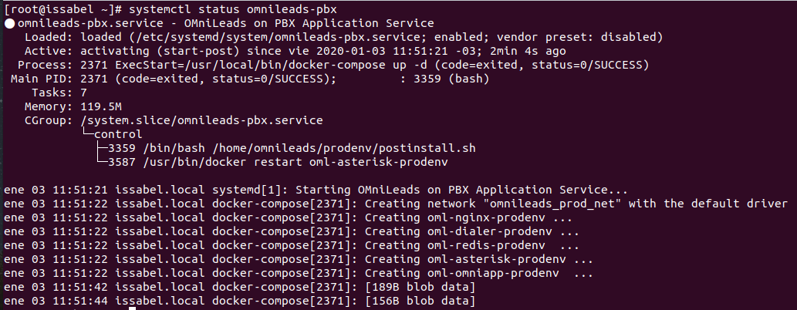

.. _about_install_docker_linux:

*******************************************
Instalación de OMniLeads utilizando Docker
*******************************************

A partir de la versión 1.4.0, OMniLeads puede ser desplegado en producción utilizando Docker. En esta sección se cubren todos los aspectos necesarios
para correr la aplicación utilizando esta novedosa tecnología de "virtualización" sobre CentOS-7, FreePBX o Issabel como sistema operativo subyacente.

.. note::

  Antes de avanzar aclaramos que todo lo expuesto a continuación, tiene garantías en `Issabel-20200102 <https://razaoinfo.dl.sourceforge.net/project/issabelpbx/Issabel%204/issabel4-USB-DVD-x86_64-20200102.iso>`_. Para
  `FreePBX-15 <https://downloads.freepbxdistro.org/ISO/SNG7-FPBX-64bit-1910-2.iso>`_ existe un workaround que se detalla al final de esta sección.

Al ejecutar el proceso de instalación disponible en el repositorio, se procede con la instalación de:

  * Docker
  * docker-compose
  * PostgreSQL
  * MySQL
  * RTPEngine

Estos componentes serán instalados y se van a ejecutar directamente sobre el sistema operativo de base.
Por otro lado los componentes restantes de la aplicación, serán ejecutadoss como contenedores Docker.
En la siguiente figura se presenta un esquema representativo acerca del cómo se despliega OMniLeads.

  .. image:: images/install_docker_centos.png
        :align: center

Como se puede observar los componentes: Asterisk, Kamailio, Nginx, Wombat Dialer, Redis y OMni-App se ejecutan en contenedores, mientras que RTPengine, PostgreSQL y MySQL sobre el sistema operativo base. 
A nivel de red, estos componentes se despliegan en una red LAN la cual es creada por docker, creando interfaces virtuales por cada componente.
Este tipo de configuración de red es llamado `Bridge network <https://docs.docker.com/network/bridge/>`_. La LAN por defecto para los containers es 192.168.15.0/24.

Procedimiento de instalación
****************************

Como primer paso se procede con el ingreso al host Linux para luego descargar el repositorio de OMniLeads y una vez clonado el repositorio
debemos posicionarnos sobre el path *relativo*; ominicontacto/deploy/docker/prodenv.

  .. code-block:: bash

    yum -y install git kernel-devel kernel-headers
    yum update -y
    reboot

Una vez terminado el reboot se procede a usar Ansible para la instalación, pudiendo hacerlo de los dos modos: :ref:`about_install_selfhosted` o :ref:`about_install_remote`.
Hay que tener en cuenta un estas cosas:

1. Modificar y descomentar la línea de la sección [prodenv-container] dependiendo de si se va a instalar remoto o self-hosted.

.. code-block:: bash

  # If you are installing a devenv (PE) uncomment
  [prodenv-container]
  #localhost ansible_connection=local ansible_user=root #(this line is for self-hosted installation)
  #X.X.X.X ansible_ssh_port=22 ansible_user=root #(this line is for node-host installation, replace X.X.X.X with the IP of Docker Host)

2. Revisar la sección :ref:`about_install_inventory_docker` para ver las variables de docker a modificar.
3. Modificar las variables del archivo de inventario :ref:`about_install_inventory_vars`.

.. note::

   * La variable *subnet=192.168.15.0/24*, debe modificarse OBLIGATORIAMENTE en caso de que su dirección IP LAN del Linux host (donde se ejecuta el docker-engine) coincida con este rango aquí citadas.
   * Para una instalación de ceros, en la variable *mysql_root_password* ingresar **LA MISMA** contraseña de mysql que se ingresó a la hora de instalar el FreePBX e Issabel.

4. Ejecutar el script deploy.sh de la siguiente forma:

**Para ansible remoto:**

.. code-block:: bash

  ./deploy.sh --docker-deploy

**Para ansible self-hosted:**

.. code-block:: bash

  ./deploy.sh --docker-deploy --iface=<your_iface>

Donde **<your_iface>** es la interfaz con la IP que se quiere usar para levantar los servicios que componen OMniLeads (suele ser la IP de la interfaz LAN del servidor).

Systemd - omnileads-prodenv
****************************

A partir de la isntalación se deja disponible el servicio: omnileads-prodenv.service el cual servirá para parar/levantar la aplicación. El sistema se deja configurado para que
inicie automáticamente luego de cada reinicio del sistema operativo de base.

Para verificar el servicio:

.. code-block:: bash

  systemctl status omnileads-prodenv

Si todo es correcto deberíamos obtener la siguiente salida:

Para bajar el servicio:

 .. code-block:: bash

   systemctl stop omnileads-prodenv

Para levantar el servicio:

 .. code-block:: bash

   systemctl start omnileads-prodenv

Primer login
************

Al igual que en la sección :ref:`about_install_first_login`, con la diferencia de que se debe ingresar al puerto 444:

.. code-block:: bash

  https://YOUR_HOSTNAME:444

.. important::

  En el caso de estar ejecutando este procedimiento sobre FreePBX, se debe considerar el siguiente workaround debido al tratamiento que dicha distribución hace sobre Iptables.

Workaround para freePBX
***********************

Luego de cada *reboot* del sistema operativo se deberán ejecutar los siguientes comandos para dejar apta la instancia para comenzar a trabajar.

.. code-block:: bash

  systemctl restart docker
  systemctl restart omnileads-prodenv

Estos dos comandos dejaran lista la instancia de OMniLeads sobre FreePBX.

.. Note::

    En próximas versiones se tratará de optimizar la ejecución sobre FreePBX.

FAQ
***

1. **Como cambiar las contraseñas de los containers docker?**

Hay tres contraseñas importantes: 
  - **OMniLeads Web GUI:** cambiar la variable $DJANGO_PASS en el archivo .env y reiniciar el container de omniapp: **docker restart oml-omniapp-prodenv**
  - **Postgresql y MySQL:** observar la sección de :ref:`about_maintance_change_ip_passwords`

2. **Mi segmento de red LAN es 192.168.15.0/24 o está dentro de este segmento**

Por defecto el entorno docker se levanta con esta subred interna. Cambiar la variable **SUBNET** en el archivo .env y reiniciar el servicio **omnileads-prodenv**.

3. **El entorno no inicia debido a que docker-compose dice que hay un puerto en uso, que hago?**

Hay tres puertos del Docker Host que se usan para mapear puertos internos de los containers, estos son:

*  WD_EXT_PORT=442  --> mapea con el puerto 8080/tcp en Wombat Dialer, para acceder a la GUI
*  NGINX_EXT_PORT=444 --> mapea con el puerto 443/tcp en Omniapp para acceder a OMniLeads GUI
*  PG_EXT_PORT=445  --> mapea con el puerto 5038/tcp en Postgresql para acceder a la base de datos de OMniLeads