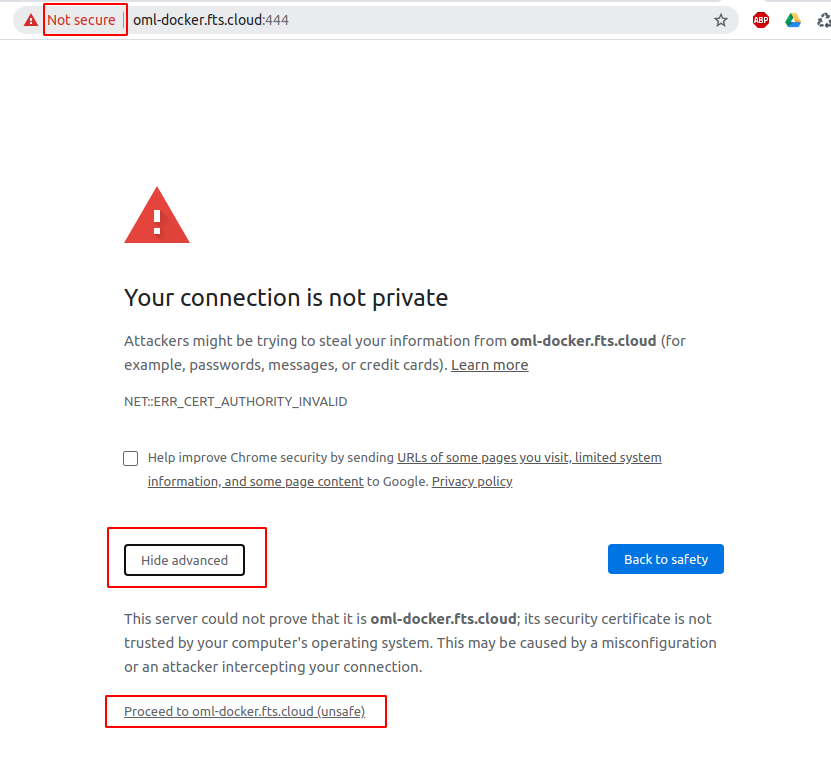

.. _about_first_access:

Primer acceso a OMniLeads
*************************

Para acceder al sistema OMniLeads debe ingresar a:

https://omnileads-hostname o https://omnileads-ip

.. note::

  A partir del release-1.10.0 El acceso web a OMniLeads puede ser usando hostname.domain o IP.

Tenemos tres posibilidades para ingresar por hostname:

* 1 - **Que los DNS de la red lo hagan**: la URL con la que usuarios administrativos y agentes acceden a la App debe ser resuelta por los DNS.
* 2 - **Forzar la resolución utilizando el archivo host de su OS**:  se trata de configurar en cada uno de las estaciones de trabajo que accederán a la App una entrada en el archivo *hosts* con el fin de que se resuelva la URL de OMniLeads con su respectiva IP de host. En el caso de Windows (*C:\Windows\System32\drivers\etc*), Para Linux o Mac (*/etc/hosts*).
* 3 - **Que un DNS externo resuelva el hostname**: suele ser el escenario mas común en entornos cloud.

Ejemplo para MAC / Linux:

.. image:: images/install_dns_hosts.png

Al encontrarnos con la pantalla de login, ingrese con las siguientes credenciales: usuario **admin** y contraseña **admin**, como se expone en la figura 2.

.. image:: images/install_1st_login.png

.. note::

  Si la instalación no cuenta con certificados de confianza y en su lugar el deploy generó certificados auto-firmados, nos vamos a encontrar con la advertencia del navegador, la cual se deberá ignorar y acceder al sitio.

.. note::

  Luego de ingresar con las credenciales por defecto, podrá cambiar la contraseña del usuario admin.

.. important::

    Si realizó **instalación con Docker** se usa el puerto 444 para el acceso web, ejemplo:

    * https://omnileads-hostname:444

    Esto es con el fin de que no conflictue con el clásico 443 que ya lo usan la web de FreePBX o Issabel
