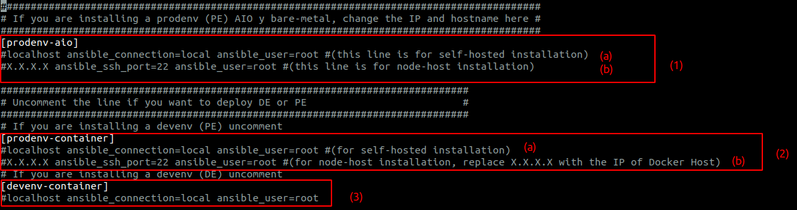

.. _about_install_inventory:

*********************
Archivo de inventario
*********************

En las diferentes secciones del *archivo de inventario* se presentan parámetros relacionados al despliegue de la App:

* Tipo de instalación a ejecutar
* Arquitectura de OMniLeads a desplegar
* Usuarios y Contraseñas de los diferentes componentes de la App
* Tiempos de sesión
* Formato de las grabaciones
* Zona horaria
* Soporte para NAT

Tipo de arquitectura a desplegar
********************************

Comenzamos por explicar la primera sección del archivo, en donde se especifica el tipo de Arquitectura a desplegar y bajo qué método de instalación. Recordemos
que las combinaciones posibles son:

* **1-a)** OMniLeads arquitectura tradicional (AIO) a través de una instalación Self-Hosted
* **1-b)** OMniLeads arquitectura tradicional (AIO) a través de una instalación Deployer-Nodes
* **2-a)** OMniLeads sobre Contenedores Docker a través de una instalación Self-Hosted
* **2-b)** OMniLeads sobre Contenedores Docker a través de una instalación Deployer-Nodes
* **3)** OMniLeads devenv (Entorno de desarrollo)

.. _about_install_inventory_aio:

OMniLeads arquitectura tradicional (AIO)
****************************************
Para desplegar esta arquitectura [:ref:`about_install_tradicional`], se debe trabajar con la seccion **[prodenv-aio]** (1-a y 1-b):

.. code-block:: bash

 ##########################################################################################
 # If you are installing a prodenv (PE) AIO y bare-metal, change the IP and hostname here #
 ##########################################################################################
 [prodenv-aio]
 #localhost ansible_connection=local ansible_user=root #(this line is for self-hosted installation)
 #X.X.X.X ansible_ssh_port=22 ansible_user=root #(this line is for node-host installation)

* **Instalación Self-Hosted:** en el caso de aplicar (1-a), se debe descomentar la primera línea, quedando:

.. code:: bash

  [prodenv-aio]
  localhost ansible_connection=local ansible_user=root #(this line is for self-hosted installation)
  #X.X.X.X ansible_ssh_port=22 ansible_user=root #(this line is for node-host installation)

* **Instalación deployer-nodes:** en el caso de aplicar (1-b), se debe descomentar la segunda línea, y reemplazar la cadena *X.X.X.X* por la IP del nodo a desplegar:

.. code:: bash

  [prodenv-aio]
  #localhost ansible_connection=local ansible_user=root #(this line is for self-hosted installation)
  192.168.95.100 ansible_ssh_port=22 ansible_user=root #(this line is for node-host installation)

.. _about_install_inventory_docker:

OMniLeads sobre contenedores Docker
***********************************
Para desplegar esta arquitectura [:ref:`about_install_contenedores`], se debe trabajar con la sección **[prodenv-container]** (2-a y 2-b):

.. code-block:: bash

  # If you are installing a devenv (PE) uncomment
  [prodenv-container]
  #localhost ansible_connection=local ansible_user=root #(this line is for self-hosted installation)
  #X.X.X.X ansible_ssh_port=22 ansible_user=root #(this line is for node-host installation, replace X.X.X.X with the IP of Docker Host)

* **Instalación Self-Hosted:** en el caso de aplicar (2-a), se debe descomentar la primera línea, quedando:

.. code:: bash

  [prodenv-container]
  localhost ansible_connection=local ansible_user=root #(this line is for self-hosted installation)
  #X.X.X.X ansible_ssh_port=22 ansible_user=root #(this line is for node-host installation, replace X.X.X.X with the IP of Docker Host)

* **Instalación deployer-nodes:** en el caso de aplicar (2-b), se debe descomentar la segunda línea, y reemplazar la cadena *X.X.X.X* por la IP del nodo a desplegar:

.. code:: bash

  [prodenv-container]
  #localhost ansible_connection=local ansible_user=root #(this line is for self-hosted installation)
  192.168.95.100 ansible_ssh_port=22 ansible_user=root #(this line is for node-host installation, replace X.X.X.X with the IP of Docker Host)

.. important::

  Estar muy atento a la hora de descomentar las líneas adecuadas de acuerdo a la arquitectura a desplegar y su método de instalación. No descomentar las de entorno de container si se quiere instalar AIO, por ejemplo.

.. _about_install_inventory_vars:

Parámetros y contraseñas
***************************
Una vez configurada la parte inherente a la arquitectura y tipo de instalación, se avanza con todo lo respectivo a usuarios y contraseñas de algunos componentes
así como también ciertos parámetros de la App:

.. code-block:: bash

  [everyone:vars]

  ###############
  # Credentials #
  ###############

  #####################################################################
  #                           Database                                #
  #                    SET POSTGRESQL PASSWORD                        #
  #####################################################################
  postgres_database=omnileads
  #postgres_user=omnileads
  #postgres_password=my_very_strong_pass
  #####################################################################
  #                           Web Admin                               #
  #                     SET WEB ADMIN PASSWORD                        #
  #####################################################################
  #admin_pass=my_very_strong_pass
  #######################################
  # AMI for wombat dialer and OMniLeads #
  #######################################
  #ami_user=omnileadsami
  #ami_password=5_MeO_DMT
  #############################
  # Wombat dialer credentials #
  #############################
  #dialer_user=demoadmin
  #dialer_password=demo
  #################################################################################################
  # Set the timezone where the nodes are. UNCOMMENT and set this if you are doing a fresh install #
  #################################################################################################
  #TZ=America/Argentina/Cordoba
  ####################################################################################################
  # Session Cookie Age (SCA) is the time in seconds that will last the https session when inactivity #
  # is detected in the session (by default is 1 hour)                                                #
  ####################################################################################################
  SCA=3600
  ###############################################################################################
  # Ephemeral Credentials TTL (ECTTL) is the time in seconds that will last the SIP credentials #
  # used to authenticate a SIP user in the telephony system (by default 8 hours)                #
  ###############################################################################################
  ECCTL=28800
  #################################################################################################
  # MONITORFORMAT refers to the format that your recordings will be converted.                    #
  # Mp3 is the preferred format because the small size of file.                                   #
  # If you want your recordings in format "wav" (asterisk default recording format), change this  #
  # variable to wav.                                                                              #
  # The conversion of recordings is scheduled to be done at 01:00 am everyday.                    #
  # You can edit this # changing crontab of omnileads user                                        #
  #################################################################################################
  MONITORFORMAT=mp3
  #################################################################################################
  # Login failure limit (LFM) is the attempts a user has to enter an incorrect password in login  #
  # Decrease it if paranoic reasons                                                               #
  #################################################################################################
  LOGIN_FAILURE_LIMIT=10
  ####################################
  # Language of schedule disposition #
  ####################################
  schedule=Agenda

Como se puede observar, el archivo viene completamente documentado en términos de cada variable o parámetro.

.. important::

  A la hora de los despliegues hay que descomentar los parámetros citados. Si usted no los descomenta la instalación fallará.

.. _about_install_inventory_oml_cloud:

Parámetros para desplegar detrás NAT
************************************

Los parámetros **external_hostname**, **external_port**, deben configurarse si e quiere instalar un OMniLeads en un servidor detrás de NAT, en donde
los agentes se conectan a la URL conformada por **https://external_hostname:external_port**, desde Internet.

.. image:: images/install_oml_nat.png

Como se intenta expresar en la imagen, se asume que los usuarios *remotos* accederán a la App utilizando una URL (dominio y puerto) que resuelve en la IP pública de la interfaz WAN router/firewall.

Luego el firewall deberá reenviar el tráfico de voz y datos hacia los puertos UDP: 20000-30000 y y TCP: 443 del host donde reside la App.

.. code-block:: bash

  #######################################################################################
  #                                OMniLeads cloud:			 	      #
  # If you are wishing to install OML in a cloud provider you must set these variables: #
  #  - external_port: the outside port where OML web server will listen requests        #
  #  - external_hostname: the dns external users will connect to                        #
  #  - public_ip: where OML is installed                                                #
  #######################################################################################
  #external_port=
  #external_hostname=

.. important::

  Se deben establecer dos reglas de firewall entrantes y una saliente:

      * Reenviar tráfico entrante desde los puertos 20000 a 30000 UDP hacia los puertos 20000 a 30000 del host OMniLeads
      * Reenviar tráfico desde el *external_port* elegido hacia el puerto 443 del host OMniLeads
      * Permitir tráfico saliente desde el host OMniLeads hacia internet por los puertos 10000 al 20000

 .. _about_install_inventory_docker_vars:

Variables Docker
*****************
Esta sección permite personalizar dos parámetros a la hora de desplegar OMniLeads como contenedores docker.

.. code-block:: bash

  [docker:vars]
  registry_username=freetechsolutions
  #registry_email=
  #registry_password=
  subnet=192.168.15.0/24

* **registry_username:** si se va a deployar las imagenes oficiales de OMniLeads, dejar esta variable como está. En caso de contar con sus propias imágenes, aquí se indicará el nombre del docker-registry pertinente.
* **subnet:** se refiere a la red LAN con la que se levantarán los containers.

Las variables *registry_email* y *registry_password* son necesarias en caso de querer hacer un **build** de sus propias imágenes.
