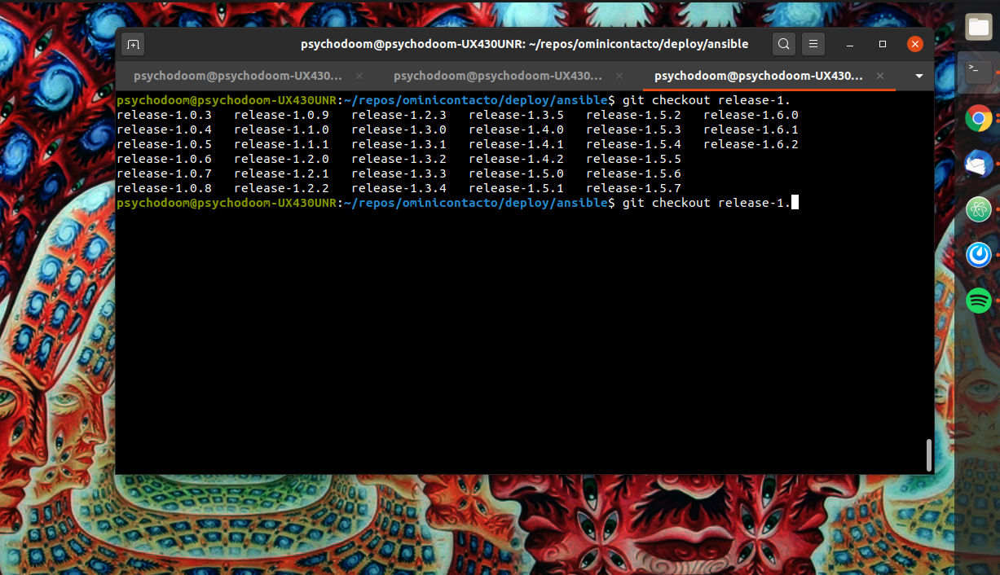
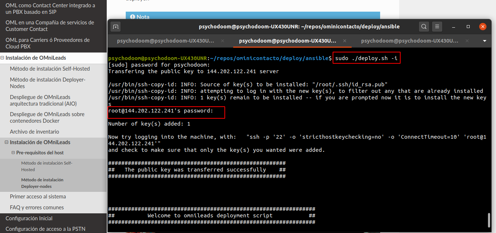
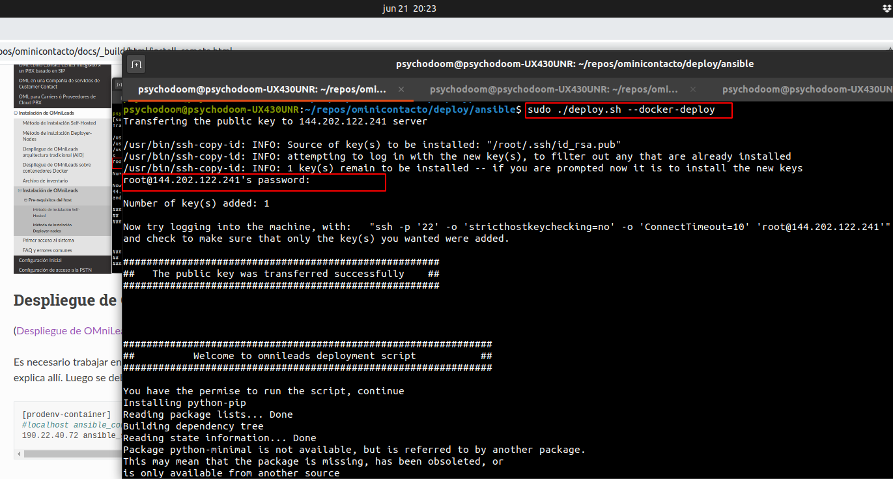

.. _about_install_remote:

*************************************
Método de instalación Deployer-nodes
*************************************
(:ref:`about_install_method_deployer`)

Partimos desde el punto de haber realizado los pasos de pre-requisitos sobre el host. Volvemos a establcer conexión SSH con el host y se procede con la ejecución de la instalación desde
nuestro deployer.

.. note::

  Actualmente podemos establecer como *deployer* los SO Ubuntu-18.04 o Debian 10

Asumiendo que contamos con el repositorio descargado dentro de cualquiera de los SO mencionados, debemos posicionarnos sobre el directorio donde reside el instalador e inventario.
Luego escojer una versión de la App a desplegar:

.. code:: bash

  cd ./ominicontacto/deploy/ansible
  git checkout release-V.V.V

Donde V.V.V es la combinación asociada a la versión de la App. Utilizando la tecla *Tab* se obtienen todas las versiones disponibles.

Una vez seleccionada la versión a instalar, se procede con la configuración de :ref:`about_install_inventory` y posterior ejecución del instalador.

.. important::

 Antes de seguir, asegurese que ha configurado su archivo de inventario, de acuerdo al tipo de instalación y arquitectura a desplegar.

Despliegue de OMniLeads arquitectura tradicional (AIO)
******************************************************
(:ref:`about_install_contenedores`)

Es necesario trabajar en la sección **[prodenv-aio]** del archivo de inventario, tal cual se explica allí.
Luego se deben ajustar todas los parámetros y variables.

.. code:: bash

  [prodenv-aio]
  #localhost ansible_connection=local ansible_user=root #(this line is for self-hosted installation)
  201.216.40.210 ansible_ssh_port=22 ansible_user=root #(this line is for node-host installation)

.. note::

  Se debe tener en cuenta que para instalación remota, se debe utilizar la línea con el parámetro "ansible_ssh_port=22" (donde 22 es el puerto por defecto, pero es normal tambien que se utilice otro puerto) dentro de la sección [prodenv-aio]

Luego se deben ajustar todas los parámetros y variables.
Una vez ajustado el archivo de inventario, se procede con la ejecución del script de instalación.

.. note::

  Tener a mano el password de root del host a desplegar (remoto), ya que será solicitado la primera vez que el deployer instala la App.

.. code-block:: bash

  sudo ./deploy.sh -i

Despliegue de OMniLeads sobre contenedores Docker
*************************************************
(:ref:`about_install_contenedores`)

Es necesario trabajar en la sección **[prodenv-conatainer]** del archivo de inventario, tal cual se explica allí.
Luego se deben ajustar todas los parámetros y variables.

.. code:: bash

  [prodenv-container]
  #localhost ansible_connection=local ansible_user=root #(this line is for self-hosted installation)
  190.22.40.72 ansible_ssh_port=22 ansible_user=root #(this line is for node-host installation, replace X.X.X.X with the IP of Docker Host)

.. note::

  Se debe tener en cuenta que para instalación remota, se debe utilizar la línea con el parámetro "ansible_ssh_port=22" (donde 22 es el puerto por defecto, pero es normal tambien que se utilice otro puerto) dentro de la sección [prodenv-aio]

Luego se deben ajustar todas los parámetros y variables.
Una vez ajustado el archivo de inventario, se procede con la ejecución del script de instalación.

.. note::

  Tener a mano el password de root del host a desplegar (remoto), ya que será solicitado la primera vez que el deployer instala la App.

.. code-block:: bash

  sudo ./deploy.sh --docker-deploy

Instalación finalizada
**********************

Al cabo de unos minutos el proceso de instalación finaliza arrojando una pantalla que evidencia la culminación exitosa del procedimiento.

.. image:: images/install_ok.png

.. important::

  Una vez finalizado la instalación, aplicar un reinicio del host.

Usted podrá proceder con el :ref:`about_first_access`
