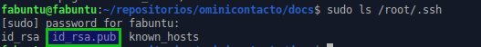
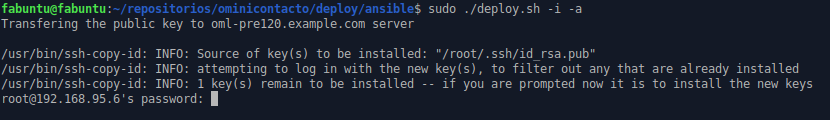
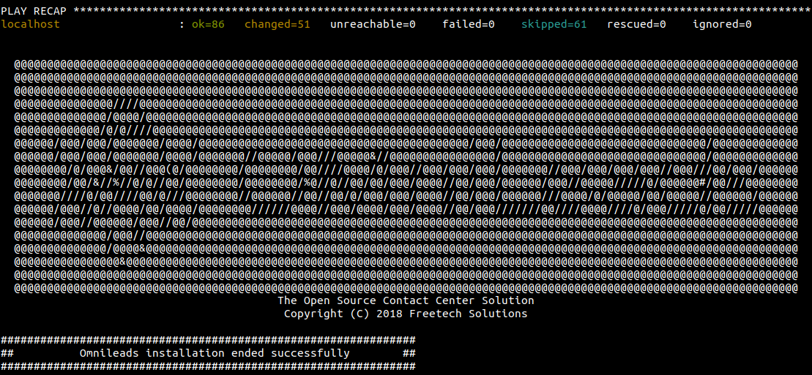

.. _about_install_remote:

********************************
Instalación desde ansible remoto
********************************

Este tipo de instalación implica que la descarga del proyecto desde el repositorio y la ejecución del script de instalación se realiza desde
la estación de trabajo del sysadmin, ya que precisamente al estar basada en Ansible la instalación se hace viable éste método.

La ventaja principal de esta opción es que el sysadmin puede instalar y mantener varias instancias de OMniLeads desde un único nodo "deployer".

.. image:: images/install_ansible_remote.png

*Figure 1: remote ansible install*

Pre-requisitos:
^^^^^^^^^^^^^^^

- Una instancia de GNU/Linux CentOS 7 (minimal), Debian 9 (netinstall) ó Ubuntu Server 18.04
- 20 GB de espacio en disco
- 4 GB de memoria RAM
- En *Ubuntu / Debian*; Instalar el paquete sudo, openssh-server y phyton-minimal, permitir login SSH con el usuario root y reiniciar el servicio de ssh para que se tomen los cambios:

.. note::

   En versiones menores a CentOS 7.6 es necesario primero hacer un yum update y luego reebotear el server

.. code-block:: bash

  apt-get install sudo openssh-server python-minimal -y
  sed -i 's/#PermitRootLogin prohibit-password/PermitRootLogin yes/' /etc/ssh/sshd_config
  systemctl restart ssh

- Es muy importante dejar la hora correctamente configurada en el host.
- Configurar una *dirección IP* y un *hostname* fijo en el host destino de la instalación.

.. _about_install_remote_deployer:

************************************************************
Preparación en la máquina que ejecuta la instalación remota
************************************************************

- Debemos contar con el paquete git para luego clonar el repositorio del protyecto y seleccionar el release a instalar.

Ubuntu - Debian:

.. code-block:: bash

  apt install git
  git clone https://gitlab.com/omnileads/ominicontacto.git
  cd ominicontacto
  git checkout master

CentOS:

.. code-block:: bash

  yum install git
  git clone https://gitlab.com/omnileads/ominicontacto.git
  cd ominicontacto
  git checkout master

- Debemos asegurarnos de contar con una clave pública generada en la carpeta /root/.ssh/

.. code-block:: bash

   code content
   sudo ls -l /root/.ssh/

Es probable que ya contemos con una clave pública (id_rsa.pub), como se aprecia en la *figura 1*.

*Figure 1: ls -a /root/.ssh command output*

En caso de NO disponer de una, se puede generar rápidamente con el siguiente comando:

::

 sudo ssh-keygen

.. image:: images/install_sshkeygen_remote.png

*Figure 2: ssh-keygen command output*

Este comando genera nuestra clave *id_rsa.pub* que mencionamos anteriormente.

- Se comprueba la *dirección IP* y *hostname* que posee el host destino de la instalación, para luego ajustar el archivo *inventory* que se utiliza a la hora de tomar los parámetros de la instalación.

::

 hostname
 ip a

.. image:: images/install_hostname_command.png

*Figure 3: hostname command output*

.. image:: images/install_ip_a_command.png

*Figure 4: ip a command output*

Preparación del archivo *inventory*:
^^^^^^^^^^^^^^^^^^^^^^^^^^^^^^^^^^^^

- En este paso debemos trabajar sobre el archivo  :ref:`about_install_inventory` disponible dentro del directorio "PATH/ominicontacto/deploy/ansible".

.. note::

   OMniLeads utiliza ansible para realizar la instalación, por lo tanto existe un "archivo de inventario" que debe ser modificado de acuerdo a los parámetros
   del host sobre el que estamos trabajando.

Modificar y descomentar la segunda linea, generar la cadena 'hostname' por el que hemos configurado a nuestro servidor. También en esta línea, se debe editar el parámetro
'X.X.X.X' con la dirección IP que implementa el host sobre el que vamos a ejecutar la isntalación remota.

.. code-block:: bash

 ##########################################################################################
 # If you are installing a prodenv (PE) AIO y bare-metal, change the IP and hostname here #
 ##########################################################################################
 [prodenv-aio]
 #hostname ansible_connection=local ansible_user=root ansible_host=X.X.X.X #(this line is for self-hosted installation)
 oml-name.example.com ansible_ssh_port=22 ansible_user=root ansible_host=10.10.10.100 #(this line is for node-host installation)

Luego, allí en el inventory mismo debemos ajustar las :ref:`about_install_inventory_vars` de la instanacia.

Una vez ajustados todos los parámetros del archivo de inventario, procedemos con la ejecución de la instalación.

Ejecución del script de instalación:
^^^^^^^^^^^^^^^^^^^^^^^^^^^^^^^^^^^^

La instalación de OMniLeads se realiza mediante el script *deploy.sh*, ubicado dentro de la carpeta deploy/ansible con respecto a la carpeta
raíz del proyecto (ominicontacto).

Una vez configuradas las variables citadas, se procede con la ejecución del script de instalación (uitilizando sudo).

.. code-block:: bash

  sudo ./deploy.sh -i

*Figure 9: remote root password*

La diferencia respecto de la instalación 'Self-Hosted', es que el script nos pide la contraseña del usuario *root* del host
destino de la instalación.

El tiempo de instalación dependerá mayormente de la velocidad de conexión a internet del host sobre ek que se está corriendo el deplot de  OML,
ya que se deben descargar, instalar y configurar varios paquetes correspondientes a los diferentes componentes de software que conforman el sistema.

Si la ejecución de la instalación finaliza exitosamente, se despliega una vista como la de la figura 8.

*Figure 10: OMniLeads installation ended succesfuly*

Primer acceso a OMniLeads:
^^^^^^^^^^^^^^^^^^^^^^^^^^

Si la ejecución de la instalación fue exitosa, entonces podemos realizar un :ref:`about_first_access`.

.. important::

 Cada vez que se ejecuta el script *./deploy.sh* ya sea para instalar, correr una actualización del sistema o modificar algún parñametro de red,
 el archivo de "inventory" se vuelve a cero, es decir se pierde toda la parametrización realizada antes de la ejecución del script. No obstante una vez finalizada la
 ejecución de "deplo.sh", se genera una copia del archivo "inventory" (llamada my_inventory), para no perder todos los parámetros del sistema
 utilizados en la última ejecución del script. La copia en cuestión se ubica en el path donde ha sido clonado el repositorio de OML y bajo el nombre de "my_inventory"
 como lo expone la figura.

.. image:: images/install_my_inventory.png

*Figure 6: inventory copy, my_inventory file*

Errores comunes:
^^^^^^^^^^^^^^^^

- El server no tiene internet o no resuelve dominios (configuración de DNS).*Compruebe el acceso a internet del host (por ej: actualizando paquetes - apt-get update | yum update).*

- Timeout de algún paquete que se intenta bajar. Puede volver a intentar ejecutar el deploy y si vuelve a fallar, la opción puede ser. *Instalar el paquete desde la terminal.*

- Falla por mala sintaxis o falta de definición de *hostname* y *dirección IP* en el archivo *inventory*. *Revisar archivo inventory*

- No se configuró correctamente el acceso ssh del host destino de la instalación. *Revisar estado del firewall. Comprobar acceso remoto por ssh con el usuario root*

- En caso de contar con algún host Ubuntu-Debian, recordar que se deben instalar paquetes como *sudo, openssh-server o python-minimal* antes de correr el script de *deploy.sh*
