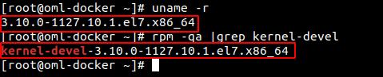
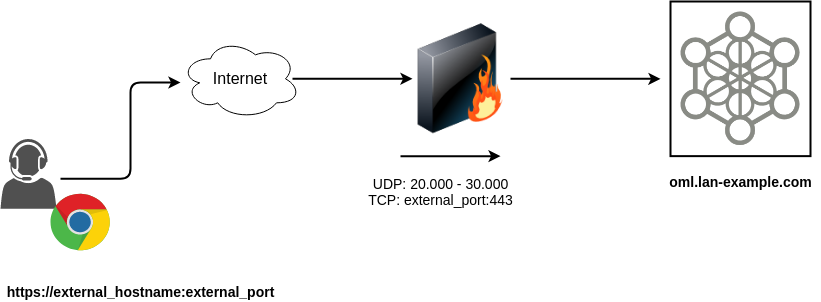

.. _about_install_prerequisitos:

Pre-requisitos
**************

Se asume que contamos con una instancia de CentOS-7 o Amazon Linux, sobre la cual se ejecutará la instalación. Pero antes de ésto debemos realizar
una serie de pasos necesarios, por lo tanto a través de una conexión SSH al host se procede con:

Configuración del hostname
**************************

Antes de avanzar con la instalación no olvidar configurar el hostname del host. OMniLeads utiliza dicho valor como parámetro a la hora de
configurar algunos servicios relacionados a la parte SIP (Telefonía).

Deshabilitar firewalld y SElinux:
*********************************

.. code-block:: bash

  systemctl disable firewalld
  sed -i 's/^SELINUX=.*/SELINUX=disabled/' /etc/sysconfig/selinux
  sed -i 's/^SELINUX=.*/SELINUX=disabled/' /etc/selinux/config

Instalación de actualizaciones, kernel-devel
********************************************
.. code-block:: bash

  yum update -y && yum install kernel-devel git -y
  reboot

.. important::

  Revisar que el paquete kernel-devel coincida con el kernel.

Ejecutar los comandos:

.. code-block:: bash

  uname -r
  rpm -qa |grep kernel-devel

Proporcionar Certificados SSL confiables
****************************************

OMniLeads se despliega con certificados SSLv3 para la conexión HTTPS del browser con el servidor web (Nginx), utilizando un par cert/key en formato PEM auto-firmado. Utiliza SHA-512 con encriptación RSA como algoritmo de firma y un tamaño de clave 4096 bits. Al ser auto-firmado, produce en el browser un **Warning de Sitio No Seguro** al momento de acceder al sistema por primera vez (ya que la autoridad certificadora o CA no está dentro del repositorio de CAs Confiables del Browser). Una vez agregada la excepción para confiar en él de manera segura, dicho certificado ya queda configurado para su aceptación.

Sin embargo, se recomienda cargar sus certificados SSL de confianza durante la instalación de la App. Usted deberá ubicar sus archivos **cert** y **key** en formato **.pem** dentro de la carpeta **ominicontacto/deploy/certs**.
Para agregar sus certificados, basta con borrar el **cert.pem** y **key.pem** que vienen por defecto y ubicar los suyos. Durante el proceso de deploy se detectan los archivos en dicha ubicación y por lo tanto se proporcionan a nivel web y webtrc, de manera tal que al finalizar el deploy la plataforma quede disponible y utilizando sus propios certificados de confianza.

Ejecución del deploy
********************

Una vez disponible el host, se procede con la instalación. Aquí es donde debemos elegir el tipo
de instalación y arquitectura de OMniLeads a desplegar.

.. toctree::
  :maxdepth: 3

  install_self_hosted.rst
  install_remote.rst

.. _about_install_inventory_oml_cloud:

OMniLeads detrás NAT
*********************

En un OMniLeads detras de NAT los agentes se conectan a la URL conformada por **https://external_hostname:external_port**, desde Internet.

Como se intenta expresar en la imagen, se asume que los usuarios *remotos* accederán a la App utilizando una URL (dominio y puerto) que resuelve en la IP pública de la interfaz WAN router/firewall.

Luego el firewall deberá reenviar el tráfico de voz y datos hacia los puertos UDP: 20000-30000 y y TCP: 443 del host donde reside la App.

.. important::

  Se deben establecer dos reglas de firewall entrantes y una saliente:

      * Reenviar tráfico entrante desde los puertos 20000 a 30000 UDP hacia los puertos 20000 a 30000 del host OMniLeads
      * Reenviar tráfico desde el *external_port* elegido hacia el puerto 443 del host OMniLeads
      * Permitir tráfico saliente desde el host OMniLeads hacia internet por los puertos 10000 al 20000

.. note::

  También se puede usar la IP pública en vez de hostname
