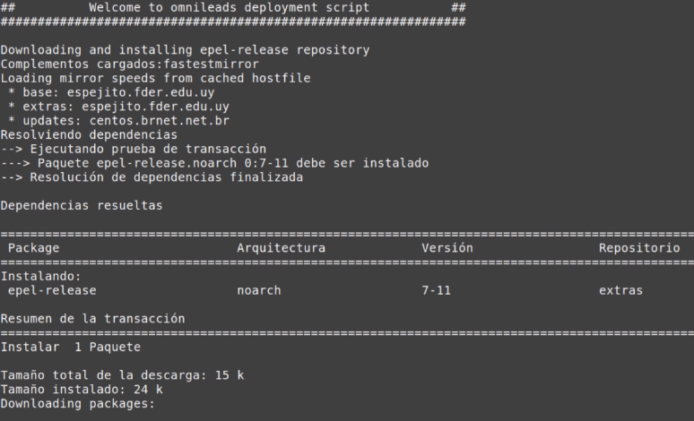
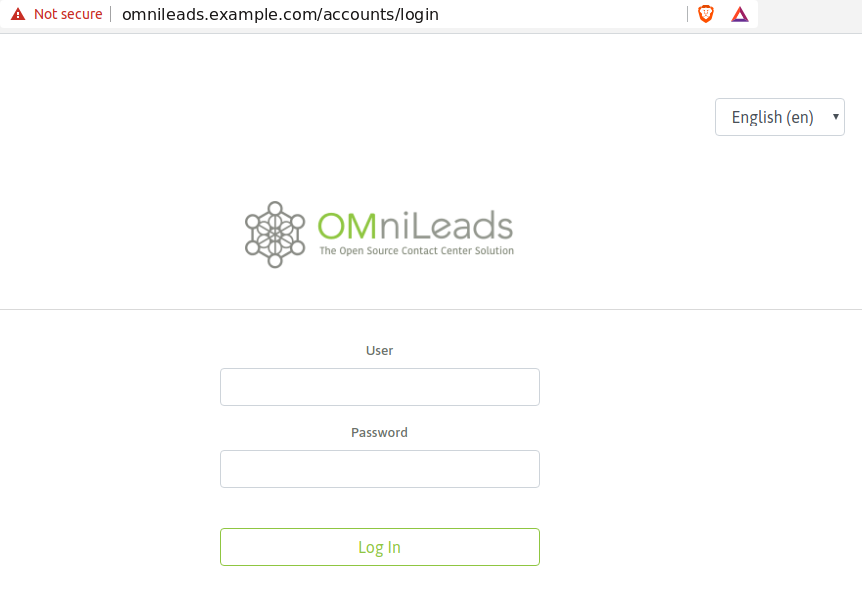

.. _about_install_selfhosted:

***************************
Ansible Self-Hosted Install
***************************

Al mencionar "Ansible Self-Hosted" nos referimos a instalar OMniLeads sobre un sistema operativo (GNU/linux kernel) en un despliegue monolítico
(todos los servicios corriendo sobre dicho host). Se descarga el proyecto (repositorio) sobre el host destino de la instalación, para posteriormente ejecutar el
script de instalación allí en dicho host.

.. image:: images/install_gitlab_repo.png

*Figure 1: self-hosted install*

Pre-requisitos:
^^^^^^^^^^^^^^^

- Una instancia de GNU/Linux CentOS 7 (minimal), Debian 9 (netinstall) ó Ubuntu Server 18.04
- 20 GB de espacio en disco
- 4 GB de memoria RAM
- Dejar la hora correctamente configurada en el host.
- Configurar una *dirección IP* y un *hostname* fijo, antes de ejecutar la instalación.

Ajustes necesarios antes  de la ejecución de script:
^^^^^^^^^^^^^^^^^^^^^^^^^^^^^^^^^^^^^^^^^^^^^^^^^^^^

- Debemos contar con git para luego clonar el repositorio del proyecto y seleccionar el release a instalar

**CentOS:**

.. code-block:: bash

  yum install git
  git clone https://gitlab.com/omnileads/ominicontacto.git
  cd ominicontacto
  git checkout master

- Instalar paquete kernel-devel, realizar el update del sistema operativo y rebotear la máquina.

  .. code-block:: bash

    yum install kernel-devel -y
    yum update -y
    reboot

.. important::

  Luego del reboot es importante revisar que el paquete kernel-devel coincida con el kernel que se muestre con el comando *uname -a*

- La instalación se trabaja en el directorio "deploy/ansible", disponible desde la raíz del proyecto (PATH/ominicontacto/deploy/ansible):

.. code-block:: bash

 cd deploy/ansible

- En este paso debemos trabajar sobre el archivo  :ref:`about_install_inventory` disponible dentro del directorio "PATH/ominicontacto/deploy/ansible".

.. note::

   OMniLeads utiliza ansible para realizar la instalación, por lo tanto existe un "archivo de inventario" que debe ser modificado de acuerdo a los parámetros
   del host sobre el que estamos trabajando.

Luego, allí en el inventory mismo debemos ajustar las :ref:`about_install_inventory_vars` de la instanacia.

Una vez ajustados todos los parámetros del archivo de inventario, procedemos con la ejecución de la instalación.

Ejecución del script de instalación:
^^^^^^^^^^^^^^^^^^^^^^^^^^^^^^^^^^^^

La instalación de OMniLeads se realiza mediante el script *deploy.sh*, ubicado dentro de la carpeta deploy/ansible con respecto a la carpeta
raíz del proyecto (ominicontacto).

Una vez configuradas las variables citadas, se procede con la ejecución del script de instalación (como usuario root o con privilegios sudo):

.. code-block:: bash

  sudo ./deploy.sh -i --iface=<your_iface>

Donde **<your_iface>** es la interfaz con la IP que se quiere usar para levantar los servicios que componen OMniLeads (suele ser la IP de la interfaz LAN del servidor).

El tiempo de instalación dependerá mayormente de la velocidad de conexión a internet del host OML, ya que se deben descargar, instalar y configurar varios paquetes correspondientes a los diferentes componentes de software que conforman el sistema. Aproximadamente, este tiempo es de 20 a 30 minutos.

*Figure 4: install running*

Si la ejecución de la instalación finaliza exitosamente, se despliega una vista como la de la figura 8.

.. image:: images/install_ok.png

*Figure 5: OMniLeads installation ended succesfuly*

Primer acceso a OMniLeads:
^^^^^^^^^^^^^^^^^^^^^^^^^^

Para acceder al sistema OMniLeads debe ingresar a:

https://omnileads-hostname

.. Important::
  El acceso web a OMniLeads debe ser a través del hostname.domain del host. Por lo tanto existen dos posibilidades a la hora de resolver el
  hostname:

  * Que los DNS de la red lo hagan.
  * Añadir el hostname.domain del host, dentro del archivo de *hosts* (Windows, Linux o Mac de cada PC que tenga que acceder a OMniLeads.

En el segundo caso, podemos editar el archivo de *hosts* de nuestro Sistema Operativo:

.. image:: images/install_dns_hosts.png

Una vez ajustado el método por el cual se resolverá el FQDN o hostname de nuestra instanacia de OMniLeads, se procede con el acceso al URL a través de cualquier browser moderno.
Al encontrarnos con la pantalla de login, simplemente se debe ingresar el usuario admin y la clave generada durante la instalación, como se expone en las figura.

.. Note::

  Si no recuerda la contraseña de admin web, podemos consultar su valor :ref:`about_maintance_envvars`.

Errores comunes:
^^^^^^^^^^^^^^^^

- El server no tiene internet o no resuelve dominios (configuración de DNS). **Compruebe el acceso a internet del host (por ej: actualizando paquetes - apt-get update | yum update).**

- Timeout de algún paquete que se intenta bajar. Puede volver a intentar ejecutar el deploy y si vuelve a fallar, la opción puede ser instalar el paquete desde la terminal.

- No ejecutó el script de deploy con *sudo*, en el host deployer.

- En caso de contar con algún host Ubuntu-Debian, recordar que se deben instalar paquetes como *sudo, openssh-server o python-minimal* antes de correr el script de *deploy.sh*
