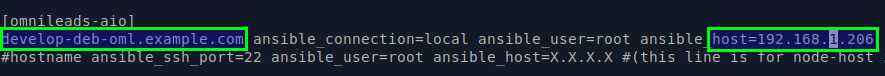
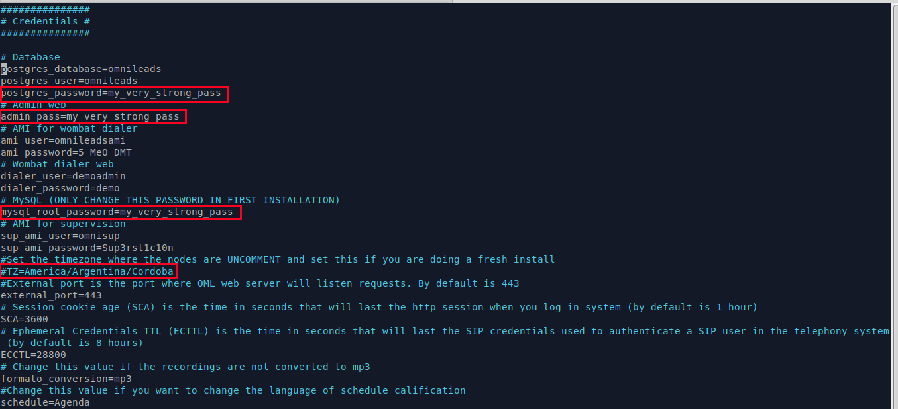
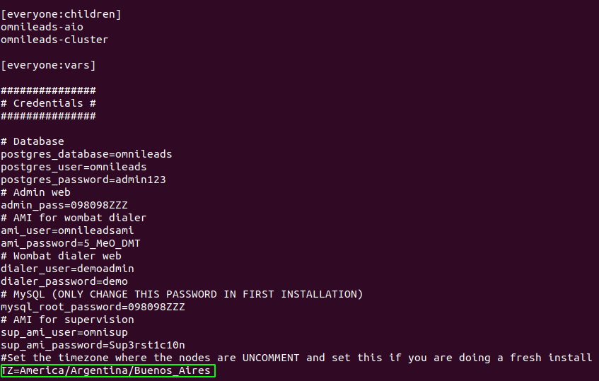

***************************
Ansible Self-Hosted Install
***************************

Cuando decimos "Ansible Self-Hosted" nos referimos a instalar OMniLeads sobre un OS de forma monolítica (todos los servicios corriendo en dicho host) y
descargando el proyecto en el OS destino de la instalación, para posteriormente ejecutar el script de instalación desde el propio host.

.. image:: images/install_gitlab_repo.png

*Figure 1: self-hosted install*

Pre-requisitos:
^^^^^^^^^^^^^^^

- Una instancia de GNU/Linux CentOS 7 (minimal), Debian 9 (netinstall) ó Ubuntu Server 18.04
- 20 GB de espacio en disco
- 4 GB de memoria RAM

- Es muy importante dejar la hora correctamente configurada en el host.
- Configurar una *dirección IP* y un *hostname* fijo, antes de ejecutar la instalación.

.. note::

   En versiones menores a CentOS 7.6 es necesario primero hacer un yum update y luego reebotear el server

Ajustes necesarios antes  de la ejecución de script:
^^^^^^^^^^^^^^^^^^^^^^^^^^^^^^^^^^^^^^^^^^^^^^^^^^^^

- Debemos contar con el paquete git para luego clonar el repositorio del protyecto y seleccionar el release a instalar

**Ubuntu - Debian:**

.. code-block:: bash

  apt install git
  git clone https://gitlab.com/omnileads/ominicontacto.git
  cd ominicontacto
  git checkout master

**CentOS:**

.. code-block:: bash

  yum install git
  git clone https://gitlab.com/omnileads/ominicontacto.git
  cd ominicontacto
  git checkout master

- La instalación se trabaja en el directorio "deploy/ansible", disponible desde la raíz del proyecto (PATH/ominicontacto/deploy/ansible):

.. code-block:: bash

 cd deploy/ansible

- Se comprueba la *dirección IP* y *hostname* que posee el host y que luego se utiliza en el archivo de inventario en el proceso de instalación:

.. code-block:: bash

 hostname
 ip a

.. image:: images/install_hostname_command.png

*Figure 2: hostname command output*

.. image:: images/install_ip_a_command.png

*Figure 3: ip a command output*

- En este paso, se debe editar el archivo *inventory* (PATH/ominicontacto/deploy/ansible).

.. note::

   OMniLeads utiliza ansible para realizar la instalación, por lo tanto existe un "archivo de inventario" que debe ser modificado de acuerdo a los parámetros del host sobre el que estamos trabajando.

Modificar y descomentar la cadena 'hostname' por el que hemos configurado a nuestro servidor. También en esta línea, se debe editar el parámetro 'X.X.X.X' con la dirección IP del host sobre el que estamos trabajando.

*Figure 4: inventory file network params section*

Además dentro del mismo archivo, unas líneas debajo encontraremos la sección *[everyyone:vars]*, en la cual se pueden alterar variables y contraseñas
que vienen por defecto en el sistema.

*Figure 5: Passwords and parameters of services*

- Introducir el parámetro "time zone" adecuado para su instanacia. Es **Importante** que realice este paso o la instalación no se va a poder realizar.

*Figure 6: inevntory - Time Zone parameter*

Es importante aclarar que cada vez que se corre el script *./deploy.sh* ya sea para instalar, re-instalar, actualizar, modificar la dirección IP de OML, etc., el archivo de inventory se vuelve a "cero". No obstante se genera una copia del archivo **(my_inventory)**, de manera tal que se cuente con los parámetros del sistema utilizados en la última ejecución del script. La copia en cuestión se ubica en el path donde ha sido clonado el repositorio de OML y bajo el nombre de "my_inventory" como lo expone la figura 6.

.. image:: images/install_my_inventory.png

*Figure 7: inventory copy, my_inventory file*

Ejecución del script de instalación:
^^^^^^^^^^^^^^^^^^^^^^^^^^^^^^^^^^^^

La instalación de OMniLeads se realiza mediante el script *deploy.sh*, ubicado dentro de la carpeta deploy/ansible con respecto a la carpeta
raíz del proyecto (ominicontacto).

Una vez configuradas las variables citadas, se procede con la ejecución del script de instalación (como usuario root o con privilegios sudo):

.. code-block:: bash

  sudo ./deploy.sh -i

El tiempo de instalación dependerá mayormente de la velocidad de conexión a internet del host OML, ya que se deben descargar, instalar y configurar varios paquetes correspondientes a los diferentes componentes de software que conforman el sistema.

.. image:: images/install_deploysh.png

*Figure 8: install running*

Si se olvidó incluir algún host en el archivo de inventario saldrá este mensaje:

.. image:: images/install_no_hosts_matched.png

Si la ejecución de la instalación finaliza exitosamente, se despliega una vista como la de la figura 8.

.. image:: images/install_ok.png

*Figure 9: OMniLeads installation ended succesfuly*

Primer acceso a OMniLeads:
^^^^^^^^^^^^^^^^^^^^^^^^^^

Si la ejecución de la instalación fue exitosa, entonces vamos por el primer acceso a OMniLeads.

.. toctree::
   :maxdepth: 2

   install_first_access.rst

Errores comunes:
^^^^^^^^^^^^^^^^

- El server no tiene internet o no resuelve dominios (configuración de DNS). **Compruebe el acceso a internet del host (por ej: actualizando paquetes - apt-get update | yum update).**

- Timeout de algún paquete que se intenta bajar. Puede volver a intentar ejecutar el deploy y si vuelve a fallar, la opción puede serinstalar el paquete desde la terminal.

- Falla por mala sintaxis o falta de definición de *hostname* y *dirección IP* en el archivo *inventory*.

- No ejecutó el script de deploy con *sudo*, en el host deployer.

- En caso de contar con algún host Ubuntu-Debian, recordar que se deben instalar paquetes como *sudo, openssh-server o python-minimal* antes de correr el script de *deploy.sh*
