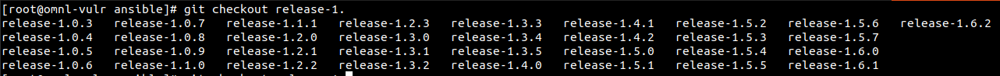
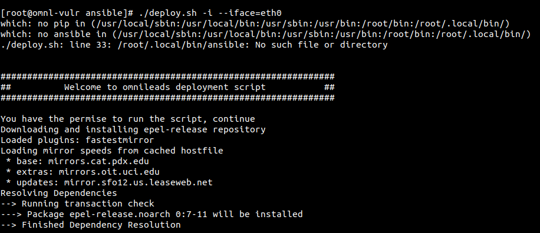
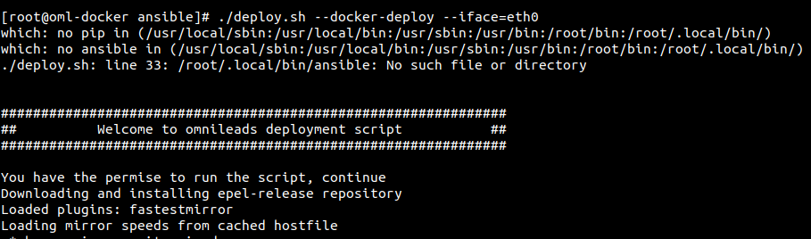

.. _about_install_selfhosted:

**********************************
Método de instalación Self-Hosted
**********************************
(:ref:`about_install_method_selfhosted`)

Partimos desde el punto de haber realizado los pasos de pre-requisitos sobre el host. Volvemos a establcer conexión SSH con el host y se procede con la descargar del repo de la App.

.. code-block:: bash

  yum install bash-completion bash-completion-extras -y
  source /etc/bash_completion.d/git
  git clone https://gitlab.com/omnileads/ominicontacto.git
  cd ./ominicontacto/ansible/deploy
  git checkout release-V.V.V

Donde V.V.V es la combinación asociada a la versión de la App. Utilizando la tecla *Tab* se obtienen todas las versiones disponibles.

Una vez seleccionada la versión a instalar, se procede con la configuración de :ref:`about_install_inventory` y posterior ejecución del instalador.

.. important::

 Antes de seguir, asegurese que ha configurado su archivo de inventario, de acuerdo al tipo de instalación y arquitectura a desplegar.

Despliegue de OMniLeads arquitectura tradicional (AIO)
******************************************************
(:ref:`about_install_tradicional`)

Es necesario trabajar en la sección **[prodenv-aio]** del archivo de inventario, tal cual se explica allí.
Luego se deben ajustar todas los parámetros y variables.

Una vez ajustado el archivo de inventario, se procede con la ejecución del script de instalación.

.. code-block:: bash

  ./deploy.sh -i --iface=NETWORK_INTERFACE

A partir de este punto el proceso comienza su ejecución y puede tomar unas decenas de minutos siempre dependiendo de la velocidad de la conexión a Internet y la capacidad de procesamiento
del host.

Despliegue de OMniLeads sobre contenedores Docker
*************************************************
(:ref:`about_install_contenedores`)

Es necesario trabajar en la sección **[prodenv-conatainer]** del archivo de inventario, tal cual se explica allí.
Luego se deben ajustar todas los parámetros y variables.

Una vez ajustado el archivo de inventario, se procede con la ejecución del script de instalación.

.. code-block:: bash

  ./deploy.sh --docker-deploy --iface=NETWORK_INTERFACE

A partir de este punto el proceso comienza su ejecución y puede tomar unas decenas de minutos siempre dependiendo de la velocidad de la conexión a Internet y la capacidad de procesamiento
del host.

.. note::

  Usted deberá reemplazar NETWORK_INTERFACE por la interfaz de red del host a la cual se quiera atañar todos los servicios
  y componenetes que ejecuta OMniLeads. (Por ej: eth0, ens18, eth1, wlp2s0, etc.)

Instalación finalizada
**********************

Al cabo de unos minutos el proceso de instalación finaliza arrojando una pantalla que evidencia la culminación exitosa del procedimiento.

.. image:: images/install_ok.png

.. important::

  Una vez finalizado la instalación, aplicar un reinicio del host.

Usted podrá proceder con el :ref:`about_first_access`
