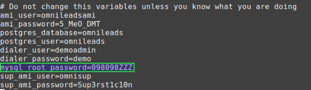
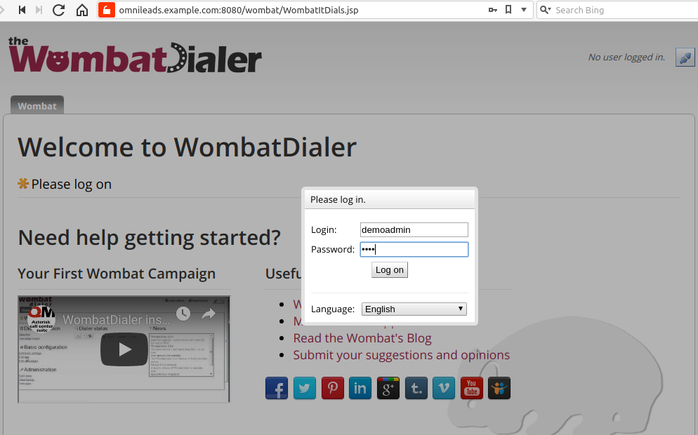
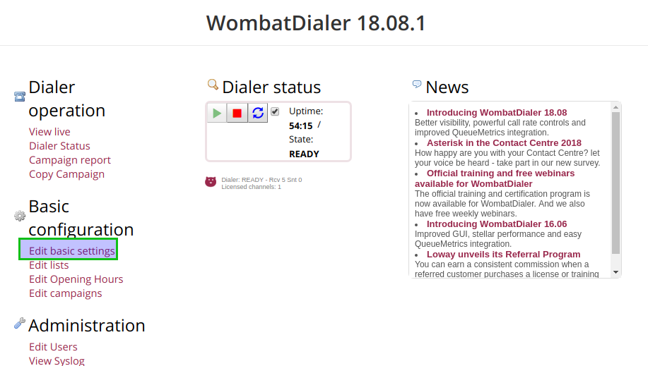
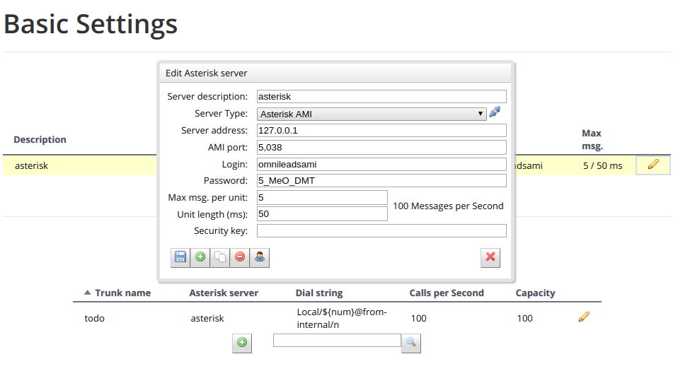
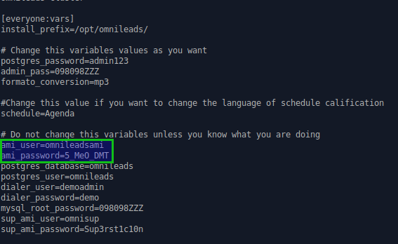
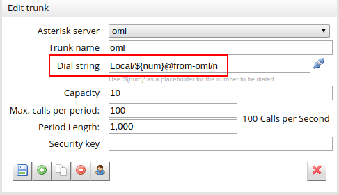
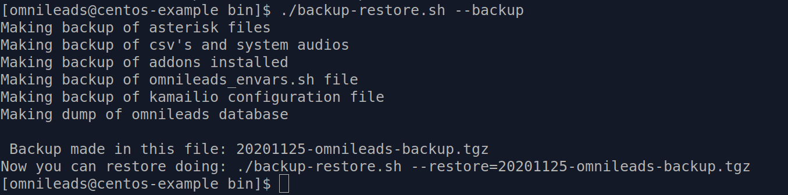
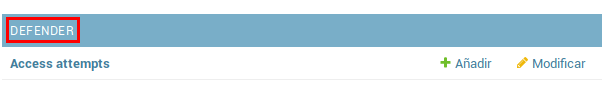

******************************
Gestiones del administrador IT
******************************

Configuración del módulo de *Discador predictivo*
*************************************************
Antes que nada se notifica que si la instancia de OML desplegada en los pasos anteriores, NO contemplan el uso de campañas con discado saliente predictivo, este paso puede ser omitido.
OMniLeads necesita de una herramienta de terceros para implementar las campañas con discador predictivo. Esta herramienta se basa en licencias de software comerciales que deben
ser gestionadas con el fabricante.

De todas maneras el sistema puede ser utilizado con un canal de pruebas que otorga como demo. Por lo tanto podemos configurar el componente y correr pruebas de concepto
antes de adquirir licencias para una operación real.

Si se desean correr campañas predictivas, se debe generar la siguiente configuración básica de Wombat Dialer .
Para generar esta configuración debemos seguir una serie de pasos que comienzan con el acceso a la URL correspondiente.

http://omnileads.yourdomain:8080/wombat ó http://XXX.XXX.XXX.OML:8080/wombat

Al ingresar por primera vez, se debe proceder con la creación de la base de datos MariaDB que utiliza Wombat Dialer.
Hacer click en botón remarcado en la figura 2.

.. image:: images/maintance_wd_2.png

*Figure 1: DB create*

Luego es el momento de ingresar la clave del usuario root de MySQL y hacer click en botón remarcado en la figura 3.
Nota: el password del motor MariaDB fue configurado dentro del archivo "inventory" antes de activar la instalación del sistema. (En el mismo directorio en el que clonó el repositorio de OML).

.. image:: images/install_my_inventory.png

*Figure 2: MariaDB root password*

Procedemos entonces con la creación de la base de datos MariaDB que utilizará de ahora en más el componente Wombat Dialer.

.. image:: images/maintance_wd_mariadb_create.png

*Figure 3: MariaDB root password*

Una vez creada la base de datos MariaDB que utiliza Wombat Dialer, se procede con el primer login.

.. image:: images/maintance_wd_mariadb_post_create.png

*Figure 4: Login post db create*

A continuación se debe realizar un login en la interfaz de administración de Wombat Dialer para avanzar con la configuración
de parámetros necesarios para la interacción con OML.

Al ingresar se despliega una pantalla como la siguiente, donde debemos acceder con el usuario y passwords que se generaron en la instalación.
Recordar que éstas variables se encuentran en la copia del archivo inventory (my_inventory).

*Figure 5: Access to WD*

Una vez adentro del sistema, se procede con la configuración de dos parámetros básicos necesarios para dejar lista la integración con OMniLeads.
Para ello debemos acceder al menú de "Configuración básica" como se indica en la figura 6.

*Figure 6: WD basic config*

En este menú se debe generar en primer lugar se debe generar una nueva instancia de conexión dentro de la sección "Asterisk Servers"
como se expone en la figura 7.

*Figure 7: WD basic config - AMI Asterisk*

En este paso debeŕa ingresar el usuario y contraseña AMI disponible en el archivo *inventory* utilizado en la instalación.

*Figure 9: WD basic config - AMI Asterisk user & pass*

En el siguiente punto, se configura un Troncal utilizando un "Nombre del troncal" arbitrario, pero con la cadena de llamado marcada
en la figura 9. Local/${num}@from-oml/n

*Figure 9: WD basic config - Asterisk Trunk*

Por último, recuerde dar "play" al servicio de dialer, tal como lo indica la siguiente figura 10.

.. image:: images/maintance_wd_config4.png

*Figure 10: WD activate*

Finalmente la plataforma se encuentra habilitada para gestionar llamadas predictivas. La instalación por defecto cuenta con una licencia de Wombat Dialer demo de un canal.

Back & Restore
**************
OMniLeads dispone de un script para llevar a cabo las tareas de backup/restore.

.. important::

  En caso de hacer el restore en una nueva máquina, es necesario que dicha máquina:

  * Tenga OMniLeads instalado en la misma version que la maquina productiva
  * Tenga la misma IP y el mismo hostname de la maquina productiva

Para realizar un backup:

Debemos acceder por ssh al host donde tenemos corriendo OMniLeads. Una vez dentro del host se ejecutan los siguiente comandos.

::

  su omnileads -
  cd /opt/omnileads/bin
  ./backup-restore.sh -b

La ejecución del script arroja una salida similar a la de la figura 11.

*Figure 11: backup*

Como se puede observar, nos indica cómo realizar el restore de dicho backup.

Dentro del path **/opt/omnileads/backup**, se generan los archivos ".tgz" que contienen los backups ejecutados.

Si el restore se realiza en nuevo host, entonces se debe dejar disponible el archivo generado en el backup dentro del path **/opt/omnileads/backup**.

Para llevar a cabo un restore, se debe ejecutar:

::

  su omnileads
  cd /opt/omnileads/bin/
 ./backup-restore.sh -r nombre_del_archivo_de_backup

Por ejemplo:

::

  su omnileads
  cd /opt/omnileads/bin/
 ./backup-restore.sh -r 20190211_database.tgz

No hace falta agregar el path completo de ubicación del backup.

Un restore exitoso arroja una salida similar a la figura 12.

 .. image:: images/maintance_backup_2.png

 *Figure 12: restore*

Una vez finalizado el restore, ejecutar el siguiente comando para regenerar los archivos de configuración y valores de AstDB de la instancia que se restoreó:

::

 /opt/omnileads/bin/manage.sh regenerar_asterisk

Actualizaciones
***************

.. important::

  Para realizar el upgrade de la plataforma es **IMPRESCINDIBLE** contar con las contraseñas de *postgresql*, *mysql* y *django admin* que se usaron durante la instalación. Dichas contraseñas las podrá ver en el archivo *my_inventory*, y tendrá que asignarlas nuevamente en el archivo *inventory*. Si no se utilizan las mismas contraseñas que se usaron para la instalación el upgrade puede fallar

OMniLeads es forjado bajo un paradigma de releases continuos, lo cual implica un flujo de actualizaciones constantes.
Por ello es muy importante llevar a cabo de manera limpia las actualizaciones.

El equipo de OMniLeads ha realizado el testeo de upgrades de la plataforma en los siguientes escenarios. Se recomienda acoplarse a estos escenarios.

===================  =============================
Linux Distro         Upgrade soportado y testeado
===================  =============================
CentOS 7.6            Desde 1.1.1 a 1.3.0
Debian 9.3            Desde 1.2.2 a 1.3.0
Ubuntu Server 18.04   No soportado
===================  =============================

A continuación se exponen los pasos a seguir para llevar a cabo una nueva actualización de la plataforma. Esta tarea también se realiza con el script "deploy.sh".

Las actualizaciones se anuncian por los canales de comunicaciones oficiales del proyecto.
Dependiendo el método de instalación que se haya seleccionado:

**Instalación Self-Hosted**

Acceder como root al host omnileads
Posicionarse sobre el directorio donde reside el script “deploy.sh”

::

 cd ominicontacto/deploy/ansible

Asumiendo que estamos trabajando sobre los release estables (master)
Se debe ejecutar un "git pull origin master" para traernos las actualizaciones del repositorio.

Observar que el parámetro *hostname* y *dirección IP* tiene que coincidir respecto a lo que tenga cargado el host donde corre OMniLeads.

::

 [omnileads-aio]
 oml-dev.example.com ansible_ssh_connection=local ansible_user=root ansible_host=192.168.95.155

::

 git pull origin master

A continuación se ejecuta el script con el parámetro -u (update). Esta ejecución tomará unos minutos e implica el aplicar todas las actualizaciones
descargadas con el "git pull origin master" sobre nuestra instancia de OMniLeads.

::

 ./deploy.sh -u

Si todo fluye correctamente, al finalizar la ejecución de la tarea veremos una pantalla como muestra la figura 13.

.. image:: images/maintance_updates_ok.png

*Figure 14: updates OK*

**Instalación desde workstation Linux remoto**

Se debe acceder al repositorio clonado en nuestra maquina workstation, para desde allí correr la actualización sobre el host Linux OMniLeads.

::

 cd PATH_repo_OML
 git pull origin master
 cd ominicontacto/deploy/ansible

A continuación y como en cada ejecución del script "deploy.sh", se debe repasar el archivo de inventory, velando por la coincidencia del parámetro hostname y dirección IP respecto al host donde corre OMniLeads y vamos a actualizar.

::

 [omnileads-aio]
 oml-dev.example.com ansible_ssh_port=22 ansible_user=root ansible_host=10.10.1.100

.. note::

  Se debe tener en cuenta que para instalación remota, se debe utilizar la línea con el parámetro "ansible_ssh_port=22" (donde 22 es el puerto por defecto, pero es normal tambien que se utilice otro puerto) dentro de la sección [omnileads-aio]

  Se ejecuta el script con el parámetro -u (update). Esta ejecución tomará unos minutos e implica el aplicar todas las actualizaciones descargadas con el "git pull origin master" sobre nuestra instancia de OMniLeads.

::

	./deploy.sh -u

Finalmente, la plataforma queda actualizada a la última versión estable "master"

.. image:: images/maintance_updates_ok.png

*Figure 15: updates from ansible remote OK*

.. note::

  Los nuevos releases suelen traer nuevo codigo JavaScript. El browser mantiene el código viejo en su cache por lo que se **recomienda** instalar en el browser un addon para borrar la cache. *Clear cache* para *Google Chrome*, por ejemplo

Cambios de los parámetros de red (Hostname y/o Dirección IP)
************************************************************

OMniLeads es un sistema complejo, con varios servicios orientados a las comunicaciones real-time corriendo en el Linux Host.
Esto implica que un cambio de *dirección IP* o *hostname* del host conlleva cierta complejidad.

Para llevar a cabo éstas tareas, debemos ejecutar nuevamente el script "deploy.sh", el mismo que fue utilizado para llevar a cabo la
instalación de la plataforma.

Debemos ingresar con el usuario root al sistema, cambiar la dirección IP a nivel **sistema operativo** y/o el hostname y asegurarnos de que el host tomó los cambios. Se recomienda
un *reboot* del sistema.

Luego continuamos con los cambios sobre OML, para ellos debemos pararnos sobre el directorio donde se clonó el repositorio de OML (si fue una instalación self-hosted será
dentro del host remoto, si fue una instalación desde ansible-remoto será en la máquina *deployer*), para luego acceder al directorio *deploy/ansible*, donde tenemos los
archivos *deploy.sh* e *inventory*.

Allí debemos editar nuevamente el archivo *inventory* y repasar el hostname para que coincida con el hostname del host y allí también debemos configurar la nueva dirección IP.

::

 [omnileads-aio]
 hostname ansible_connection=local ansible_user=root ansible_host=X.X.X.X #(this line is for self-hosted installation)

Se guardan los cambios sobre el archivo y finalmente se ejecuta el script *deploy.sh*.

::

 cd ominicontacto/deploy/ansible
 ./deploy.sh --change-network -a

Por último se ejecuta un reinicio de la plataforma. Luego podemos comenzar a utilizar OML en la nueva dirección IP.

::

 reboot

**NOTA:** si está resolviendo el nombre del host de OMniLeads con su archivo *hosts* de su maquina de trabajo, no olvide tambien cambiar los parámetros.

Modificación de passwords de servicios
***************************************

En caso de querer modificar las contraseñas usadas en los servicios, basta con modificar dicha contraseña dentro del archivo de inventario. Una vez seteadas ahi se procede a ejecutar el *deploy.sh* así:

::

  cd ominicontacto/deploy/ansible
  ./deploy.sh --change-passwords -a

Desbloqueo de usuarios
***********************

OMniLeads cuenta con un sistema de bloqueo de usuarios, cuando alguno ingresa la contraseña erronea tres veces. Esta es una medida de seguridad implementada para evitar ataques de fuerza bruta en la consola de Login de la plataforma. El usuario administrador tiene la posibilidad de desbloquar algún usuario que haya sido bloqueado por ingresar su contraseña errónea sin querer.

Para desbloquearlo se ingresa a la siguiente URL: https://omnileads-hostname/admin, esta URL despliega la llamada **Consola de Administración de Django**.

.. image:: images/django_admin.png

*Figure 16: Django admin console*

Allí, ingresar las credenciales del usuario admin. Luego hacer click en el botón **Defender**

*Figure 17: Defender in django admin*

Esto abre la administración de **Django Defender** (https://github.com/kencochrane/django-defender) que es el plugin de Django usado para manejar esto. Hacer click en **Blocked Users**

.. image:: images/blocked_users.png

*Figure 18: Blocked users view*

Se observará el usuario bloqueado. Basta con hacer click en **Unblock** para desbloquearlo.

.. image:: images/unblock.png

*Figure 19: Unblock user view*

Ya el usuario podrá loguearse sin problema.

Desinstalación de OMniLeads
****************************

Si por alguna razón quiere desinstalar OMniLeads de su máquina o VM se cuenta con un script para ello. Ya viene incorporado en el proceso de instalación, basta con ejecutarlo:

.. code::

  oml-uninstall

Este script:

* Desinstala los servicios esenciales de omnileads: asterisk, kamailio, rtpengine, mariadb, postgresql, wombat dialer, redis, nginx y omniapp.
* Borra la carpeta /opt/omnileads (incluyendo grabaciones)
* Elimina las bases de datos

.. note::

  El script no desinstala la paquetería de dependencias usadas para la instalación de los servicios.

.. important::

  Tener cuidado al ejecutarlo, una vez ejecutado no hay forma de recuperar el sistema.  
