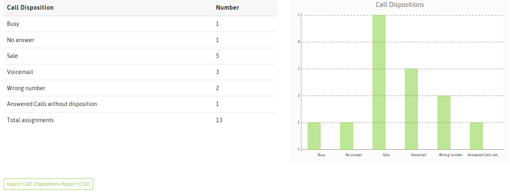
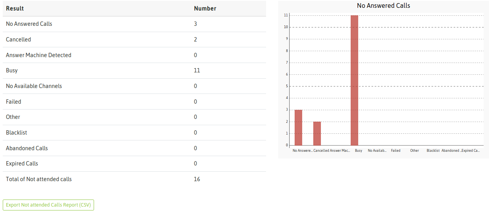
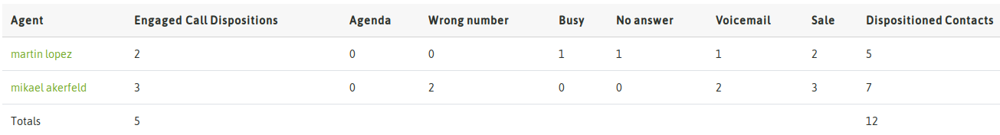
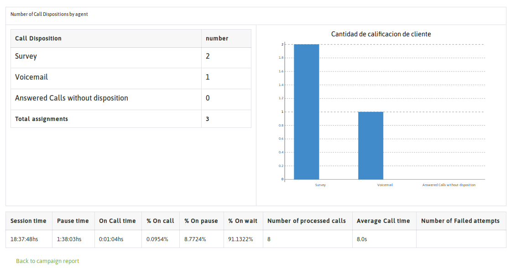
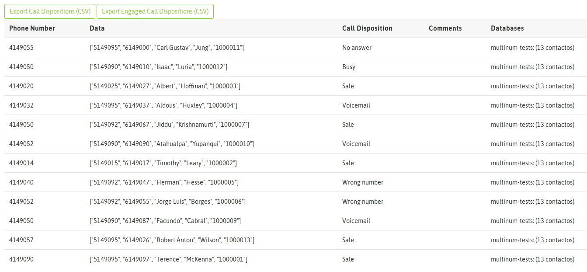
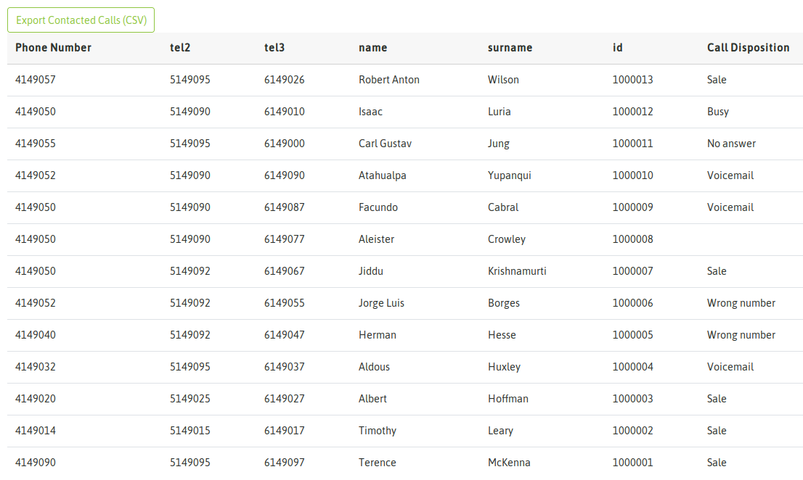

.. _about_outbound_camp_reports:

Reportes de Campañas Salientes
*******************************

En esta sección se cubren todos los reportes disponibles para una campaña de llamadas salientes.

.. image:: images/output-outcamp.png

*Figure 1: Campaign Reports view*

Reporte general de una campaña saliente
****************************************

Este reporte nos brinda un resumen de varios aspectos de la campaña. Cuestiones como cantidad de llamadas pendientes
para finalizar la campaña, cantidad y detalle de todas las llamada, de los registros contactados y calificados, no contactados y
de las calificaciones generadas por agente.

Para acceder a este reporte, se debe ingresar a la opción "Reportes" dentro de la campaña.

La primera información que nos arroja la vista son los "Contactos pendientes de gestionar" VS "total de llamadas realizadas" en
la campaña. Éstas llamadas contemplan el hecho de que se pueder realizar más de una llamada a cada contacto de la base. Por lo tanto
es de esperar que el número de llamadas realizadas sea superior a la cantidad de contactos que existen en la base de la campaña.

.. image:: images/output_outbound_camp_reports_1.png

*Figure 2: Contacts pending / Performed calls*

Siguiendo el recorrido por la presente pantalla, nos vamos a encontrar con el primer botón de exportación de información
a CSV. En este caso el botón nos permite exportar a "CSV / Planilla de cálculos" todos los teléfonos contactados (que atendieron)
dentro de la campaña junto a su calificación.

.. image:: images/output_outbound_camp_reports_2.png

*Figure 3: Contacted calls*

La información generada se presenta como lo indica la figura 4.

.. image:: images/output_outcamp_csv_contacted.png

*Figure 4: Contacted calls CSV*

Como se puede apreciar, el archivo presenta como primer columna el teléfono contactado. Si bien el contacto puede tener
asociado más de un teléfono en este reporte la columna "Phone number" hace referencia al teléfono contactado por la campaña
y al cual se asocia la calificación de agente (columna calificación).

El próximo informe que se presenta, tiene que ver con la contabilización de las diferentes calificaciones que realizaron
los agentes sobre las llamadas generadas en la campaña (figura 5).

En este caso y en general toda información tabulada tiene su exportación a CSV para poder disponer de los datos sobre
una planilla de cálculos.

*Figure 5: Call dispositions list*

Continuando con la sucesión de informes presentados en la pantalla de reportes de la campaña, nos vamos a topar con un
listado que contibiliza todas las llamadas que no fueron contactadas en la campaña, es decir intentos fallidos clasificados
de acuerdo a lo que el sistema detecta como respuesta del proveedor de telefonía sobre el que se coloca la llamada.

*Figure 6: Call failed details*

A continuación se presenta un informe sobre la performance de cada agente que trabajó en la campaña. Se expone mediante
la contabilización de cada calificación generada por cada agente. Además se cuenta con un link que permite saltar a
una pantalla con un informe más detallado sobre el agente en cuestión y su performance en la campaña en cuestión.

*Figure 7: Agent performance*

Entonces si se hace click sobre uno de los agentes, se despliega una nueva pantalla con mayor detalle, en la que se
contempla por ejemplo la información de:

- Tiempo acumulado en la campaña
- Tiempo en pausa dentro de la campaña
- Tiempo efectivo en llamadas dentro de la campaña
- Cantidad de llamadas procesadas
- Tiempo promedio de llamada
- Cantidad de intentos de llamadas fallidas
- Procentajes de efectividad

*Figure 8: Agent performance detail*

Regresando al reporte de la campaña, como último ítem se presenta un listado de todas las llamadas generadas por la campaña
y su resultado. Se expone de manera separada todas las llamadas manuales que se hayan hecho en la campaña.
Recordemos que en cualquier tipo de campaña, se pueden generar paralelamente llamadas manuales.

.. image:: images/output_outcamp_4.png

*Figure 9: Total calls*

Reporte de calificaciones
*************************

Este reporte presenta cada contacto gestionado en la campaña junto a la calificación que ha recibido por parte del agente
que procesó la llamada asociada al contacto. Además se puede generar un archivo CSV con las calificaciones ordinarias
por un lado y otro con los contactos cuya calificación recibida fue del tipo "gestión".

*Figure 10: Call dispositions detail*

Es importante aclarar que en este listado también se contemplan aquellos contactos introducidos dinámicamente en la campaña
por los agentes. Por ejemplo contactos referidos de otro contacto.

Resultados de la base de contactos
**********************************

Aquí se presenta un listado plano de la base de contactos asociada a la campaña y el resultado en la medida que avanza
la campaña. La diferencia con el reporte anterior es que aquí NO se listan los contactos que fueron introducidos en
el transcurso de la campaña, sino que se busca hacer un mapeo entre la campaña asignada a la campaña y el resultado
al ser procesada por la campaña.

*Figure 11: DB result*
