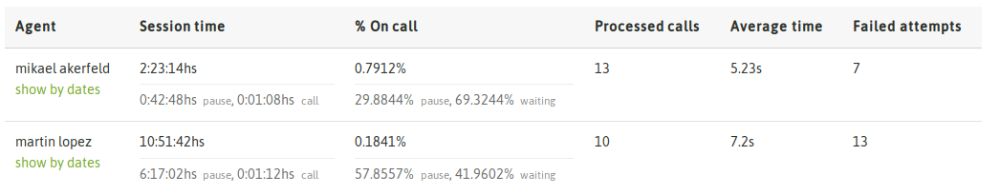
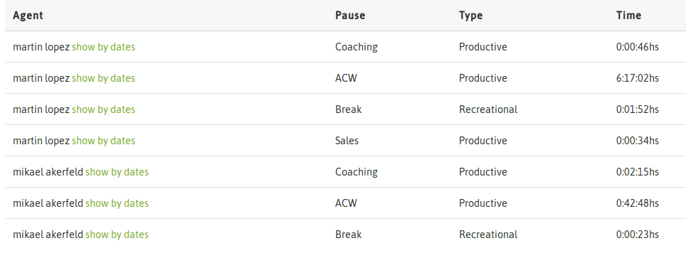
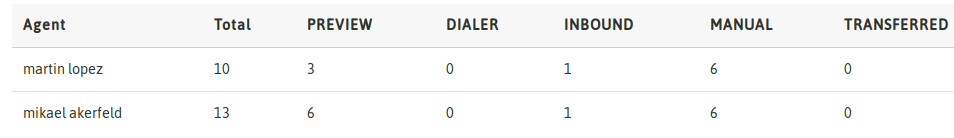

Métricas de agente
******************

Al acceder al menú *Reportes -> Agentes* se despliega una vista que nos permite seleccionar el agente o grupo de agentes por un lado y la fecha o rango de fechas por el otro.
Que nos permite filtrar la salida del reporte de actividad de agentes.

.. image:: images/output_gral_agents_1.png

*Figure 1: Choice of date and agents*

Una vez ejecutada la búsqueda, se despliega como primera información una tabla con el resumen de toda la actividad realizada por los agentes.

*Figure 2: Agent activity summary*

A partir de nuestro resumen se comienza a desglozar la información como por ejemplo el tiempo acumulado en pausa. Entoces la segunda tabla que presenta
la vista es un reporte detallado de las pausas y el tiempo de cada una, en las que cada agente estuvo detenido.

*Figure 3: Pause details*

El próximo parámetro que se desgloza tiene que ver con la cantidad de llamadas procesadas por cada agente en términos de campañas. Es decir se presenta un detalle
por agente de cuantas llamadas y qué tiempo le dedicó a cada una de las campañas sobre las que procesó sus llamadas.

.. image:: images/output_gral_agents_4.png

*Figure 4: Calls & Campaigns*

Finalmente se presenta una tabla en la que se detalla la cantidad de llamadas de cada tipo (manual, preview, dialer y entrantes), en las que estuvo vinculado el agente.

*Figure 5: Call types*
