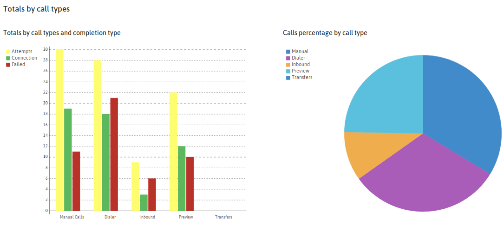
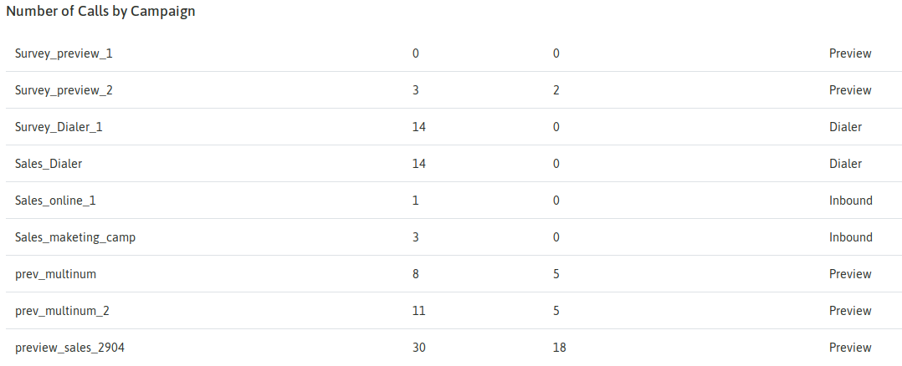
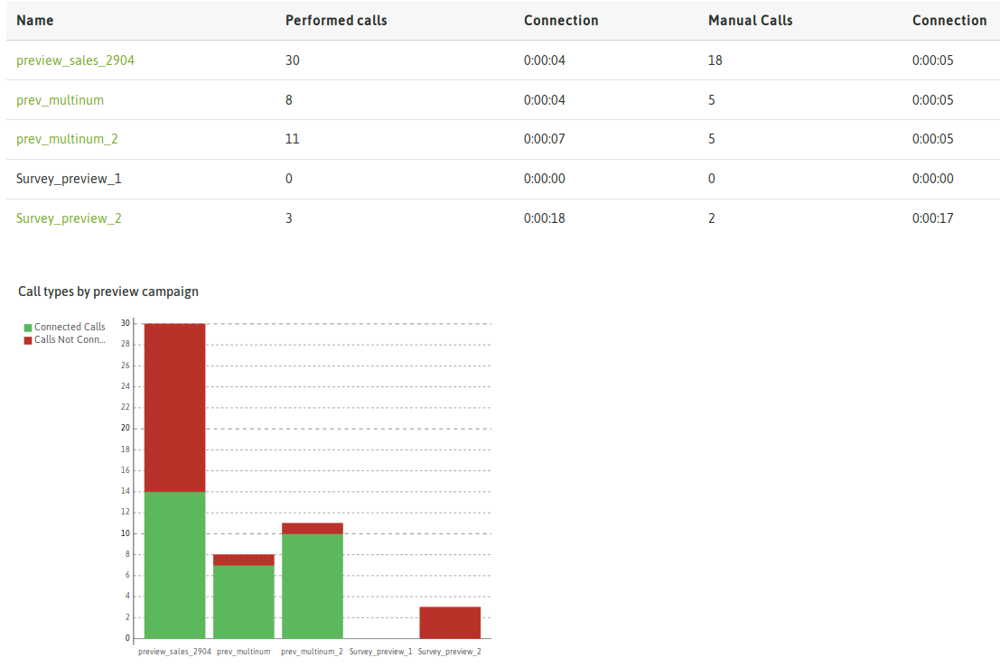
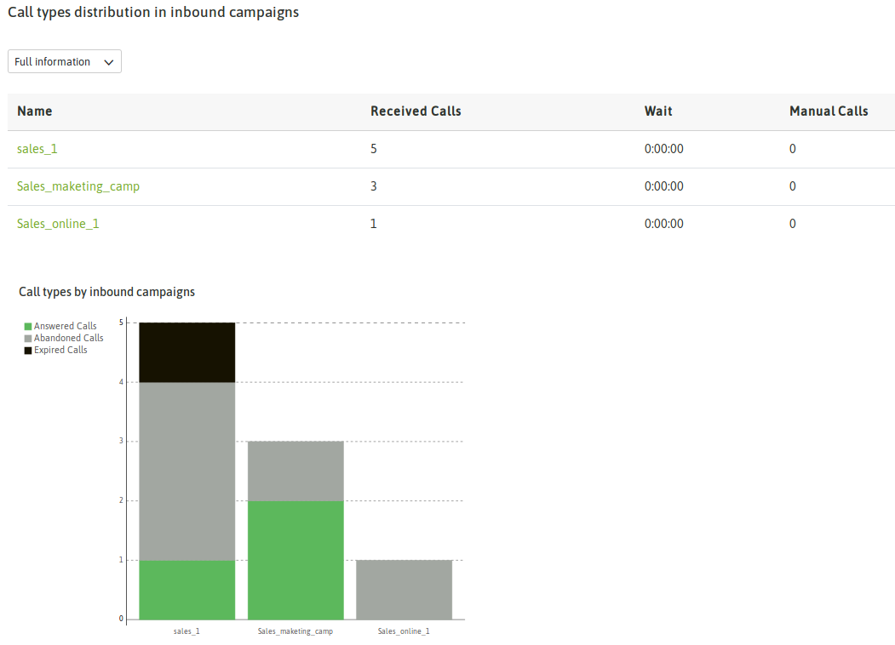

Reporte general de llamadas
****************************

El reporte se puede correr como en todos los casos, sobre una fecha o rango de fechas. El mismo expone información
sobre todas las llamadas transaccionadas por la plataforma dentro de la fecha acotada.

El primer informe que se nos presenta tiene que ver con esa totalidad de llamadas transaccionadas por la plataforma
clasificadas en:

- Llamadas manuales
- Llamadas de campañas preview
- Llamadas de campañas predictivas
- Llamadas de campañas entrantes

.. image:: images/output_gral_calls_1.png

*Figure 1: Call types*

Además se detalla la información en términos de si las llamadas fueron o no "conectadas".

Luego aparecen un par de gráficos que representan las estadísticas arriba mencionadas.

*Figure 2: Call types graphic*

La siguiente información se presenta como una tabla en la que se descopone granularmente a todas las llamadas transaccionadas
por la plataforma en términos de las campañas por donde fueron procesadas las mismas.

*Figure 3: Calls and campaigns*

En las siguientes tres secciones se presenta de manera tabular y gráfica una descomposición de todas las llamadas procesadas
por OMniLeads en términos de su naturaleza (entrantes, manuales, preview y predictivas) y a su vez dentro de cada una
de estas clasificaciones se descompone en las campañas puntuales de cada tipo de llamada.

De esta manera se puede deducir rápidamente la efectividad de cada campaña a partir de la exposición de la información
tanto tabular como gráficamente.

- Llamadas predictivas

.. image:: images/output_gral_calls_4.png

*Figure 4: Dialer calls*

- Llamadas preview

*Figure 5: Preview calls*

- Llamadas entrantes

*Figure 6: Inbound calls*
