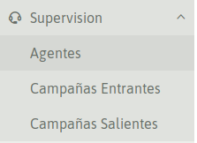
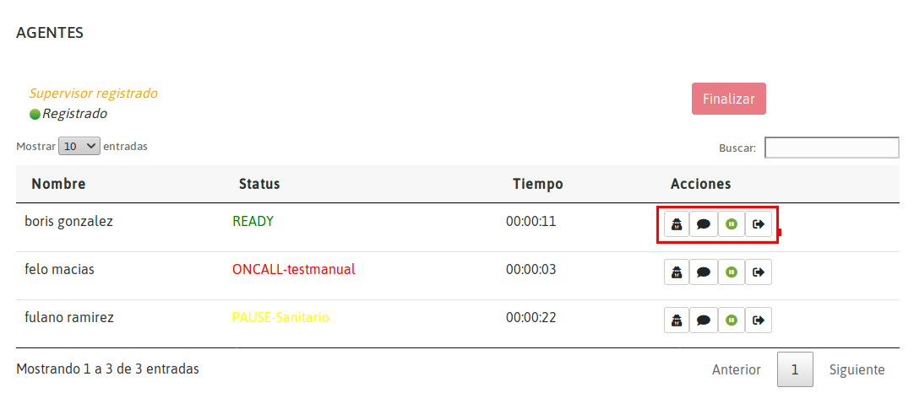
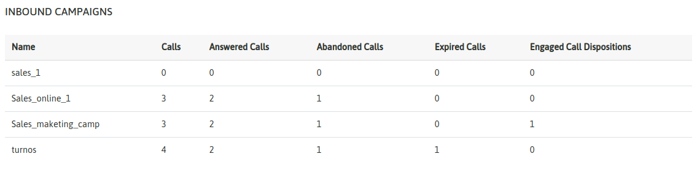
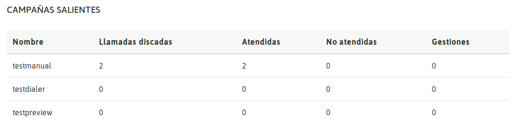

.. _about_supervision:

Supervision
***********

Este módulo permite visualizar el estado de las campañas entrantes, campañas salientes (Manual, Dialer y Preview) y agentes.

*Figure 1: Choices for supervision*

Visualización de status de Agentes
***********************************

En la sección de agentes se observan todos los agentes logueados en el sistema y el estado en el que se encuentran (READY, OnCall, Paused, Dialing, Offline, Unavailable) .

.. important::

  * Un agente debe estar asignado al menos a una campaña para que aparezca en este módulo
  * Cuando un agente pasa al estado "Offline" desaparece del listado de agentes.
  * Cuando un agente pasa al estado "Unavailable" quiere decir que el agente perdió conexión o cerró el browser sin desloguearse.

*Figure2: View of realtime supervision*

Un supervisor puede tomar acciones sobre cada agente. Para ello son los cuatro botones que aparecen al lado del estado. A continuación se describe la función de cada uno (de izquierda a derecha):

  - **Espiar:** el supervisor escucha la **llamada activa** entre agente y cliente. Hacer click en el botón *Finalizar* para terminar de escuchar, en cualquier momento
  - **Espiar y susurrar:** el supervisor puede hablar al agente sin que el cliente lo perciba, durante una **llamada activa**. Hacer click en el botón *Finalizar* para terminar de escuchar, en cualquier momento
  - **Pausar agente:** suponiendo que el agente se fue a break y se le olvidó ponerse en pausa, el supervisor puede con este botón inducir una pausa para que no reciba llamadas. Puede despausar oprimiendo nuevamente este botón.
  - **Desloguear agente:** suponiendo que el agente terminó su sesión y no se deslogueó correctamente del sistema (no presionó su nombre y dió click en salir, extremo derecho superior de la consola de agente), el supervisor puede desloguear al agente con este botón. Es importante hacer este proceso para no tener tiempos de sesión incoherentes en el reporte de agentes.

.. note::

   El supervisor cuenta con un pequeño webphone. Para poder hacer estas acciones es necesario que aparezca el mensaje de **Supervisor Registrado**.

Visualización de campañas entrantes
***********************************

Esta vista expone un resumen de todas las campañas entrantes productivas, en término de los resultados acumulados del día de la operación; llamadas recibidas, atendidas, abandonadas, abandonadas durante el anuncio de bienvenida, tiempo promedio de espera, expiradas, en espera, tiempo promedio de abandono y gestiones (*) positivas dentro de cada campaña.

*Figure3: view of realtime inbound campaigns*

Visualización de campañas salientes
***********************************

Al igual que en el punto anterior, las campañas salientes tambien cuentan con un resumen actualizado en tiempo real, de los resultados de cada campaña; llamadas discadas, atendidas, no atendidas y las gestiones (*) positivas de cada una.

*Figure4: view of realtime outbound campaigns*

.. note::

   Se entiende por día el día a dia de operación desde las 00:00 hasta las 23:59. En el siguiente día las estadísticas de campañas entrantes y salientes se resetean.

.. note::

  Se entiende por Gestión positiva a una llamada que el agente calificó con una calificación de gestión, calificación capaz de ejecutar un formulario de campaña.
