.. _about_pbx_integration:

**********************************
Integración entre OMniLeads & PBXs
**********************************

Vamos a abordar nuestro ejemplo utilizando Issabel-PBX un proyecto de software libre bien conocido donde además todo lo expuesto aquí puede ser
extrapolado como configuración para cualquier IPPBX basada en Asterisk.

.. image:: images/pbx_integration.png
      :align: center

.. Note::

  Los pasos descriptos en esta sección son aplicables tanto al esquema donde OMniLeads se encuentra en un host exclusivo y la IPPBX en otro, así como también para el caso en que
  OMniLeads se ejecuta en Docker conviviendo dentro del mismo host de la IPPBX.

Configuración del troncal SIP en la IPPBX
*******************************************

Seleccionamos la creación de un nuevo troncal SIP y completamos la configuración con los siguientes parámetros:

* En caso de tener OMniLeads en un Host y la IPPBX en otro Host.-

.. code-block:: bash

 type=friend
 host=XXX.XXX.XXX.OML
 port=5160
 disallow=all
 allow=alaw
 qualify=yes
 secret=omnileads
 fromuser=issabel
 context=from-internal

* En caso de ejecutar OMniLeads con Docker dentro de sistema operativo base de la IPPBX.-

.. code-block:: bash

 type=friend
 host=XXX.XXX.XXX.PBX
 port=5163
 disallow=all
 allow=alaw
 qualify=yes
 secret=issabelOML
 fromuser=issabel
 context=from-internal

Observar que lo único que cambia entre ambas posibilidades es el parámetro **port**, entre 5160 (OMniLeads en un host aparte) y 5163 (OmniLeads dockerizado sobre el mismo host de la IPPBX) y además
el parámetro **host** el cual posee el valor de la IP LAN de la IPPBX.

Una vez disponible nuestro troncal SIP, pasamos a comprobar accesibilidad utilizando el CLI de Asterisk de la IPPBX.

 .. image:: images/telephony_pjsip_LAN_pbx_issabel_trunk.png
       :align: center

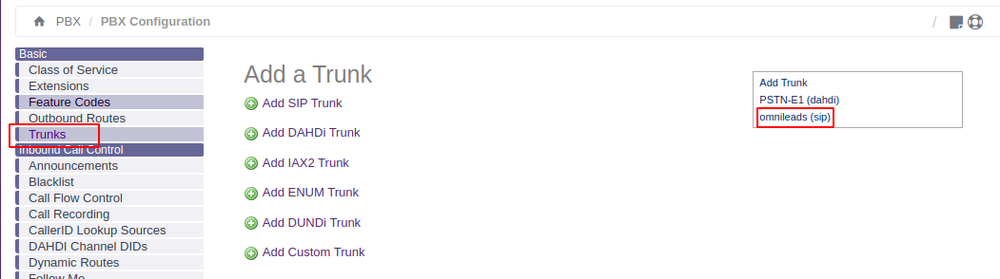

Estrablecemos una sesión bash dentro del host donde se ejecuta Issabel-PBX y lanzamos el comando:

.. code-block:: bash

  asterisk -rx 'sip show peers'

Si todo va bien, deberíamos observar OK en la linea de salida correspondiente al nuevo troncal SIP, ya sea con el puerto 5160 o 5163.

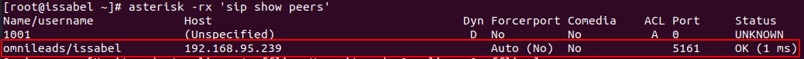

Configuración del troncal SIP en OMniLeads
******************************************

Una vez generado el troncal SIP del lado de la IP-PBX, se procede con la generación de la contraparte correspondiente en OMniLeads.

* En caso de tener OMniLeads en un Host y la IPPBX en otro Host, utilizamos la plantilla PBX Omnileads (LAN).-

.. code-block:: bash

 type=wizard
 transport=trunk-transport
 accepts_registrations=no
 sends_auth=yes
 sends_registrations=no
 accepts_auth=yes
 endpoint/rtp_symmetric=no
 endpoint/force_rport=no
 endpoint/rewrite_contact=no
 endpoint/timers=yes
 aor/qualify_frequency=60
 endpoint/allow=alaw,ulaw
 endpoint/dtmf_mode=rfc4733
 endpoint/context=from-pbx
 remote_hosts=XXX.XXX.XXX.PBX:5060
 inbound_auth/username=issabel
 inbound_auth/password=issabelOML
 outbound_auth/username=omnileads
 outbound_auth/password=issabelOML
 endpoint/from_user=omnileads

* En caso de ejecutar OMniLeads con Docker dentro de sistema operativo base de la IPPBX, utilizamos la plantilla Omnileads inside PBX.-

.. code-block:: bash

 type=wizard
 transport=trunk-nat-docker-transport
 accepts_registrations=no
 sends_auth=yes
 sends_registrations=no
 accepts_auth=yes
 endpoint/rtp_symmetric=no
 endpoint/force_rport=yes
 endpoint/rewrite_contact=yes
 endpoint/timers=yes
 aor/qualify_frequency=60
 endpoint/allow=alaw,ulaw
 endpoint/dtmf_mode=rfc4733
 endpoint/context=from-pbx
 remote_hosts=XXX.XXX.XXX.PBX:5060
 inbound_auth/username=issabel
 inbound_auth/password=issabelOML
 outbound_auth/username=omnileads
 outbound_auth/password=issabelOML
 endpoint/from_user=omnileads

Quedando efectiva nuestra troncal, pasamos a controlar si Issabel está accesible desde OMniLeads, utilizando el CLI de Asterisk de OMniLeads.

.. Note::

  Si estamos ejecutando OMniLeads sobre Docker, para acceder al contenedor que ejecuta el componente Asterisk de OMniLeads, debemos ejecutar el comando:
  **docker exec -it oml-asterisk-prodenv** , a partir de allí se invoca el CLI.

.. code-block:: bash

  asterisk -rx 'pjsip show endpoints'

La salida del comando debería ser similar a la figura:

  .. image:: images/telephony_pjsip_LAN_pbx_oml_trunk2.png
        :align: center

En este punto existe un troncal SIP entre ambos sistemas telefónicos, quedando pendiente la configuración del enrutamiento de llamadas entre ambos sistemas.

Finalmente ponemos énfasis en relacionar parámetros entre la configuración del SIP trunk en Issabel con la de OMniLeads.

Una imagen vale mas que mil palabras:

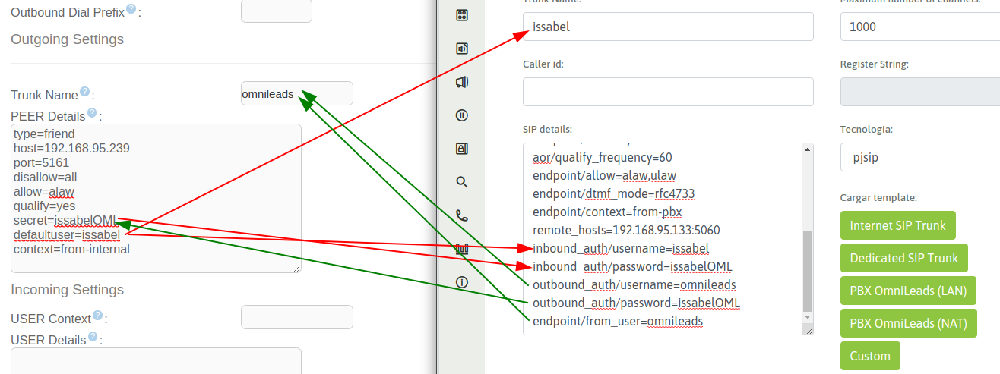

Como enviar llamadas desde la IP-PBX hacia OMniLeads
*******************************************************

A continuación se plantea una forma de conectar los recursos de la IP-PBX (rutas entrantes, IVRs, anuncios, extensiones, etc.) con OMniLeads. Es decir, que por ejemplo
desde una opción del IVR principal de la compañía se pueda derivar a una campaña entrante de OMniLeads, o bien que una extensión pueda contactar o transferir una
llamada hacia una campaña entrante o agente de OMniLeads.

Esto es completamente viable utilizando las *custom extensions* de la IP-PBX, en nuestro caso ejemplar: Issabel-PBX.

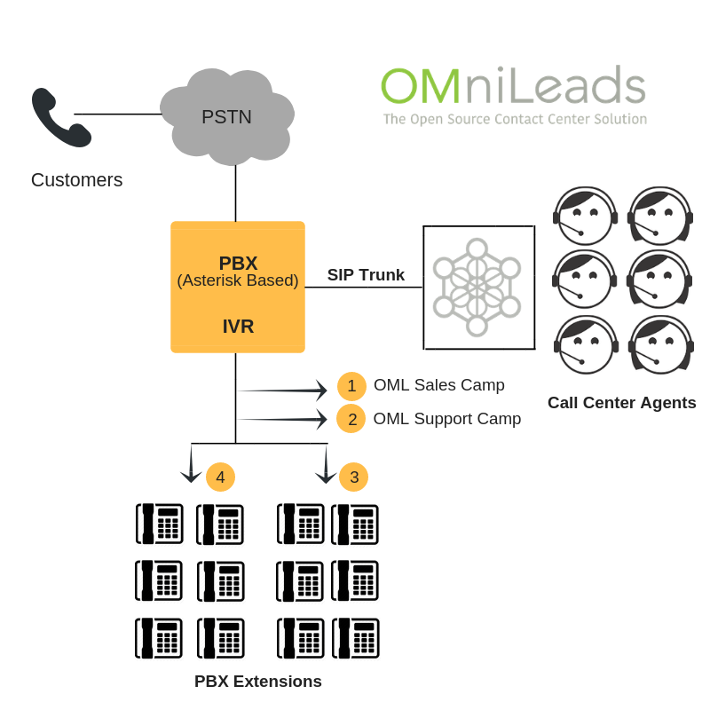

Llamadas hacia rutas entrantes de OMniLeads
**********************************************

Se plantea entonces el ejemplo donde se desea crear una *custom extension* que al marcarla desde otra extensión o bien invocarla desde algún objeto del PBX (IVR, ruta entrante, anuncio, etc.)
establezca un canal contra OMniLeads, particularmente apuntando a una *ruta entrante* la cual puede a su vez enviar la llamada hacia una campaña entrante.

Por un lado entonces, tendremos una ruta entrante en OMniLeads, apuntando por ej. a una campaña entrante:

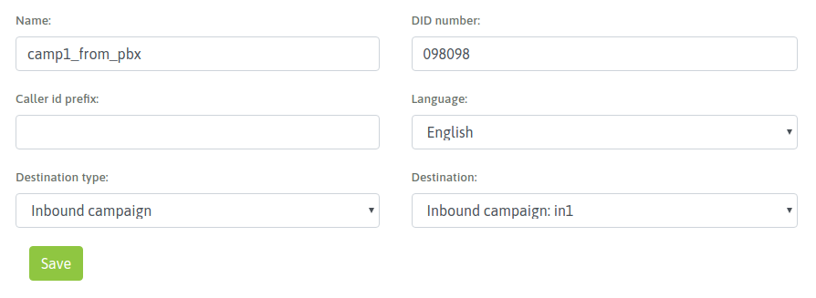

Teniendo en cuenta que el DID elegido fue *098098*, en la IPPBX hay que generar una *extension* del tipo *custom*, donde la cadena de *Dial* apunte al troncal SIP contra OMniLeads y el
número enviado sea precisamente *098098*.

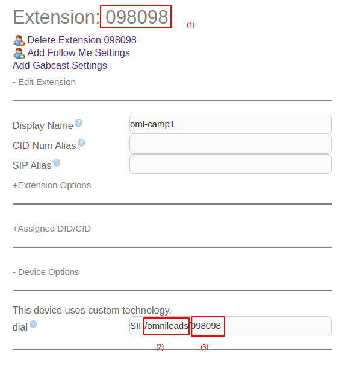

En la figura remarcamos tres elementos:

(1) - El número de extensión, no necesariamente debe ser identico al número enviado hacia OMniLeads (3). Puede ser un número cualquiera, siempre y cuando la cadena de Dial de la custom extension coincida con el DID de la ruta entrante de OML (098098 para nuestro ejemplo).
(2) - El *trunk* a donde apuntar la custom extension. Este valor debe coincidir con el campo *Trunk Name* en el troncal SIP contra OMniLeads generado en la IP-PBX.
(3) - El número a enviar por el trunk tiene que coincidir con el DID de la ruta entrante de OMniLeads.

De esta manera entonces cualquier extensión de la IPPBX podrá marcar o transferir una llamada hacia esta *custom extension* y la misma será enviada hacia la ruta entrante
correspondiente en OMniLeads para finalmente conectar sobre una campaña entrante o el elemento asignado como destino de la ruta entrante en OMniLeads.

Como mención final, está claro que podremos tener en la IPPBX tantas custom extensions apuntando a diferentes rutas entrantes de OMniLeads como querramos !

Llamadas hacia agentes de OMniLeads
************************************

Para el caso de vincular un Agente de OMniLeads en la IPPBX (es decir que desde una extensión se pueda marcar el número de una *custom extension* y ésta termine enlazando en una llamada
a un agente de OMniLeads), el número a enviar en la cadena de Dial de la custom extension estará conformado ya no por un DID de ruta entrante de OMniLeads, sino que será una combinación
del ID del agente y su número SIP.

Vayamos al grano con esto:

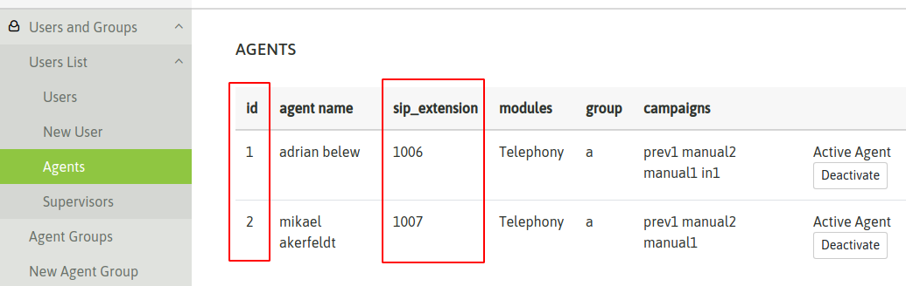

Partiendo de la figura, tomemos al agente *Adrian Belew*. Observar que su ID es igual a 1 y su número SIP es 1006. Por lo tanto a la hora de conformar entonces el número a enviar en la cadena
Dial de la custom extension de la IPPBX debemos concatenar el *Número SIP* con su *ID de agente*; en nuestro ejemplo sería **10061** para el agente *Adrian Belew* y **10072** para el agente *Mikael Ackerfeldt*.

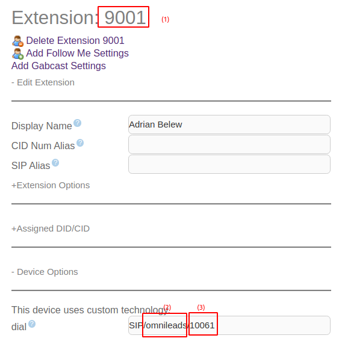

En la figura remarcamos tres elementos:

(1) - El número de extensión, no necesariamente debe ser identico al número enviado hacia OMniLeads (3). Puede ser un número cualquiera, siempre y cuando la cadena de Dial de la custom extension coincida con la concatenación del ID de agente y su número SIP (10061 para nuestro ejemplo).
(2) - El *trunk* a donde apuntar la custom extension. Este valor debe coincidir con el campo *Trunk Name* en el troncal SIP contra OMniLeads generado en la IP-PBX.
(3) - El número a enviar por el trunk tiene que coincidir con la concatenación del ID de agente y su número SIP (10061 para nuestro ejemplo).

Se deberá repetir el procedimiento para cada agente que haya que vincular dentro de la IPPBX.

Llamadas desde OMniLeads hacia la PSTN y recursos de la IPPBX
***************************************************************

Finalmente vamos a generar el enrutamiento saliente dentro de OMniLeads, que permita a los agentes y discadores lanzar llamadas hacia la PSTN por un lado
a su vez que permitimos que los agentes puedan marcar o transferir llamadas hacia recursos de la IPPBX como extensiones, ring groups, colas de llamadas ,etc.

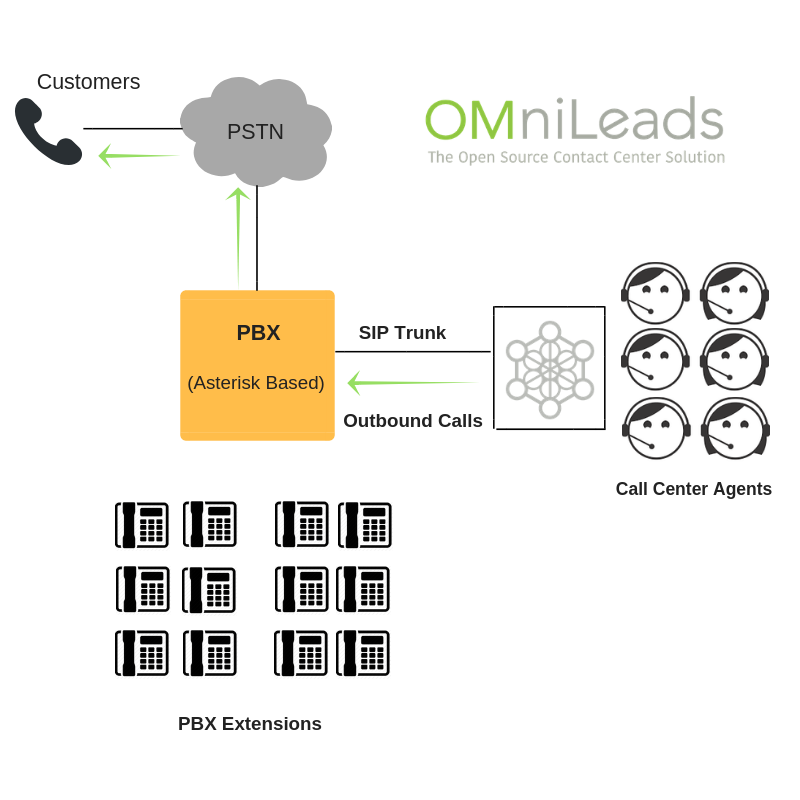

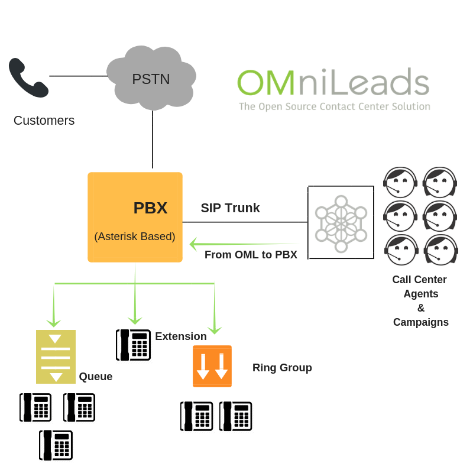

Simplemente se debe añadir una nueva ruta saliente que apunte al troncal hacia la IPPBX.

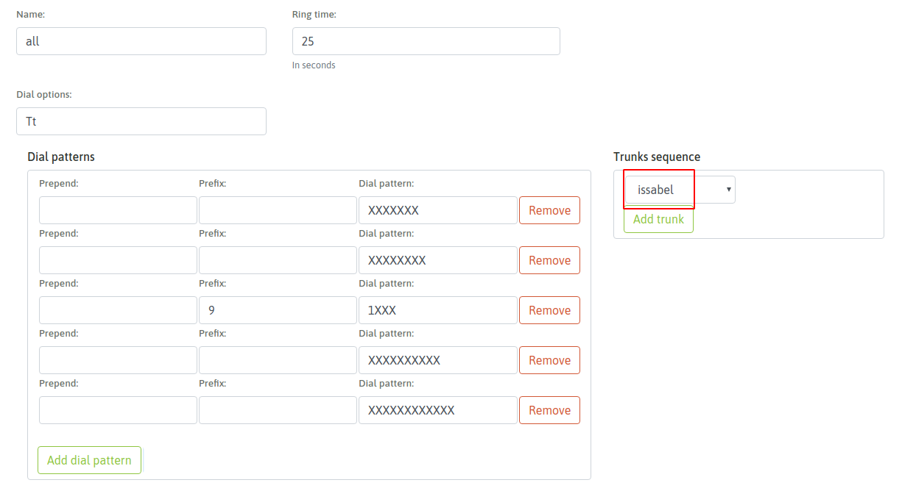

De esta manera la integración queda completamente funcional y ambos sistemas pueden realizar todo tipo de llamadas e interacciones.
