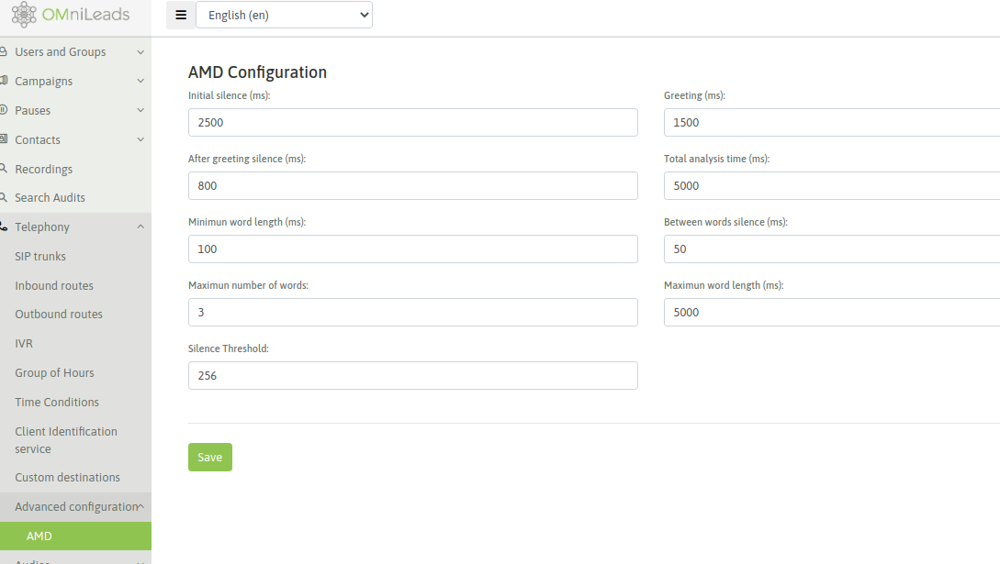
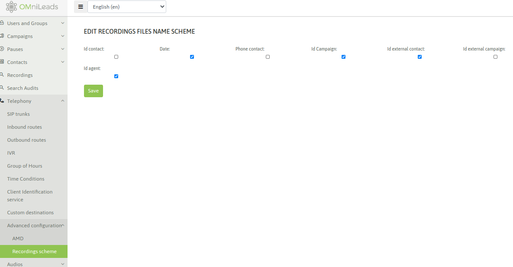

************************************
Configuración de módulo de telefonía
************************************

En esta sección se exponen las configuraciones necesarias a realizar para que nuestra App pueda interactuar con la PSTN (red telefónica pública), de manera tal que
los agentes puedan tomar llamadas provenientes del exterior así como también marcar llamadas hacia teléfonos externos.

.. important::

  OMniLeads admite solamente SIP como tecnología de interconexión con otros conmutadores de telefonía. Por lo tanto el integrador podrá configurar troncales SIP de proveedores ITSP,
  troncales SIP contra sistemas PBX y/o troncales SIP contra Gateways FXO y/o E1/T1.

Configuración de troncales SIP
******************************

Para acceder a la configuración debemos ingresar en el punto de menú *(Telephony -> SIP Trunks)* y allí añadir un nuevo troncal PJSIP.
Se va a desplegar un formulario similar al de la figura.

.. image:: images/telephony_pjsiptrunk_abm.png
       :align: center

Los campos del formulario son:

- **Trunk Name**: el nombre del troncal. Debe ser alfanumperico sin espacios ni caracteres especiales (Ej: Trunk_provider_a).
- **Number of channels**: es la cantidad de canales que permite el vínculo.
- **Caller id**: el número con el que saldrán las llamadas por el troncal.
- **SIP details**: en este campo de texto se proporcionan los parámetros SIP usando sintaxis de `PJSIP configuration Wizard <https://wiki.asterisk.org/wiki/display/AST/PJSIP+Configuration+Wizard>`_ de Asterisk.

A continuación desplegamos algunas plantillas sugeridas para los tipos de escenarios planteados como casos de uso típicos de OMniLeads.

.. toctree::
  :maxdepth: 1

  telephony_pjsip_templates.rst

Configuración para el enrutamiento de llamadas salientes
********************************************************

OMniLeads permite gestionar el enrutamiento de llamadas salientes sobre múltiples troncales SIP (previamente creados), de manera tal que
utilizando criterios como el *largo o prefijo del número* para determinar por qué vínculo SIP encaminar la llamada. Además es posible mantener una lógica de *failover*
entre los diferentes troncales SIP asignados a una ruta saliente.

Para acceder a la vista de configuración de rutas salientes, ingresar al punto de menú (*Telephony -> Outbound routes*)

.. image:: images/telephony_outr.png

*Figure 2: Outbound route*

- **Nombre**: es el nombre de la ruta (alfanumérico sin espacios)
- **Ring time**: es el tiempo (en segundos) que las llamadas cursadas por esta ruta, intentarán establecer una conexión con el destino, antes de seguir intentando por el próximo troncal o bien descartar la llamada.
- **Dial options**: son las opciones de la aplicación "Dial" utilizadas por Asterisk(r) en bajo nivel.
- **Patrones de discado**: mediante patrones, se puede representar los *tipos de llamadas* que serán aceptadas por la ruta y así entonces colocadas sobre el Troncal SIP para finalmente alcanzar el destino deseado.

Para comprender cómo se representan los dígitos utilizando *patrones*, se recomienda leer éste link: https://www.voip-info.org/asterisk-extension-matching/.

Dentro de cada patrón ingresado hay tres campos:

  * **Prepend**: son los dígitos que se mandan por el trunk SIP como adicionales al número discado. Es decir llegan al Trunk posicionados delante del número marcado.
  * **Prefijo**: son los dígitos que pueden venir como “prefijo” de una llamada marcada y éstos serán quitados en el momento de enviarlos por el SIP Trunk.
  * **Patrón de discado**: se busca representar en este campo el patrón de dígitos autorizados que la ruta va a procesar para y enviar a un SIP Trunk para sacar la llamada hacia el exterior.

- **Secuencia de troncales**: son los troncales SIP sobre los cuales la ruta saliente va a intentar establecer la llamada discada por OML. Si la llamada falla en un troncal, se sigue intentando en el siguiente.

Configuración de módulo AMD
***************************

El módulo de AMD de Asterisk, puede configurarse en OMniLeads usando la siguiente interfaz:

*Figure 2: Amd configuration page*

Configuración esquema de nombres de archivos de grabaciones de llamadas
***********************************************************************

La siguiente sección permite configurar el formato que tendrán los nombres de los archivos de grabaciones generadas por
llamadas en el sistema.

Al seleccionar algunas de las opciones mostradas en la página esto impactará directamente en el nombre de los archivos de grabación.

Nota: tener en cuenta que el ID de Agente como variable no está disponible para campañas Entrantes ni Salientes de Discador.

*Figure 2: Recordings scheme page*

Configuración de enrutamiento de llamadas entrantes
****************************************************

El tratamiento de llamadas entrantes se abordará en la sección *Campañas Entrantes* de esta documentación ya que para poder operar con dicho módulo debemos al menos
tener creado algún objeto (IVR, condicional de tiempo, campaña entrante, etc.) hacia a donde rutear cada DID generado.

:ref:`about_inboundroutes`.
