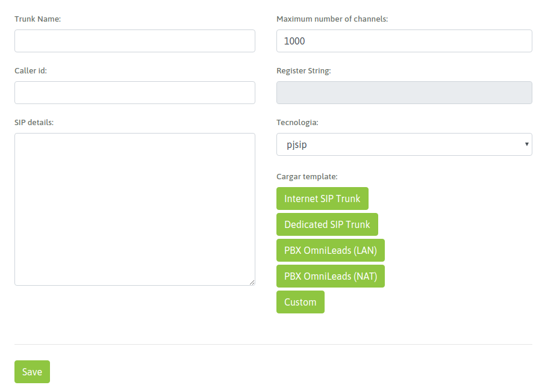
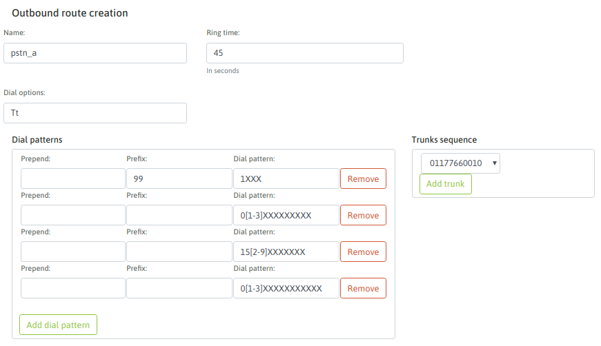

*********************************
Configuración de acceso a la PSTN
*********************************

En este capítulo vamos a explicar cómo dejar configurada la capa de *acceso a la PSTN* de OMniLeads para operar de acuerdo a los contextos planteados.
OMniLeads admite solamente SIP como tecnología de interconexión con otros conmutadores de telefonía. Por lo tanto el integrador podrá configurar troncales SIP de proveedores ITSP,
troncales SIP contra sistemas PBX y/o troncales SIP contra Gateways FXO o E1/T1.

.. important::

  A partir del Release-1.4.0 OMniLeads implementa y recomienda el uso de troncales PJSIP debido a su eficiencia en términos
  de recursos informáticos y debido a su estado de *deprecated* en el cual entrará el módulo chan_sip en Asterisk 17.

  Usted podrá visitar la documentación de releases anteriores para disponer de ejemplos basados en chan_sip.

Explicación del ABM para troncales PJSIP
*****************************************

Para acceder a la configuración debemos ingresar en el punto de menú *(Telephony -> SIP Trunks)* y allí añadir una nueva
troncal PJSIP. Se va a desplegar un formulario similar al de la figura 1.

*Figure 1: New SIP Trunk*

Los campos del formulario son:

- **Trunk Name**: el nombre del troncal. Debe ser alfanumperico sin espacios ni caracteres especiales (Ej: Trunk_provider_a).
- **Number of channels**: es la cantidad de canales que permite el vínculo.
- **Caller id**: el número con el que saldrán las llamadas por el troncal.
- **SIP details**: en este campo de texto se proporciona los parámetros SIP en sintaxis de `PJSIP configuration Wizard <https://wiki.asterisk.org/wiki/display/AST/PJSIP+Configuration+Wizard>`_ de Asterisk.

Como se puede apreciar en la figura 1, existen una serie de *plantillas* de configuración en base al tipo de conexión troncal que se desea configurar, que pueden
facilitar bastante el trabajo.

A continuación desplegamos las plantillas sugeridas en los tipos de escenarios planteados como casos de uso de OMniLeads.

* :ref:`about_telephony_pjsip_internet_provider`.
* :ref:`about_telephony_pjsip_lan_provider`.
* :ref:`about_telephony_pjsip_lan_pbx`.
* :ref:`about_telephony_pjsip_internet_pbx`.
* :ref:`about_telephony_pjsip_oml_inside_pbx`.

Configuración de enrutamiento de llamadas salientes
***************************************************

OMniLeads permite gestionar el enrutamiento de llamadas salientes sobre múltiples troncales SIP (previamente creados), de manera tal que
utilizando criterios como el *largo o prefijo del número* para determinar por qué vínculo SIP encaminar la llamada. Además es posible mantener una lógica de *failover*
en término de troncales SIP.

Para acceder al ABM de rutas salientes ingresar al punto de menú (*Telephony -> Outbound routes*)

*Figure 2: Outbound route*

- Nombre: es el nombre de la ruta (alfanumérico sin espacios)
- Ring time: es el tiempo (en segundos) que las llamadas cursadas por esta ruta, intentarán establecer una conexión con el destino, antes de seguir intentando por el próximo troncal o bien descartar la llamada.
- Dial options: son las opciones de la aplicación "Dial" utilizadas por Asterisk(r) en bajo nivel.
- Patrones de discado: mediante patrones, se puede representar los “tipos de llamadas” que serán aceptados por la ruta para enviarlos al destino por el Trunk SIP.

Para comprender cómo se representan los dígitos con patrones, se recomienda leer éste link: https://www.voip-info.org/asterisk-extension-matching/.

Dentro de cada patrón ingresado hay tres campos:

  * Prepend: son los dígitos que se mandan por el trunk SIP como adicionales al número discado. Es decir llegan al Trunk posicionados delante del número marcado.
  * Prefijo: son los dígitos que pueden venir como “prefijo” de una llamada marcada y éstos serán quitados en el momento de enviarlos por el SIP Trunk.
  * Patrón de discado: se busca representar en este campo el patrón de dígitos autorizados que la ruta va a procesar para y enviar a un SIP Trunk para sacar la llamada hacia el exterior.

- Secuencia de troncales: son los troncales SIP sobre los cuales la ruta saliente va a intentar establecer la llamada discada por OML. Si la llamada falla en un troncal, se sigue intentando en el siguiente.

Configuración de enrutamiento de llamadas entrantes
****************************************************

El tratamiento de llamadas entrantes se abordará en la sección *Campañas Entrantes* de esta documentación ya que para poder operar con dicho módulo debemos al menos
tener creado algún objeto (IVR, condicional de tiempo, campaña entrante, etc.) hacia a donde rutear cada DID generado en OMniLeads.

:ref:`about_inboundroutes`.
