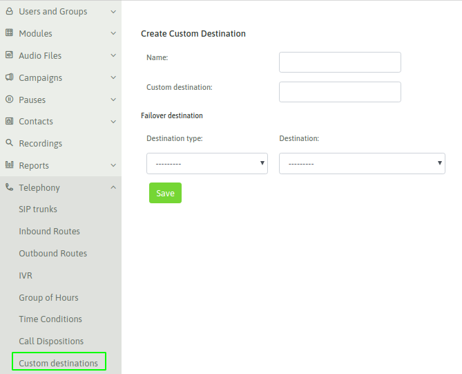
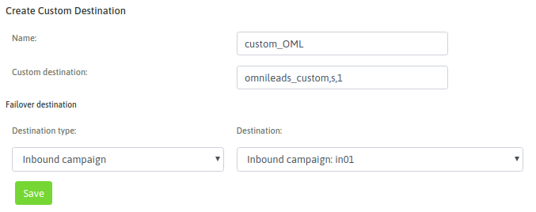
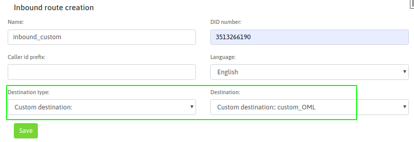

.. _about_custom_dst:

************************************
Ejecución de dialplan personalizado
************************************

Resulta sumamente útil disponer de la posibilidad de poder forzar a que una llamada ejecute un "plan de discado" generado a imagen y semejanza de cualquier
requerimiento puntual del modelo de negocios implicado.

Pero a qué nos referimos con **"plan de discado"**, como bien sabemos OMniLeads utiliza `Asterisk <https://www.asterisk.org>`_ como pieza fundamental dentro
del módulo de "gestión de llamadas telefónicas" y por lo tanto cualquier programador con conocimientos de sintaxis de "dialplan" podrá generar sus propias
rutinas de tratamiento de llamadas, pudiendo a su vez invocarlas dentro del flujo de llamadas de:

* Rutas Entrantes
* Campañas entrantes
* Destinos de failover
* Rutas salientes
* Etc.

Por lo que se permite entonces generar un "nodo" invocable dentro de una llamada procesada en OMniLeads, siendo este "nodo" lógica de programación de Asterisk, personalizada
de acuerdo a cualquier necesidad puntual que esté por afuera del alcance de los módulos típicos del sistema.

Por ejemplo, a la hora de tener que lanzar un IVR que implique algún tratamiento avanzado de las llamadas entrantes (sistemas de autogestión o confirmación de trámites).

Modo de configuración
**********************

El módulo "custom destination" simplemente involucra un formulario sencillo donde se indica el nombre (campo Name) del Nodo de "dialplan personalizado" y además la triada:

* Contexto
* Extensión
* Prioridad

Hacia donde enviar la llamada afectada por éste nodo (campo Custom destination). Además contamos con la necesidad de indicar un destino en caso de fallo.

*figure 1: custom dst view*

Por otro lado, el programador podrá generar su código a nivel archivo de texto "oml_extensions_custom.conf". El cual será cargado en tiempo real y también
tenido en cuenta a la hora de generar los backup & restore de la plataforma.

Ejemplo
********

Vamos a implementar un dialplan como el siguiente:

.. code-block:: bash

  [omnileads_custom]
  exten => s,1,Verbose(2, omnileads custom dialplan)
  same => n,Answer()
  same => n,Playback(demo-congrats)
  same => n,Hangup()

Por lo tanto, por un lado generamos el dialplan citado en el archivo "oml_extensions_custom.conf" ubicado en "/opt/omnileads/asterisk/etc/asterisk".

Luego debemos generar el "nodo" custom destination sobre la interfaz de configuración de OMniLeads.

*figure 2: custom dst example*

Finalmente podemos invocar a nuestro nodo, desde una opción del IVR, condicional de tiempo o ruta entrante.

*figure 3: custom dst example*
