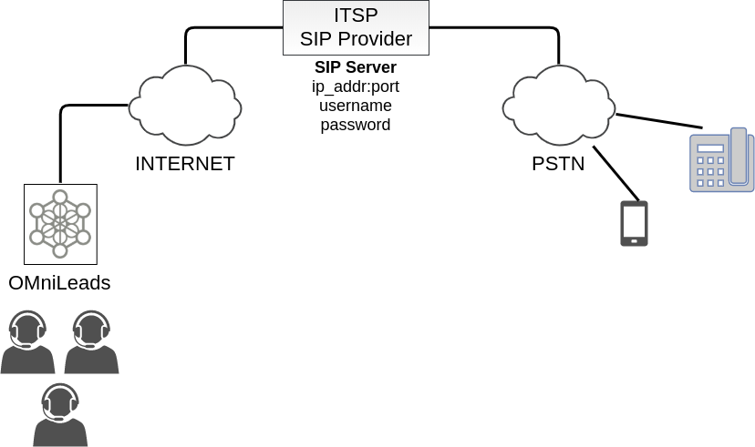
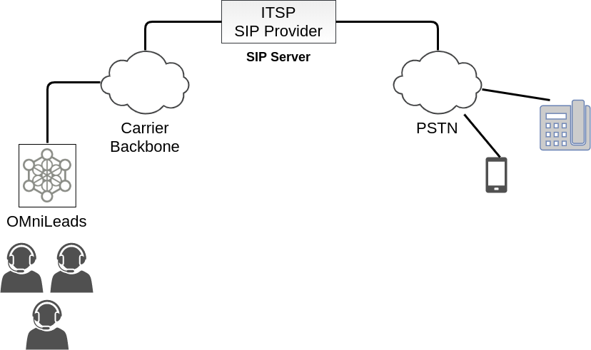
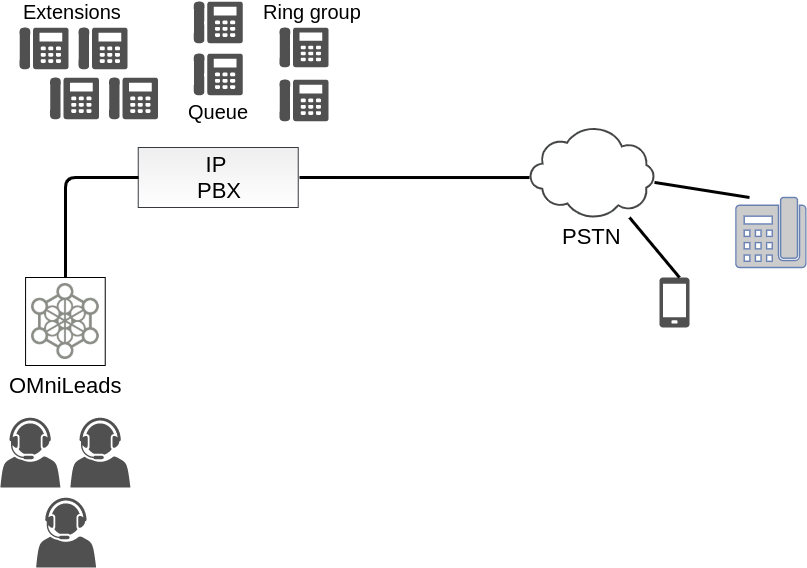
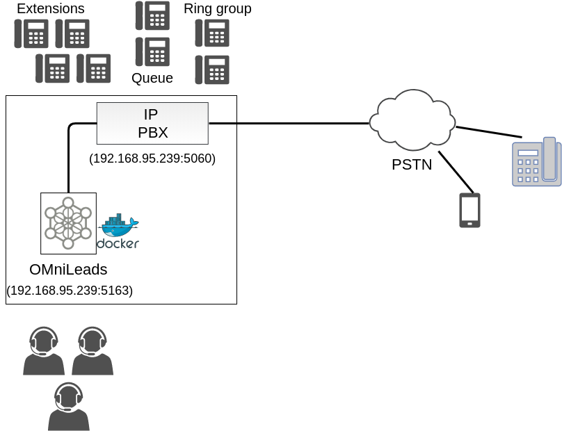

.. _about_telephony_pjsip_internet_provider:

***********************************************
Troncal contra un proveedor SIP sobre Internet
***********************************************

Se trata del tipo de proveedor de troncales SIP al que se puede acceder a través de nuestra propia conexión a internet, utilizando generalmente la autenticación SIP para
el envío de llamadas y la registración como suscriptor.

Para este esquema analizamos la plantilla `PJSIP configuration Wizard <https://wiki.asterisk.org/wiki/display/AST/PJSIP+Configuration+Wizard>`_ que se propone para completar con sus datos.

.. code-block:: bash

 type=wizard
 transport=trunk-nat-transport
 accepts_registrations=no
 accepts_auth=no
 sends_registrations=yes
 sends_auth=yes
 endpoint/rtp_symmetric=yes
 endpoint/force_rport=yes
 endpoint/rewrite_contact=yes
 endpoint/timers=yes
 aor/qualify_frequency=60
 endpoint/allow=alaw,ulaw
 endpoint/dtmf_mode=rfc4733
 endpoint/context=from-pstn
 remote_hosts=****IPADDR-or-FQDN:PORT****
 endpoint/from_user=****YOUR SIP_USERNAME****
 outbound_auth/username=****YOUR SIP_USERNAME****
 outbound_auth/password=****YOUR SIP_PASSWORD****

Los últimos cuatro parámetros tienen que ver con los datos que el proveedor nos facilita, esto es; la dirección o FQDN y puerto correspondiente hacia donde debemos
disparar nuestros REGISTER o INVITE para registrar el troncal o enviar una llamada saliente y además los valores de *username* y *password* con los cuales el proveedor autentica cada REGISTER e INVITE
generado desde OMniLeads.

Respecto al resto de los parámetros vamos a enfatizar:

* **transport=trunk-nat-transport**

Este parámetro indica a la pila PJSIP de Asterisk que debe *advertir* la IP pública y puerto público con la que saldrán "nateados" los paquetes SIP a la hora de alcanzar el SIP-Server del proveedor.
(Asumimos que OMniLeads se encuentra detrás de NAT con respecto a los paquetes que salen hacia el proveedor SIP)

Los próximos 4 parámetros hacen alusión al hecho de que típicamente bajo este esquema OMniLeads no solicita autenticación al proveedor SIP en caso de las llamadas entrantes, pero si debe autenticarse
a la hora de enviar llamadas hacia el proveedor y que además debe enviar un registro recurrente para poder ser localizado por el proveedor SIP a la hora de conectarle llamadas entrantes.
Estamos hablando puntualmente de los parámetros y sus valores:

* **accepts_registrations=no**
* **accepts_auth=no**
* **sends_auth=yes**
* **sends_registrations=yes**

Los siguientes tres parámetros tienen que ver con los codecs a utilizar, el modo de los DTMF y muy importante el punto de entrada de las llamadas que lleguen por el troncal.
Osea:

* **endpoint/allow=alaw,ulaw**
* **endpoint/dtmf_mode=rfc4733**
* **endpoint/context=from-pstn**.

.. _about_telephony_pjsip_lan_provider:

*************************************************
Troncal contra un proveedor SIP backbone dedicado
*************************************************

Bajo esta clasificación tenemos a los proveedores de vínculos SIP que llegan con su propio backbone de conectividad a la locación física donde se encuentra el centro de datos.
Suele ser típico en este escenario que el proveedor no pida autenticación ni registro, además al cursar las llamadas sobre el backbone privado del proveedor la cuestión
del NAT deja de ser un factor a resolver desde nuestro lado.

Para este esquema analizamos la plantilla `PJSIP configuration Wizard <https://wiki.asterisk.org/wiki/display/AST/PJSIP+Configuration+Wizard>`_ que se propone para completar con sus datos.

 .. code-block:: bash

  type=wizard
  transport=trunk-transport
  accepts_registrations=no
  accepts_auth=no
  sends_registrations=no
  sends_auth=no
  endpoint/rtp_symmetric=no
  endpoint/force_rport=no
  endpoint/rewrite_contact=no
  aor/qualify_frequency=60
  endpoint/allow=alaw,ulaw
  endpoint/dtmf_mode=rfc4733
  endpoint/timers=yes
  endpoint/language=es
  endpoint/context=from-pstn
  remote_hosts=****IPADDR-or-FQDN:PORT****
  endpoint/from_user=****YOUR SIP_USER****

Donde los últmos dos parámetros tienen que ver con los datos que el proveedor nos facilita, es decir; la dirección IP / FQDN y puerto correspondiente hacia donde debemos
disparar nuestros INVITE a la hora de enviar una llamadas salientes y el **endpoint/from_user** esperado. Tener en cuenta que bajo este esquema asumimos que el proveedor SIP
no nos autentica vía SIP, por lo tanto no usamos username ni password..

El parámetro: **transport=trunk-transport**, hace referencia al hecho de que no hace falta advertir ninguna IP pública, ya que como bien mencionamos bajo este esquema nos desentendemos del NAT.

El resto de los parámetros ya fueron discutidos en el caso anterior.

.. _about_telephony_pjsip_lan_pbx:

*****************************************
Troncal contra una PBX dentro de la LAN
*****************************************

Un esquema muy implementado tiene que ver con la conexión vía troncal SIP entre OMniLeads y la central IP-PBX de la compañía. Bajo esta modalidad el acceso a la PSTN
es proporcionado por la central IP-PBX, de manera tal que las llamadas salientes hacia la PSTN se cursan por el troncal SIP hasta la IP-PBX y luego ésta se encarga de
rutear las llamadas hacia los destinos concretos a través de sus vínculos hacia la PSTN. Para el caso de las llamadas entrantes, la IP-PBX puede derivar llamadas
desde diversos recursos propios (opciones del IVR, rutas entrantes, anuncios, time conditions, etc.) hacia OMniLeads.

Bajo esta configuración una compañía puede desplegar una potente herramienta de Contact Center totalmente integrada con su central IP-PBX.

La plantilla `PJSIP configuration Wizard <https://wiki.asterisk.org/wiki/display/AST/PJSIP+Configuration+Wizard>`_ que se propone para completar de acuerdo a la configuración
generada del lado de la IP-PBX es:

 .. code-block:: bash

  type=wizard
  transport=trunk-transport
  accepts_registrations=no
  sends_auth=yes
  sends_registrations=no
  accepts_auth=yes
  endpoint/rtp_symmetric=nov
  endpoint/force_rport=no
  endpoint/rewrite_contact=no
  endpoint/timers=yes
  aor/qualify_frequency=60
  endpoint/allow=alaw,ulaw
  endpoint/dtmf_mode=rfc4733
  endpoint/context=from-pbx
  remote_hosts=****IPADDR-or-FQDN:PORT****
  inbound_auth/username=****SIP_USER PBX -> OML****
  inbound_auth/password=****SIP_PASS PBX -> OML****
  outbound_auth/username=****SIP_USER OML -> PBX****
  outbound_auth/password=****SIP_PASS OML -> PBX****
  endpoint/from_user=****SIP_USER OML -> PBX****

Se plantea autenticar vía SIP las llamadas salientes (desde OMniLeads hacia la IPPBX) y las llamadas entrantes (desde la IPPBX hacia OMniLeads). Por eso la razón de ser
de los siguientes parámetros y sus valores:

* **sends_auth=yes**
* **accepts_auth=yes**
* **remote_hosts=****IPADDR-or-FQDN:PORT******
* **inbound_auth/username=****SIP_USER PBX -> OML******
* **inbound_auth/password=****SIP_PASS PBX -> OML******
* **outbound_auth/username=****SIP_USER OML -> PBX******
* **outbound_auth/password=****SIP_PASS OML -> PBX******
* **endpoint/from_user=****SIP_USER OML -> PBX******

Damos por sentado la interpretación de los parámetros a partir de sus sugestivos nombres. Además se resalta el hecho de no implicar registración SIP alguna, ni desde OMniLeads hacia
el PBX ni a la inversa, ya que ambos sistemas se encuentran en una red LAN y con una dirección IP o FQDN asignado.

Por otro lado los parámetros **transport=trunk-transport** y **endpoint/force_rport=no** nos dicen que no se aplica ningún tipo de tratamiento de NAT a los paquetes SIP engendrados desde OMniLeads.

Finalmente resaltamos el parámetro; **endpoint/context=from-pbx** que indica que las llamadas provenientes desde la IP-PBX tienen un punto de acceso diferentes a las provenientes de
la PSTN, ya que entre otras posibilidades se permite contactar directamente a los agentes posibilitando el hecho de que una extensión de la IP-PBX pueda marcar o transferir hacia un agente.

.. _about_telephony_pjsip_internet_pbx:

********************************************
Troncal contra una PBX a  través de Internet
********************************************

Al igual que en el caso anterior, se plantea una vinculación entre ambos sistemas de telefonía solo que ahora se considera que la conectividad SIP atraviesa un ambiente de NAT en internet.
Podemos asumir un escenario bajo el cual OMniLeads se encuentra montado sobre un VPS en internet en donde puede ser pertinente que se haga una registración contra la IP-PBX ubicada
en el centro de datos de la compañía.

.. image:: images/telephony_pjsip_internet_pbx_arq.png
       :align: center

Por ello es que la plantilla de configuración cambia en un par de parámetros:

.. code-block:: bash

  type=wizard
  transport=trunk-nat-transport
  accepts_registrations=no
  sends_auth=yes
  sends_registrations=yes
  accepts_auth=yes
  endpoint/rtp_symmetric=yes
  endpoint/force_rport=yes
  endpoint/rewrite_contact=yes
  endpoint/timers=yes
  aor/qualify_frequency=60
  endpoint/allow=alaw,ulaw
  endpoint/dtmf_mode=rfc4733
  endpoint/context=from-pbx
  remote_hosts=****IPADDR-or-FQDN:PORT****
  inbound_auth/username=****SIP_USER PBX -> OML****
  inbound_auth/password=****SIP_PASS PBX -> OML****
  outbound_auth/username=****SIP_USER OML -> PBX****
  outbound_auth/password=****SIP_PASS OML -> PBX****
  endpoint/from_user=****SIP_USER OML -> PBX****

Se plantea entonces una registración hacia la IP-PBX; **sends_registrations=yes**, siendo este parámetro el indicador para generar los REGISTER.
Observemos además los valores asignados a los parámetros; **transport=trunk-nat-transport** y **endpoint/force_rport=yes** implican un tratamiento
en términos del NAT y los paquetes SIP gestados desde OMniLeads.

El resto de los parámetros son similares a los aplicados en el esquema anterior.

.. _about_telephony_pjsip_oml_inside_pbx:

**********************
OMniLeads inside IPPBX
**********************

Esta plantilla hace alusión a una instalación :ref:`about_install_docker_pbx`. Es decir bajo este escenario OMniLeads se encuentra corriendo en el mismo host que el software de IPPBX.
Lo cual implica que se establezca un PJSIP trunk desde el *Asterisk dockerizado* dentro del host y el Asterisk que se ejecuta como servicio a nivel sistema operativo de base de la IPPBX.

Por ello es que la plantilla de configuración cambia en un par de parámetros:

.. code-block:: bash

 type=wizard
 transport=trunk-nat-docker-transport
 accepts_registrations=no
 sends_auth=yes
 sends_registrations=no
 accepts_auth=yes
 endpoint/rtp_symmetric=nov
 endpoint/force_rport=yes
 endpoint/rewrite_contact=yes
 endpoint/timers=yes
 aor/qualify_frequency=60
 endpoint/allow=alaw,ulaw
 endpoint/dtmf_mode=rfc4733
 endpoint/context=from-pbx
 remote_hosts=***IPADDR-or-FQDN:pORT***
 inbound_auth/username=***SIP_USER PBX -> OML***
 inbound_auth/password=***SIP_PASS PBX -> OML***
 outbound_auth/username=***SIP_USER OML -> PBX***
 outbound_auth/password=***SIP_PASS OML -> PBX***
 endpoint/from_user=***SIP_USER OML -> PBX****

Respecto a los parámetros vamos a observar que se trata de una configuración muy similar al escenario :ref:`about_telephony_pjsip_lan_pbx`, solo que al tener el componente Asterisk dockerizado,
se realiza un tratamiento de NAT, observar los parámetros **trunk-nat-docker-transport** y **endpoint/force_rport=yes** que se encargan de alterar la dirección IP de los paquetes SIP engendrados desde OMniLeads
dockerizado para que salgan con la IP del host IPPBX en lugar de hacerlo con la IP dinámica del asterisk Docker.

El resto de los parámetros son similares a los aplicados en los esquemas anteriores.

********************
Troncal PJSIP Custom
********************

Aquí el administrador podrá escribir a medida su propia configuración PJSIP wizard.
