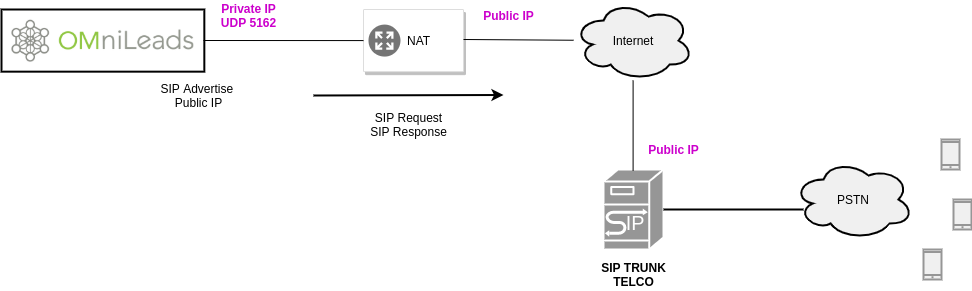
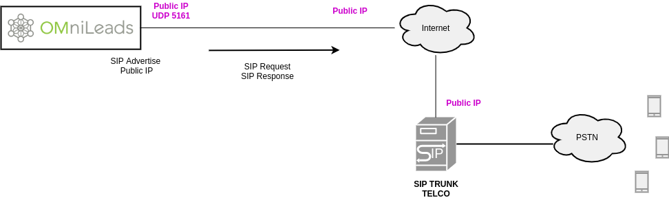
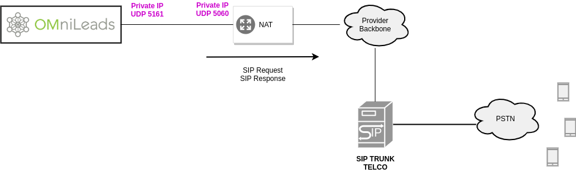
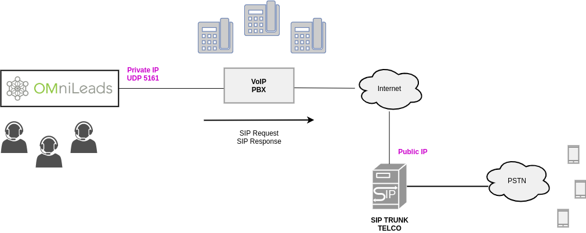

.. _about_telephony_pjsip_internet_provider:

******************************
Parámetros generales SIP Trunk
******************************

Como bien se anticipó PJSIP es el módulo que implementa SIP para este tipo de troncales. Pero además la sintaxis elegida para generar la configuración a nivel Asterisk es
`pjsip wizard <https://wiki.asterisk.org/wiki/display/AST/PJSIP+Configuration+Wizard>`_.

.. important::

  Debemos recordar muy bien que OMniLeads NO utiliza el puerto 5060 como puerto para los troncales SIP. El puerto 5060 es utilizado por Kamailio en su labor WebRTC
  en sesiones contra los agentes. A la hora de generar un troncal SIP entre OML y un proveedor SIP o PBX, debemos saber que los puertos a utilizar son y varian
  de acuerdo a los escenrios debajo descriptos.

  - Puerto **5161** para troncales donde NO debemos advertir la IP publica. Es decir donde no hay NAT de por medio.
  - Puerto **5162** para troncales donde SI debemos advertir la IP pública que va a afectar con NAT los paquetes SIP que salgan de OML.
  - Puerto **5163** para troncales utilizados en la arquitectura OML sobre contenedores Docker.

A continuación se proponen los siguientes escenarios de instancias OMniLeads y su conexión con un SIP provider con terminación a la PSTN.

.. _about_telephony_pjsip_nat:

************************
OMniLeads detrás de NAT
************************

Bajo este escenario tenemos como posibilidad a la App desplegada sobre un proveedor Cloud saliendo a Internet a través de un *gateway*. También cae afectado por el NAT el despliegue
de una instancia on-premise en una LAN corporativa en la cual se sale a Internet a través del Router de la compañía utilizando una IP Pública para realizar el NAT sobre los paquetes
generados desde OMniLeads hacia el proveedor SIP.

Aquí Asterisk utiliza el puerto **UDP 5162** ya que es el puerto que implementa el hecho de advertir en los REQUEST o RESPONSE SIP la IP Pública con la que los paquetes saldrán
al exterior y llegarán al otro extremo de la troncal SIP. Esta adaptación de los paquetes mencionados se realiza a nivel SIP (señalización) y SDP (negociación de media). Por lo tanto el
destinatario externo de los paquetes no se percata de que nuestro Asterisk está detrás de NAT, llegando los paquetes ensamblados con la IP pública del dispositivo de red que
realiza el NAT sobre los paquetes enviados.

Para este esquema analizamos la plantilla `PJSIP configuration Wizard <https://wiki.asterisk.org/wiki/display/AST/PJSIP+Configuration+Wizard>`_ que se propone para completar con sus datos.

.. code-block:: bash

 type=wizard
 transport=trunk-nat-transport
 accepts_registrations=no
 accepts_auth=no
 sends_registrations=yes
 sends_auth=yes
 endpoint/rtp_symmetric=yes
 endpoint/force_rport=yes
 endpoint/rewrite_contact=yes
 endpoint/timers=yes
 aor/qualify_frequency=60
 endpoint/allow=alaw,ulaw
 endpoint/dtmf_mode=rfc4733
 endpoint/context=from-pstn
 remote_hosts=****IPADDR-or-FQDN:PORT****
 outbound_auth/username=****YOUR SIP_USERNAME****
 outbound_auth/password=****YOUR SIP_PASSWORD****

Los últimos tres parámetros tienen que ver con los datos que el proveedor nos facilita a la hora de contratar el servicio, esto es; la dirección o FQDN y puerto correspondiente de su SIP Server
hacia a donde disparar nuestros REGISTER para registrar el troncal o o INVITE a la hora de enviar llamadas salientes. Además se disponen de los valores de *username* y *password* con
los cuales el proveedor autentica dichos REQUEST.

Respecto al resto de los parámetros vamos a enfatizar:

.. code-block:: bash

 transport=trunk-nat-transport

Este parámetro es el que indica a la pila PJSIP de Asterisk que debe *advertir* la IP pública y puerto público con la que saldrán los paquetes SIP a la hora de alcanzar el SIP-Server del proveedor.

Los próximos 4 parámetros hacen alusión al hecho de que típicamente bajo este esquema OMniLeads no solicita autenticación al proveedor SIP en caso de las llamadas entrantes, pero si debe autenticarse
a la hora de enviar llamadas hacia el proveedor y que además debe enviar un registro recurrente para poder ser localizado por el proveedor SIP a la hora de conectarle llamadas entrantes.
Estamos hablando puntualmente de los parámetros y sus valores:

.. code-block:: bash

  accepts_registrations=no
  accepts_auth=no
  sends_auth=yes
  sends_registrations=yes

Los siguientes tres parámetros tienen que ver con los codecs a utilizar, el protocolo utilizado para el intercambio de DTMF. Finalmente el punto de entrada (dialplan context)
de las llamadas que lleguen por el troncal.

.. code-block:: bash

  endpoint/allow=alaw,ulaw
  endpoint/dtmf_mode=rfc4733
  endpoint/context=from-pstn

.. important::

  A la hora de declarar el SIP trunk en el otro extremo, tener en cuenta que OMniLeads utilizará el puerto SIP UDP **5162** en estos entornos con NAT.

.. _about_telephony_pjsip_nonat:

*****************************
OMniLeads en entornos sin NAT
*****************************

Bajo este escenario tenemos como posibilidad a la App desplegada sobre un VPS con IP pública cuyo proveedor SIP está también en una IP pública por lo tanto no existe NAT. También cae en este
escenario a un despliegue efectuado sobre una LAN corporativa (on premise) saliendo a Internet por el Router de la compañía o bien utilizando un SBC ó PSTN-GW, el cual se encarga (entre otras cosas)
del asunto de NAT.

SIP trunk en internet
**********************

Al igual que en el ítem anterior se plantea un proveedor SIP disponible en Internet cuya IP pública ahora es alcanzada sin la afección del NAT, ya que nuestro OMniLeads se encuentra disponible
con una IP pública. El proveedor al igual que antes nos facilita la IP o FQDN del SIP Server al que debemos enviar todos los REQUEST por un lado y un usuario y contraseña para autenticar los
mismos, por el otro.

Para este esquema analizamos la plantilla `PJSIP configuration Wizard <https://wiki.asterisk.org/wiki/display/AST/PJSIP+Configuration+Wizard>`_ que se propone para completar con sus datos.:

.. code-block:: bash

 type=wizard
 transport=trunk-transport
 accepts_registrations=no
 accepts_auth=no
 sends_registrations=yes
 sends_auth=yes
 endpoint/rtp_symmetric=yes
 endpoint/force_rport=yes
 endpoint/rewrite_contact=yes
 endpoint/timers=yes
 aor/qualify_frequency=60
 endpoint/allow=alaw,ulaw
 endpoint/dtmf_mode=rfc4733
 endpoint/context=from-pstn
 remote_hosts=****IPADDR-or-FQDN:PORT****
 outbound_auth/username=****YOUR SIP_USERNAME****
 outbound_auth/password=****YOUR SIP_PASSWORD****

En donde el único parámetro que cambia respecto a los ejemplos con NAT, es:

.. code-block:: bash

 transport=trunk-transport

Donde se indica la utilización de un transporte PJSIP donde simplemente los paquetes fluyan a través del puerto **UDP 5161** sin realizar ningún tratamiento de NAT.

SIP Trunk corporativo
**********************

Bajo esta clasificación tenemos a los proveedores de vínculos SIP que llegan con su propio backbone de conectividad a la locación física donde se encuentra el centro de datos.
Suele ser típico en este escenario que el proveedor no pida autenticación ni registro, además al cursar las llamadas sobre el backbone privado del proveedor la cuestión
del NAT deja de ser un factor a resolver desde nuestro lado.

Para este esquema analizamos la plantilla `PJSIP configuration Wizard <https://wiki.asterisk.org/wiki/display/AST/PJSIP+Configuration+Wizard>`_ que se propone para completar con sus datos.

.. code-block:: bash

  type=wizard
  transport=trunk-transport
  accepts_registrations=no
  accepts_auth=no
  sends_registrations=no
  sends_auth=no
  endpoint/rtp_symmetric=no
  endpoint/force_rport=no
  endpoint/rewrite_contact=no
  aor/qualify_frequency=60
  endpoint/allow=alaw,ulaw
  endpoint/dtmf_mode=rfc4733
  endpoint/timers=yes
  endpoint/language=es
  endpoint/context=from-pstn
  remote_hosts=****IPADDR-or-FQDN:PORT****

Donde los últmos dos parámetros tienen que ver con los datos que el proveedor nos facilita, es decir; la dirección IP / FQDN y puerto correspondiente hacia donde debemos
disparar nuestros REQUEST.
Tener en cuenta que bajo este esquema asumimos que el proveedor SIP no nos autentica vía SIP, por lo tanto no usamos username ni password.

Nuevamente se utiliza el: **transport=trunk-transport**, implicando la no afección de NAT.

El resto de los parámetros ya fueron discutidos en el caso anterior.

.. _about_telephony_pjsip_lan_pbx:

OML SIP trunk con PBX en LAN
*****************************

Un esquema muy implementado tiene que ver con la conexión vía troncal SIP entre OMniLeads y la central PBX de la compañía. Bajo esta modalidad el acceso a la PSTN
es proporcionado por la central PBX, de manera tal que las llamadas salientes hacia la PSTN se cursan por el troncal SIP hasta la PBX y luego ésta se encarga de
rutear las llamadas hacia los destinos concretos a través de sus vínculos hacia la PSTN. Para el caso de las llamadas entrantes, la PBX puede derivar llamadas
desde diversos recursos propios (opciones del IVR, rutas entrantes, anuncios, time conditions, etc.) hacia rutas entrantes de OMniLeads.

Bajo esta configuración una compañía puede desplegar una App de Contact Center totalmente integrada con su central PBX.

La plantilla `PJSIP configuration Wizard <https://wiki.asterisk.org/wiki/display/AST/PJSIP+Configuration+Wizard>`_ que se propone para completar de acuerdo a la configuración
generada del lado de la IP-PBX es:

 .. code-block:: bash

  type=wizard
  transport=trunk-transport
  accepts_registrations=no
  sends_auth=yes
  sends_registrations=no
  accepts_auth=yes
  endpoint/rtp_symmetric=no
  endpoint/force_rport=no
  endpoint/rewrite_contact=no
  endpoint/timers=yes
  aor/qualify_frequency=60
  endpoint/allow=alaw,ulaw
  endpoint/dtmf_mode=rfc4733
  endpoint/context=from-pbx
  remote_hosts=****IPADDR-or-FQDN:PORT****
  inbound_auth/username=****SIP_USER PBX -> OML****
  inbound_auth/password=****SIP_PASS PBX -> OML****
  outbound_auth/username=****SIP_USER OML -> PBX****
  outbound_auth/password=****SIP_PASS OML -> PBX****
  endpoint/from_user=****SIP_USER OML -> PBX****

Se plantea autenticar vía SIP las llamadas salientes (desde OMniLeads hacia la PBX) y las llamadas entrantes (desde la IPPBX hacia OMniLeads). Por eso la razón de ser
de los siguientes parámetros y sus valores:

* **sends_auth=yes**
* **accepts_auth=yes**
* **remote_hosts=****IPADDR-or-FQDN:PORT******
* **inbound_auth/username=****SIP_USER PBX -> OML******
* **inbound_auth/password=****SIP_PASS PBX -> OML******
* **outbound_auth/username=****SIP_USER OML -> PBX******
* **outbound_auth/password=****SIP_PASS OML -> PBX******
* **endpoint/from_user=****SIP_USER OML -> PBX******

Damos por sentado la interpretación de los parámetros a partir de sus sugestivos nombres. Además se resalta el hecho de no implicar registración SIP alguna, ni desde OMniLeads hacia
el PBX ni a la inversa, ya que ambos sistemas se encuentran en una red LAN y con una dirección IP o FQDN asignado.

Por otro lado los parámetros **transport=trunk-transport** y **endpoint/force_rport=no** nos dicen que no se aplica ningún tipo de tratamiento de NAT a los paquetes SIP engendrados desde OMniLeads.

Finalmente resaltamos el parámetro; **endpoint/context=from-pbx** que indica que las llamadas provenientes desde la IP-PBX tienen un punto de acceso diferentes a las provenientes de
la PSTN, ya que entre otras posibilidades se permite contactar directamente a los agentes posibilitando el hecho de que una extensión de la IP-PBX pueda marcar o transferir hacia un agente.

.. important::

  A la hora de declarar el SIP trunk en el otro extremo, tener en cuenta que OMniLeads utilizará el puerto SIP UDP **5161** en estos entornos SIN NAT.

********************
Troncal PJSIP Custom
********************

Aquí el administrador podrá escribir a medida su propia configuración PJSIP wizard. Más allá de las plantillas proporcionadas siempre el Administrador cuenta con la posibilidad
de ajustar la configuración de acuerdo al escenario puntual y las particularidades de cada caso, por ello es muy recomendable que se estudien bien los parámetros del stack PJSIP
de Asterisk ya que cuenta con un gran nivel de personalización.
