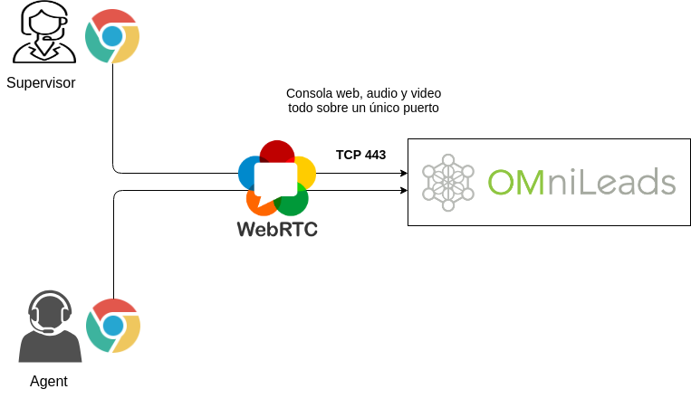

.. _about_usecase_pbx:

OML como Contact Center integrado a un PBX basado en SIP
*********************************************************

OMniLeads resulta ideal para las compañías que demandan funcionalidades típicas de Contact Center, donde el sistema PBX no llega a cubrir por su propia naturaleza.
Por lo tanto OMniLeads surge como una alternativa para complementar dicha central PBX, desde una instancia independiente (bare-metal host, virtual machine o infraestructura de cloud) integrada al PBX,
permitiendo el fluir de las comunicaciones entre ambos componentes, de manera fiable, segura y transparente.

Se plantea expandir el paradigma tradicional de adquisición de un stack de software de reportería / supervisión para instalar sobre el PBX, para en lugar de ello desplegar una completa aplicación
de Contact Center independiente (utiliza su propio Asterisk) que permite a su vez una integración sencilla con el software de PBX, De manera tal que podamos derivar una opción del IVR del PBX
hacia una campaña entrante de OMniLeads, o bien realizar una transferencia desde una extensión del PBX hacia OMniLeads o viceversa.

Las ventajas que se hacen notables son:

- Evitar el coste económico que involucran las licencias de software de las típicas herramientas complementarias del mercado que dotan al PBX de algunas funcionalidaes *reporting y supervisión* de Colas.
- Evitar el coste en términos de performance del core de telefonía *PBX* sacrificada para correr complejos reportes y herramientas de monitoreo, que implica ejecutar un «módulo de call center» sobre el sistema PBX.

En operaciones donde hay una gran demanda de extracción de reportes o bien se necesita escalar en términos de agentes, es sumamente sencillo desplegar OMniLeads *out of the box*, ya sea en una VM, VPS o Server dedicado,
sin perder la integración con el PBX.

El integrador cuenta con la opción de ejecutar la aplicación sobre el propio sistema PBX o bien en una instancia independiente.

.. image:: images/oml_and_pbx.png
        :align: center

.. _about_usecase_bpo:

OML en una Compañia de servicios de Customer Contact
*****************************************************

Bajo este escenario, OMniLeads puede trabajar como núcleo de comunicaciones de un Contact Center con agentes que van entre las decenas y centenas.
Así OMniLeads puede manejar múltiples troncales SIP a la vez, con su pertinente enrutamientos entrante y saliente de comunicaciones.

En estos contextos la escalabilidad es un requisito básico, ya que las operaciones son muy dinámicas y pueden demandar picos de usuarios conectados
trabajando en simultánea. La escalabilidad se garantiza a partir de concebir nuestra solución de manera tal que pueda ser facilmente desplegada
en modalidad de cluster de alta disponibilidad.

A su vez la API RestFull permite generar fácilmente CRMs o web workflows para cada campaña de manera tal de ajustarse a los requisitos del cliente que terceriza la cartera.

.. image:: images/oml_bpo.png
        :align: center

.. _about_usecase_cloud:

OML para Carriers ó Proveedores de Cloud PBX
********************************************

Si la necesidad es implementar un servicio de CCaaS (Contact Center as a Service) OMniLeads resulta ideal a partir de la ventaja otorgada por WebRTC y Docker como
tecnología base.

Podemos citar como ventajas:

* **WebRTC** elimina la necesidad de instalar aplicaciones softphone para escritorio, ya que la voz y el video fluye a través del browser de los agentes y supervisores. Esto elimina un punto de falla y mantenimiento sobre las estaciones de trabajo.

* Los **Codecs** implementados para audio y video son Opus y VP8, ambos diseñados para funcionar en internet y se adaptan dinámicamente al ancho de banda disponible, lo que evita los incómodos entrecortes de llamadas de la VoIP convencional.

* **Seguridad**: el intercambio de información entre las estaciones de trabajo y la instancia de OML en Cloud, se encuentra encriptado bajo los estándares HTTPS, sRTP y dTLS.

* `Kamailio <https://www.kamailio.org/>`_ es parte del core de comunicaciones de OMniLeads. Se trata de un Proxy-SIP de avanzadas prestaciones y crucial para brindar seguridad a servidores de VoIP y Video de acceso público en internet.

* Docker permite desplegar OMniLeads fácilmente abstrayéndo la infraestructura subyacente, permitiendo sin problemas correr en VPS, AWS, GCloud, etc.

